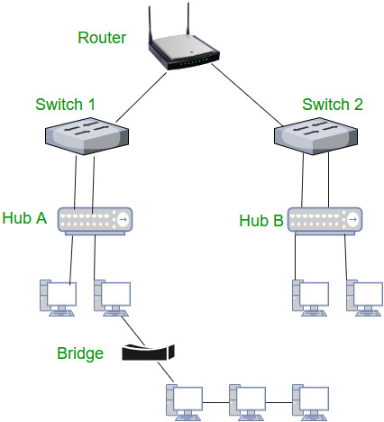

## What happens when you type www.google.com in a browser and press Enter?
- This process happens in multiple stages:
1. 1️⃣ URL Parsing
- Browser checks:
    - Protocol → https
    - Domain → www.google.com
    - Path → / (default)
2. 2️⃣ DNS Resolution
- Browser tries to find the IP address of the domain:
    - Browser cache
    - OS cache
    - Router cache
    - DNS server (ISP)
    - Root → TLD → Authoritative DNS
- ➡ Returns an IP address (e.g., 142.xxx.xxx.xxx)

3. 3️⃣ TCP Connection (3-Way Handshake)
- Between client and server:
    - SYN
    - SYN-ACK
    - ACK
- ➡ Reliable connection established

4. 4️⃣ TLS/SSL Handshake (for HTTPS)
- Server sends certificate
- Browser verifies it
- Encryption keys exchanged

5. 5️⃣ HTTP Request
- Browser sends an HTTP GET request:

6. 6️⃣ HTTP Response
- Server responds with:
    - HTML
    - CSS
    - JavaScript
    - Images

7. 7️⃣ Browser Rendering
- HTML → DOM
- CSS → CSSOM
- DOM + CSSOM → Render Tree
- Layout → Paint → Display page

> The browser resolves DNS, establishes a TCP and TLS connection, sends an HTTP request, receives a response, and renders the webpage.

## Difference between Hub, Switch, and Router

### 🔹 Hub
- Operates at Physical Layer (Layer 1)
- Broadcasts data to all devices
- No filtering or intelligence
- Causes collisions
- Least efficient

### 🔹 Switch
- Operates at Data Link Layer (Layer 2)
- Uses MAC addresses
- Sends data only to the intended device
- Reduces collisions
- Faster than hub

### Router
- Operates at Network Layer (Layer 3)
- Uses IP addresses
- Connects different networks
- Determines best path for data
- Used for Internet access

| Feature      | Hub  | Switch   | Router  |
| ------------ | ---- | -------- | ------- |
| OSI Layer    | 1    | 2        | 3       |
| Address Used | None | MAC      | IP      |
| Broadcast    | Yes  | No       | No      |
| Speed        | Slow | Fast     | Fastest |
| Security     | None | Moderate | High    |

## router
A router is a Layer 3 networking device that connects multiple networks and forwards packets based on IP addresses using routing tables.