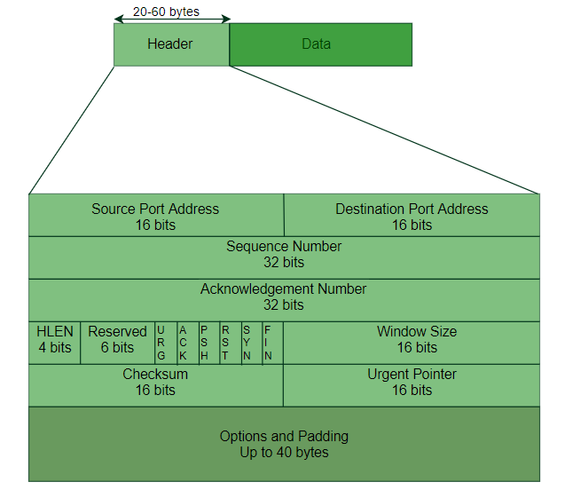
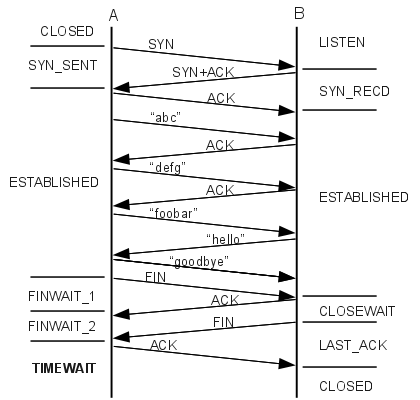
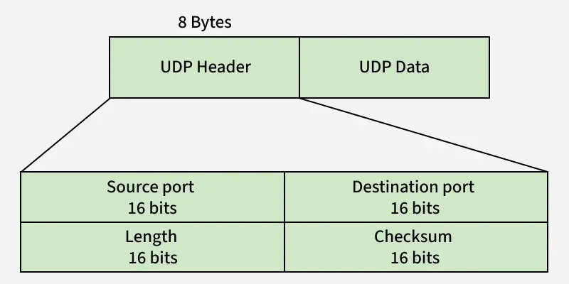
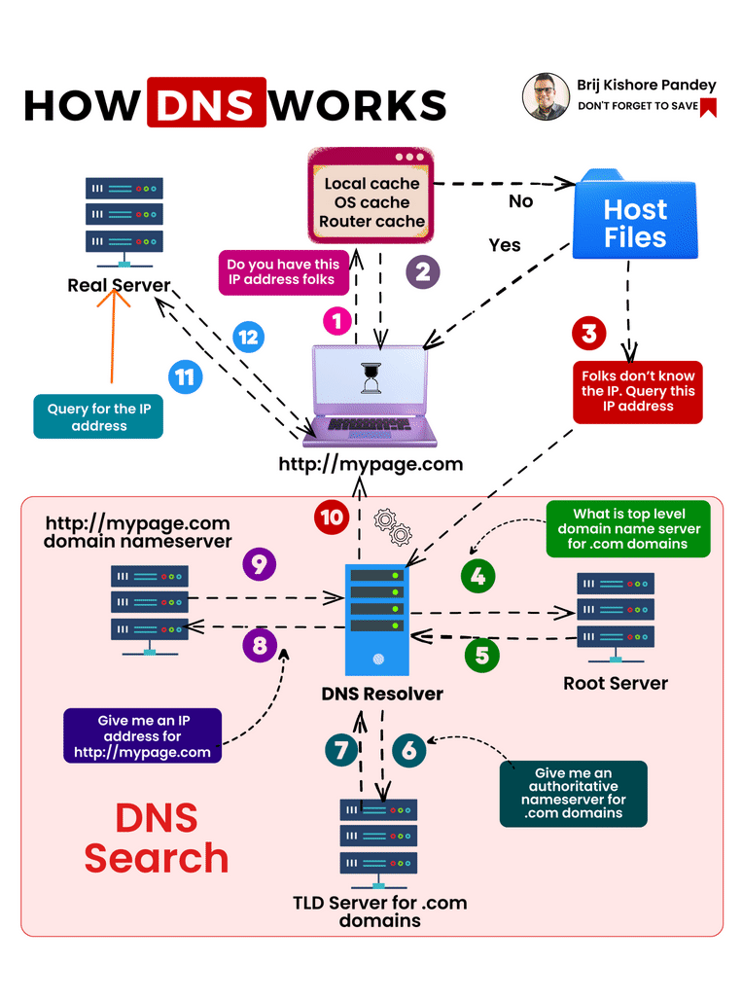

### protocols
- A protocol is a set of rules and standards that define how data is transmitted, received, and interpreted between devices on a network.
> Protocols are the “languages” computers use to communicate with each other.
#### 🔹 Why Protocols Are Needed
- Ensure proper communication
- Define data format
- Control error handling
- Manage data flow
- Enable interoperability between different systems

| Protocol | Purpose                       |
| -------- | ----------------------------- |
| **TCP**  | Reliable data transfer        |
| **UDP**  | Fast, connectionless transfer |
| **IP**   | Addressing & routing          |
| **ICMP** | Error reporting               |
| **ARP**  | Maps IP to MAC address        |

| Protocol        | Use                      |
| --------------- | ------------------------ |
| **HTTP**        | Web communication        |
| **HTTPS**       | Secure web communication |
| **FTP**         | File transfer            |
| **SMTP**        | Sending emails           |
| **POP3 / IMAP** | Receiving emails         |
| **DNS**         | Domain name resolution   |

> BY 1️⃣ IETF (Internet Engineering Task Force)
- 2️⃣ IEEE (Institute of Electrical and Electronics Engineers)

### TCP (Transmission Control Protocol) 
- is a connection-oriented, reliable, and byte-stream based transport layer protocol used for end-to-end communication in computer networks.
> TCP is a reliable, connection-oriented transport protocol that ensures error-free, ordered, and congestion-controlled data transmission between devices.
> ➡️ Used where accuracy matters more than speed.
- HTTP uses TCP to actually send data.
- Examples:
    - Web browsing (HTTP/HTTPS)
    - Email (SMTP, POP3)
    - File transfer (FTP)
    - Remote login (SSH)

#### Features of TCP : 
| Feature                 | Description                                 |
| ----------------------- | ------------------------------------------- |
| **Connection-oriented** | Connection established before data transfer |
| **Reliable**            | Guarantees delivery                         |
| **Ordered**             | Data arrives in correct sequence            |
| **Error control**       | Uses checksums & retransmission             |
| **Flow control**        | Prevents sender from overwhelming receiver  |
| **Congestion control**  | Prevents network overload                   |
| **Full-duplex**         | Data flows both directions                  |

### TCP Header :

| Field                 | Purpose                |
| --------------------- | ---------------------- |
| Source Port           | Sender application     |
| Destination Port      | Receiver application   |
| Sequence Number       | Order of data          |
| Acknowledgment Number | Confirms received data |
| Flags                 | SYN, ACK, FIN, RST     |
| Window Size           | Flow control           |
| Checksum              | Error detection        |
| Urgent Pointer        | Urgent data            |

### 5️⃣ TCP Connection Establishment (3-Way Handshake)
- TCP uses a 3-step handshake to establish a connection.
- 🧩 Step-by-Step Explanation
1. 🔹 Step 1: SYN (Synchronize)
- Client sends a SYN packet to server
- Contains an initial sequence number (ISN)
- Means: "I want to start a connection"
- 📤 Client → Server : SYN

2. 🔹 Step 2: SYN + ACK
- Server receives SYN
- Sends back:
    - SYN → its own sequence number
    - ACK → acknowledgment of client’s SYN
- 📥 Server → Client : SYN + ACK

3. 🔹 Step 3: ACK
- Client sends final ACK
- Acknowledges server’s sequence number
- 📤 Client → Server : ACK

> ✔️ Connection Established
```yml
Client                                   Server
  |                                         |
  | ----------- SYN (Seq = x) ------------> |
  |                                         |
  | <------- SYN + ACK (Seq = y, Ack = x+1) |
  |                                         |
  | ----------- ACK (Ack = y+1) ----------> |
  |                                         |
      ✅ Connection Established
```

### 6️⃣ Data Transfer in TCP
- Data is divided into segments
- Each segment has a sequence number
- Receiver sends ACKs
- Lost packets are retransmitted
> ✔ Guarantees no loss, no duplication, correct order


### 7️⃣ TCP Flow Control (Sliding Window)
- Uses window size
- Prevents fast sender from overwhelming slow receiver
- Receiver tells sender how much data it can accept
> 📌 Mechanism: Sliding Window Protocol

### 8️⃣ TCP Congestion Control
- Handles network congestion using:
- 🔹 Algorithms:
1. Slow Start
2. Congestion Avoidance
3. Fast Retransmit
4. Fast Recovery
> Purpose → Avoid network collapse.

### 9️⃣ TCP Connection Termination (4-Way Handshake)
- Connection closed using FIN and ACK:
```yml
Client → FIN
Server → ACK
Server → FIN
Client → ACK
```
> After this → connection is terminated.

### 1️⃣1️⃣ Where TCP is Used
- HTTP / HTTPS
- FTP
- SMTP / POP3 / IMAP
- SSH
- Database connections

### 1️⃣2️⃣ Advantages of TCP
- ✔ Reliable
- ✔ Error-free
- ✔ Ordered delivery
- ✔ Congestion handling

## 1️⃣3️⃣ Disadvantages of TCP
- ❌ Slower than UDP
- ❌ Higher overhead
- ❌ Not suitable for real-time streaming

## UDP PACKET :

- DATA SIZE = 2^16 - 8BYTES.

## Socket
> A socket is a combination of IP address + Port number.
- A socket is the combination of IP address + port number used to identify a specific communication endpoint.

### TCP Socket Communication
```yml
Client                    Server
  |---- connect() ------->|
  |<--- accept() ---------|
  |---- send() ---------->|
  |<--- recv() -----------|
  |---- close() --------->|
```

## HTTP (HyperText Transfer Protocol) 
- is a protocol used to transfer data between a client (browser) and a server.
    - It sends data in plain text
    - No security or encryption
    - Anyone in between can read or modify the data
- Stateless :
    - Every request is treated as a new request
    - Server does not store client context
    - Previous requests do not affect the next request
### 🔹 How Does HTTP Handle “State” Then?
- HTTP itself is stateless, but applications add state manually using:
1. 1️⃣ Cookies
Set-Cookie: sessionId=abc123
2. 2️⃣ Sessions (Server-Side)
- Server stores session data
- Client sends session ID in cookie
3. 3️⃣ Tokens (JWT)
- State stored in token
- Token sent in headers
- Authorization: Bearer <token>
| Feature         | Stateless (HTTP) | Stateful          |
| --------------- | ---------------- | ----------------- |
| Server Memory   | ❌ None           | ✅ Maintains state |
| Scalability     | High             | Lower             |
| Fault Tolerance | High             | Low               |
| Example         | HTTP             | FTP session       |


Browser sends cookie with every request.
## 🔐 What is HTTPS?
- HTTPS (HyperText Transfer Protocol Secure) is the secure version of HTTP.
- It uses:
    - SSL/TLS encryption
    - Ensures confidentiality, integrity, and authentication

| Feature        | HTTP                        | HTTPS                              |
| -------------- | --------------------------- | ---------------------------------- |
| Full Form      | HyperText Transfer Protocol | HyperText Transfer Protocol Secure |
| Security       | ❌ Not secure                | ✅ Encrypted                        |
| Encryption     | ❌ None                      | ✅ SSL/TLS                          |
| Port           | 80                          | 443                                |
| Data Safety    | Vulnerable to attacks       | Protected                          |
| Authentication | No                          | Yes (via certificates)             |
| SEO Ranking    | Lower                       | Higher (Google prefers HTTPS)      |
| Padlock Icon   | ❌ No                        | ✅ Yes                              |


### 🔒 How HTTPS Works (Simple)
1. Browser requests a secure connection
2. Server sends SSL(Secure soxket Layer)/TLS(Transport Layer Security) certificate
3. Browser verifies certificate
4. Secure encrypted channel is created
5. Data is safely transferred
> ➡️ Uses Public Key + Private Key encryption

### 🔓 Why HTTP is Unsafe
- With HTTP:
    - Data is sent in plain text
    - Hackers can perform:
        - Packet sniffing
        - Man-in-the-middle attacks
        - Data modification
    
### 🔐 Why HTTPS is Safer
- Data is encrypted
- Prevents eavesdropping
- Prevents data tampering
- Verifies website identity


## DNS:
- DNS (Domain Name System) is a naming system that translates human-readable domain names (like www.google.com) into IP addresses (like 142.250.190.14) that computers use to identify each other on the network.

### 🔹 How DNS Works (Step-by-Step)
- Example: Accessing www.google.com
1. User enters URL in browser
2. Browser checks local DNS cache
3. If not found → asks DNS Resolver (ISP)
4. Resolver contacts:
    - Root Server
    - TLD((Top-Level Domain)) Server (.com)
    - Authoritative DNS Server
5. IP address is returned
6. Browser connects to the website using that IP


### 🔹 DNS Caching
- To improve speed:
    - Browsers cache DNS results
    - OS caches DNS results
    - ISPs cache DNS responses
- This reduces lookup time and internet traffic.

