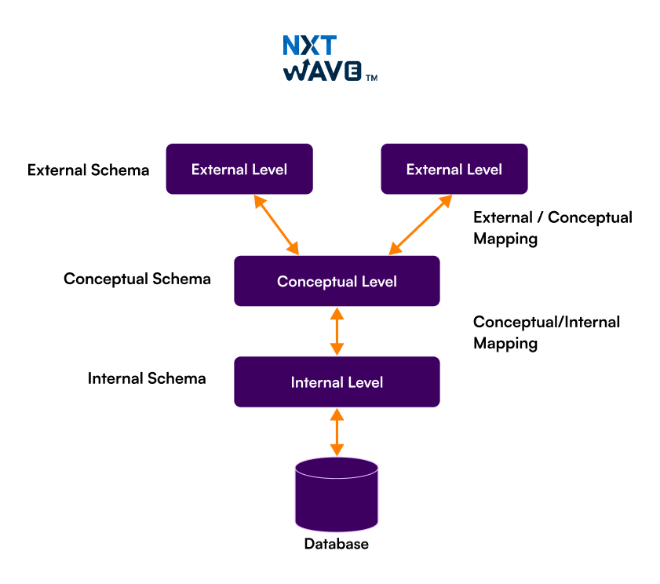
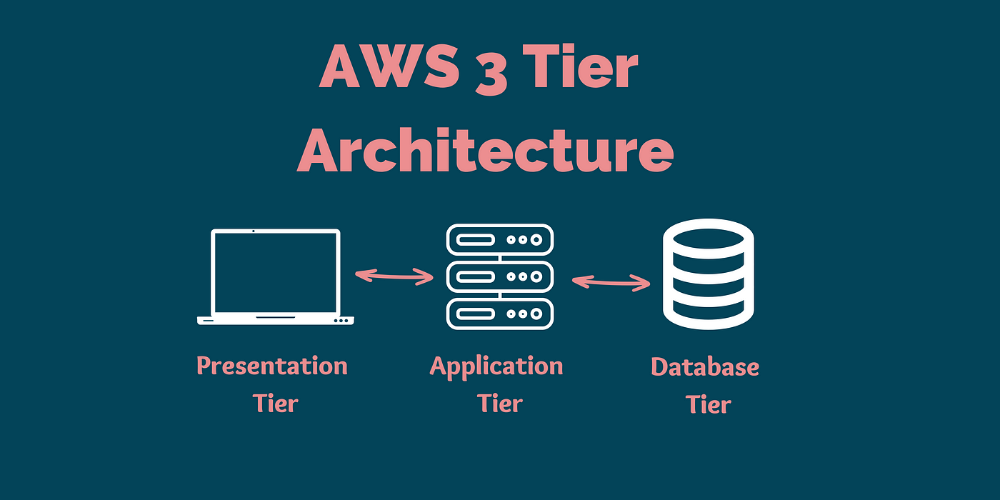
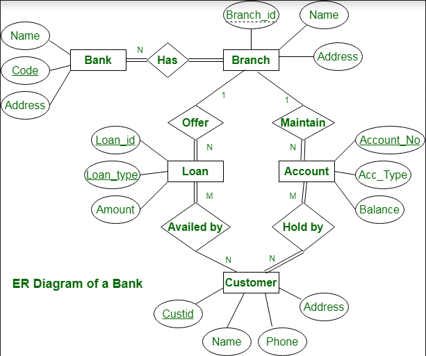
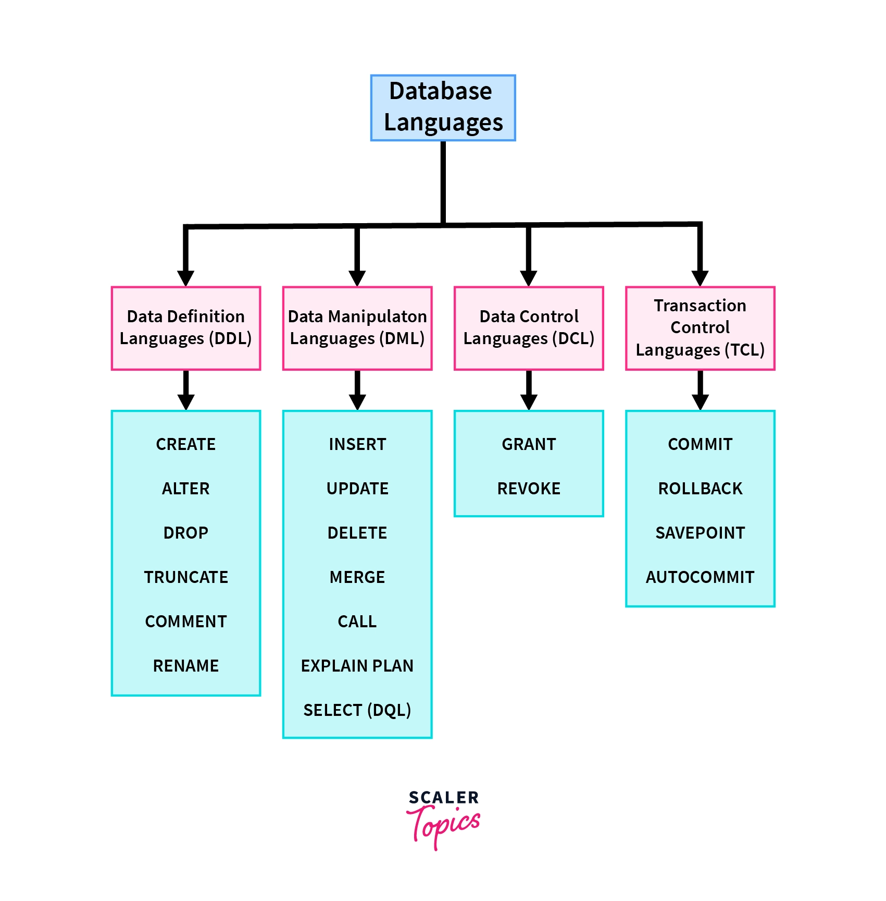
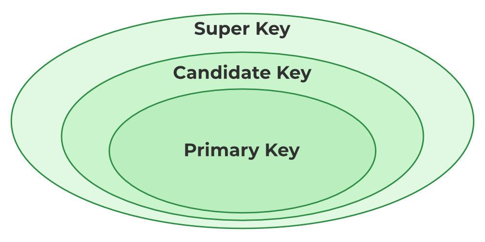

## DBMS (Database Management System)
- Data : Data is a collection of raw facts, figures, or symbols that by themselves may not have meaning, but can be processed to produce useful information.
> Database – Organized collection of related data
> DBMS Software – Manages data operations ( Create , Maintain and Control ).

### 🔹 Main Functions of DBMS
1. Data Storage & Retrieval
2. Data Manipulation (Insert, Update, Delete)
3. Concurrency Control (multiple users access)
4. Transaction Management
5. Backup & Recovery
6. Security & Authorization 
7. Data Integrity Enforcement

## DBMS Architecture :

1. 3-Tier Arch :

## SCHEMA :
- In DBMS, a schema is the logical structure or blueprint of a database.
- It defines how data is organized, including tables, fields, relationships, constraints, and data types—but not the actual data.
### 🔹 Types of Schema in DBMS (Three-Schema Architecture)
1. 1️⃣ External Schema (View Level)
- User-specific view of the database
📌 Example:
- Student sees marks
- Admin sees all records

2. 2️⃣ Conceptual Schema (Logical Level)
- Overall logical structure of the database
- Describes entities, relationships, constraints
- Independent of physical storage
STUDENT(StudentID, Name, DeptID)
DEPARTMENT(DeptID, DeptName)

3. 3️⃣ Internal Schema (Physical Level)
- Describes how data is physically stored
- Indexing, file structure, storage format
- 📌 Example:
    - B+ trees
    - Hashing
    - Disk blocks.

## DATA MODELS :
A Data Model is a conceptual framework that defines how data is structured, stored, related, and manipulated in a database.
- 🔹 Common Data Models in DBMS
| Data Model                         | Description                 |
| ---------------------------------- | --------------------------- |
| **Hierarchical Model**             | Tree structure              |
| **Network Model**                  | Graph structure             |
| **Relational Model**               | Tables (most used)          |
| **Entity-Relationship (ER) Model** | Entities & relationships    |
| **Object-Oriented Model**          | Objects & classes           |
| **NoSQL Models**                   | Key-Value, Document, Column |

1. **ER MODEL** :

| **Concept**                  | **Description**                              | **Symbol / Representation** | **Example**            |
| ---------------------------- | -------------------------------------------- | --------------------------- | ---------------------- |
| **ER Model**                 | Conceptual model used to design databases    | ER Diagram (ERD)            | Student–Course system  |
| **Entity**                   | Real-world object with independent existence | Rectangle                   | Student, Course        |
| **Strong Entity**            | Entity with its own primary key              | Single rectangle            | Student                |
| **Weak Entity**              | Depends on another entity for identification | Double rectangle            | Dependent              |
| **Attribute**                | Property of an entity                        | Oval                        | Name, Age              |
| **Key Attribute**            | Uniquely identifies entity                   | Underlined oval             | Roll_No                |
| **Composite Attribute**      | Attribute made of sub-attributes             | Oval with branches          | Name → First, Last     |
| **Simple Attribute**         | Cannot be divided                            | Single oval                 | Age                    |
| **Multivalued Attribute**    | Can have multiple values                     | Double oval                 | Phone_No               |
| **Derived Attribute**        | Calculated from another attribute            | Dashed oval                 | Age (from DOB)         |
| **Relationship**             | Association between entities                 | Diamond                     | Enrolls                |
| **Relationship Attribute**   | Attribute of a relationship                  | Oval connected to diamond   | Grade                  |
| **Degree of Relationship**   | Number of entities involved                  | Unary/Binary/Ternary        | Student enrolls Course |
| **Cardinality**              | Number of entity occurrences                 | 1:1, 1:N, M:N               | Student–Course (M:N)   |
| **Participation Constraint** | Whether participation is mandatory           | Single/Double line          | Total participation    |
| **Primary Key**              | Uniquely identifies record                   | Underlined                  | Student_ID             |
| **Foreign Key**              | Refers to primary key of another table       | Normal attribute            | Course_ID              |
| **Generalization**           | Bottom-up abstraction                        | Triangle                    | Vehicle → Car          |
| **Specialization**           | Top-down abstraction                         | Triangle                    | Employee → Manager     |
| **Aggregation**              | Relationship treated as entity               | Box around relationship     | Project assignment     |

- Entity → a real-world object => a Table in DB , Similarly a attribute is a column
- Entity Set → a group of similar entities

## 📘 Database Languages (DBMS)

1. DDL or DATA DEFITION LANGUAGE : 
- Used to define and modify the database structure (schema).
- 📌 Commands:
    - CREATE
    - ALTER
    - DROP
    - TRUNCATE
    - RENAME

2. DATA MANUPLITION LANGUAGE
- Used to insert, update, delete, and retrieve data.
    - INSERT
    - UPDATE
    - DELETE
    - SELECT

3. DATA CONTROL LANGUAGE 
- Used to control access and permissions.
    - GRANT
    - REVOKE

4. TRANSACTION CONTROL LANGUAGE 
    - COMMIT
    - ROLLBACK
    - SAVEPOINT

2. **RELATIONAL MODEL**
The Relational Model is a data model in which data is organized into tables (relations) consisting of rows (tuples) and columns (attributes).

| Term            | Meaning               |
| --------------- | --------------------- |
| Relation        | Table                 |
| Tuple           | Row                   |
| Attribute       | Column                |
| Degree          | Number of attributes  |
| Cardinality     | Number of tuples      |
| Domain          | Set of valid values   |
| Relation Schema | Structure of relation |

### 🔹 Keys in Relational Model

1. 🔑 Primary Key
- Uniquely identifies each tuple
- Cannot be NULL
- 📌 Example: StudentID

2. 🔑 Foreign Key
- Refers to primary key of another table
- Creates relationship between tables

- Other Keys
    - Candidate Key
    - Super Key
    - Composite Key
    - Alternate Key

3. A Super Key 
- is any set of one or more attributes that can uniquely identify a tuple in a relation.
📌 Example:
> STUDENT(StudentID, Email, Name)
- Possible super keys:
    - {StudentID}
    - {Email}
    - {StudentID, Name}
    - {Email, Name}
✔ May contain extra attributes
✔ Guarantees uniqueness

4. 2️⃣ Candidate Key
- A Candidate Key is a minimal super key — meaning no unnecessary attribute is present.
- 📌 From the previous example:
    - {StudentID} ✅
    - {Email} ✅
- ❌ {StudentID, Name} (not minimal)
- 
✔ Multiple candidate keys can exist
✔ One of them becomes the Primary Key

5. 4️⃣ Alternate Key
- All candidate keys not selected as the primary key are called Alternate Keys.
- Candidate Keys: {StudentID}, {Email}
- Primary Key: {StudentID}
- Alternate Key: {Email}
✔ Still enforces uniqueness

6. 5️⃣ Composite Key
- A Composite Key is a key formed using more than one attribute to uniquely identify a tuple.
- Neither StudentID nor CourseID alone is unique
- Together, they uniquely identify a record
✔ Common in many-to-many relationships

7. 6️⃣ Foreign Key
- A Foreign Key is an attribute in one table that references the primary key of another table.

| Key Type      | Uniqueness | Minimal | NULL Allowed |
| ------------- | ---------- | ------- | ------------ |
| Super Key     | Yes        | ❌       | No           |
| Candidate Key | Yes        | ✅       | No           |
| Primary Key   | Yes        | ✅       | No           |
| Alternate Key | Yes        | ✅       | No           |
| Composite Key | Yes        | Depends | No           |
| Foreign Key   | No         | —       | Yes          |

## Integrity Constraints 
- are rules enforced on a database to ensure that the data stored is accurate, valid, and consistent throughout its lifecycle.

Domain Constraint: Limits attribute values to a valid range
Entity Integrity: Primary key cannot be NULL
Referential Integrity: Foreign key must reference a valid primary key
Key Constraint: Ensures uniqueness
