## DBMS (Database Management System) (AIP E)
- Data : Data is a collection of raw facts, figures, or symbols that by themselves may not have meaning, but can be processed to produce useful information.
> Database – Organized collection of related data
> DBMS Software – Manages data operations ( Create , Maintain and Control ).

### 🔹 Main Functions of DBMS
1. Data Storage & Retrieval
2. Data Manipulation (Insert, Update, Delete)
3. Concurrency Control (multiple users access)
4. Transaction Management
5. Backup & Recovery
6. Security & Authorization 
7. Data Integrity Enforcement

## DBMS Architecture :
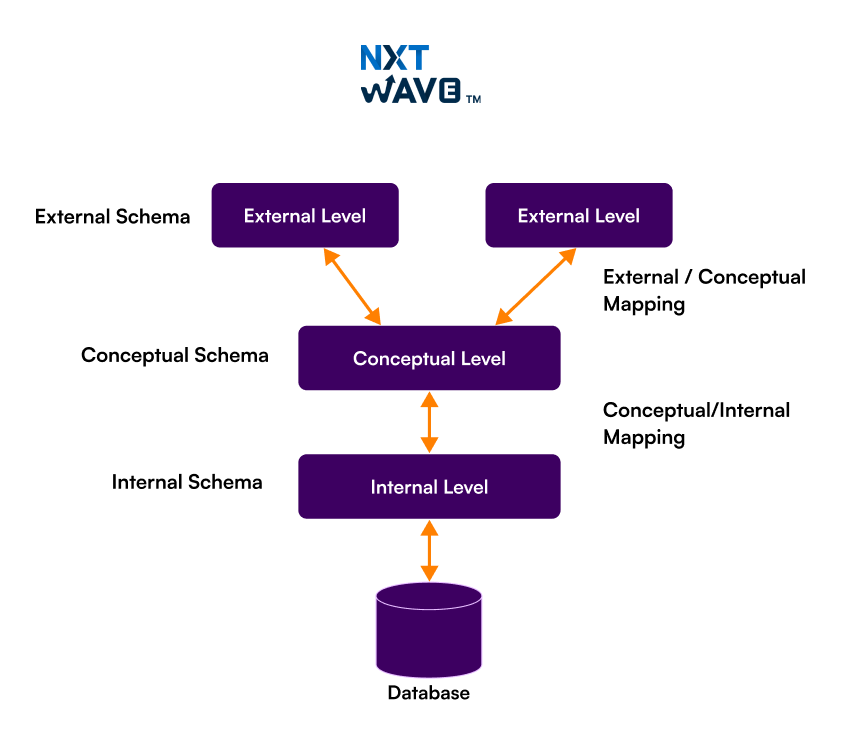
1. 1-Tier Architecture 
- is the simplest database architecture where all components—user interface, application logic, and database—reside on the same system.
> Local database programs

2. 2-tier architecture, the system is divided into:
- Client Tier (Front End)
- Database Tier (Back End)
- The client contains both:
    - User Interface
    - Business logic
- The server contains:
    - Database and data management logic
```yml
+--------------------+        SQL Queries       +--------------------+
|   Client (UI +     | <---------------------> |   Database Server   |
|   Business Logic)  |                          |   (DBMS)           |
+--------------------+                          +--------------------+
```
> Desktop applications connected directly to a database

3. 3-Tier Arch :
- 3-Tier Architecture is a **software architecture** pattern that divides an application into three separate layers:
    - Presentation Layer (UI)
    - Application / Business Logic Layer
    - Data (Database) Layer
- Each layer has a specific responsibility and communicates with the adjacent layer only.
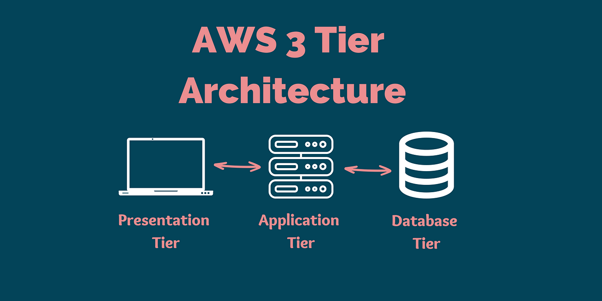


| Feature     | 1-Tier          | 2-Tier     | 3-Tier         |
| ----------- | --------------- | ---------- | -------------- |
| Layers      | 1               | 2          | 3              |
| Client      | UI + Logic + DB | UI + Logic | UI only        |
| Server      | —               | Database   | App + Database |
| Security    | Low             | Medium     | High           |
| Scalability | Low             | Medium     | High           |

## SCHEMA :
- In DBMS, a schema is the logical structure or blueprint of a database.
- It defines how data is organized, including tables, fields, relationships, constraints, and data types—but not the actual data.

### 🔹 Types of Schema in DBMS (Three-Schema Architecture)
1. 1️⃣ External Schema (View Level)
- User-specific view of the database
📌 Example:
- Student sees marks
- Admin sees all records

2. 2️⃣ Conceptual Schema (Logical Level)
- Overall logical structure of the database
- Describes entities, relationships, constraints
- Independent of physical storage
STUDENT(StudentID, Name, DeptID)
DEPARTMENT(DeptID, DeptName)

3. 3️⃣ Internal Schema (Physical Level)
- Describes how data is physically stored
- Indexing, file structure, storage format
- 📌 Example:
    - B+ trees
    - Hashing
    - Disk blocks.

## DATA MODELS :
A Data Model is a conceptual framework that defines how data is structured, stored, related, and manipulated in a database.
- 🔹 Common Data Models in DBMS
| Data Model                         | Description                 |
| ---------------------------------- | --------------------------- |
| **Hierarchical Model**             | Tree structure              |
| **Network Model**                  | Graph structure             |
| **Relational Model**               | Tables (most used)          |
| **Entity-Relationship (ER) Model** | Entities & relationships    |
| **Object-Oriented Model**          | Objects & classes           |
| **NoSQL Models**                   | Key-Value, Document, Column |

1. **ER MODEL** :
- The ER Model is a conceptual data model used in database design to visually represent:
    - Data (Entities)
    - Relationships between data
    - Attributes of data
- It helps in designing the database structure before converting it into tables.

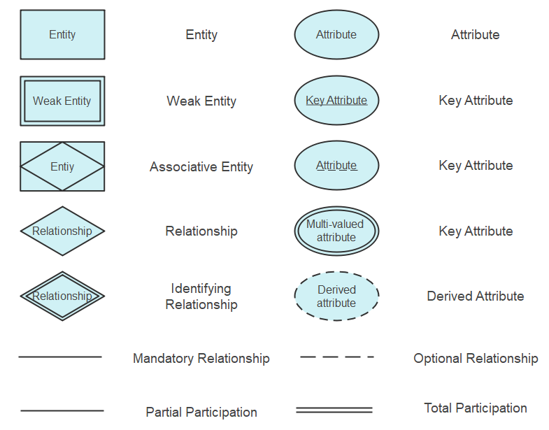
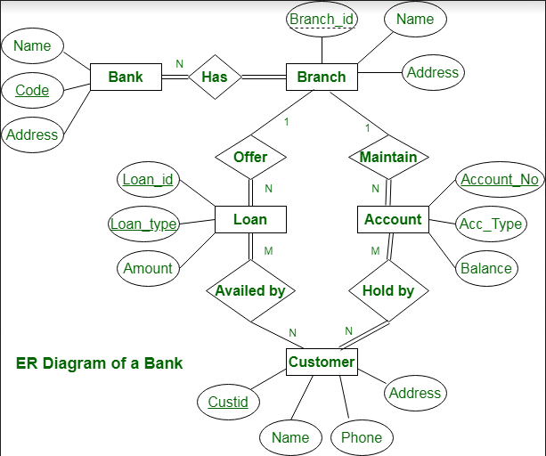
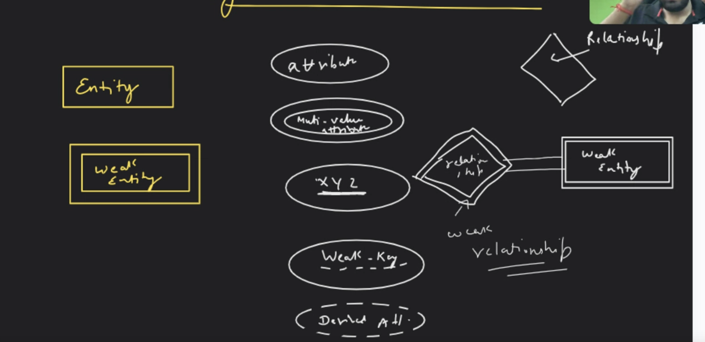
| **Concept**                  | **Description**                              | **Symbol / Representation** | **Example**            |
| ---------------------------- | -------------------------------------------- | --------------------------- | ---------------------- |
| **ER Model**                 | Conceptual model used to design databases    | ER Diagram (ERD)            | Student–Course system  |
| **Entity**                   | Real-world object with independent existence | Rectangle                   | Student, Course        |
| **Strong Entity**            | Entity with its own primary key              | Single rectangle            | Student                |
| **Weak Entity**              | Depends on another entity for identification | Double rectangle            | Dependent              |
| **Attribute**                | Property of an entity                        | Oval                        | Name, Age              |
| **Key Attribute**            | Uniquely identifies entity                   | Underlined oval             | Roll_No                |
| **Composite Attribute**      | Attribute made of sub-attributes             | Oval with branches          | Name → First, Last     |
| **Simple Attribute**         | Cannot be divided                            | Single oval                 | Age                    |
| **Multivalued Attribute**    | Can have multiple values                     | Double oval                 | Phone_No               |
| **Derived Attribute**        | Calculated from another attribute            | Dashed oval                 | Age (from DOB)         |
| **Relationship**             | Association between entities                 | Diamond                     | Enrolls                |
| **Relationship Attribute**   | Attribute of a relationship                  | Oval connected to diamond   | Grade                  |
| **Degree of Relationship**   | Number of entities involved                  | Unary/Binary/Ternary        | Student enrolls Course |
| **Cardinality**              | Number of entity occurrences                 | 1:1, 1:N, M:N               | Student–Course (M:N)   |
| **Participation Constraint** | Whether participation is mandatory           | Single/Double line          | Total participation    |
| **Primary Key**              | Uniquely identifies record                   | Underlined                  | Student_ID             |
| **Foreign Key**              | Refers to primary key of another table       | Normal attribute            | Course_ID              |
| **Generalization**           | Bottom-up abstraction                        | Triangle                    | Vehicle → Car          |
| **Specialization**           | Top-down abstraction                         | Triangle                    | Employee → Manager     |
| **Aggregation**              | Relationship treated as entity               | Box around relationship     | Project assignment     |

- Entity → a real-world object => a Table in DB , Similarly a attribute is a column
- Entity Set → a group of similar entities

1. Generalization :
> Generalization is the process of forming a generalized entity from multiple lower-level entities by extracting their common attributes.
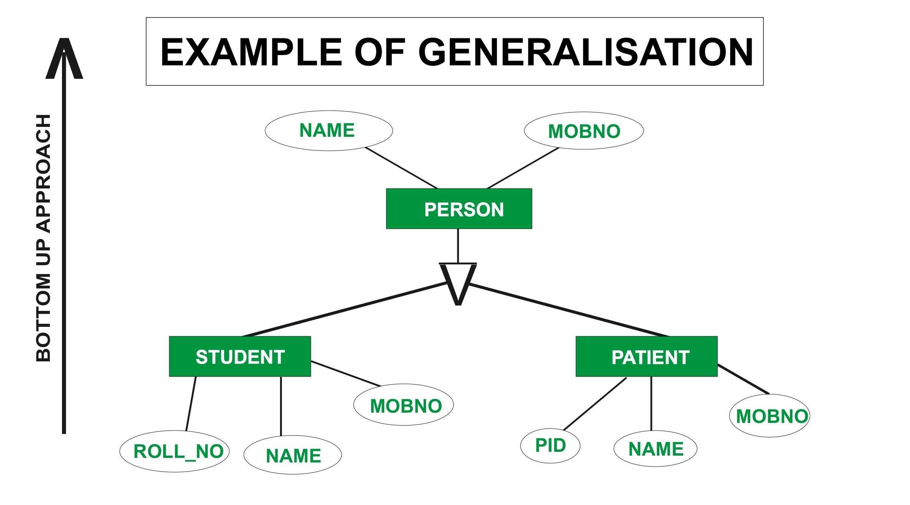
- name and number is common to every person whatever proffesion.
2. Specialization :
- Specialization in DBMS is a top-down approach where a higher-level entity is divided into lower-level entities (subclasses) based on distinct characteristics.
> Specialization is the process of dividing a super entity into one or more sub-entities based on specific attributes.

| Feature  | Specialization            | Generalization            |
| -------- | ------------------------- | ------------------------- |
| Approach | Top-down                  | Bottom-up                 |
| Action   | Divide entity             | Combine entities          |
| Focus    | Differences               | Similarities              |
| Example  | Person → Student, Teacher | Student, Teacher → Person |

3. Aggregation : 
- Aggregation is a concept in ER modeling where a relationship between entities is treated as a single entity, allowing relationships between relationships.
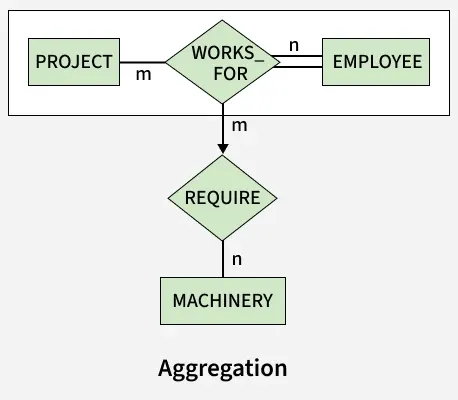
> relation between relations.
| Feature  | Aggregation             | Generalization   | Specialization |
| -------- | ----------------------- | ---------------- | -------------- |
| Purpose  | Relationship as entity  | Combine entities | Divide entity  |
| Approach | Abstraction             | Bottom-up        | Top-down       |
| Uses ISA | ❌ No                    | ✅ Yes            | ✅ Yes          |
| Solves   | Relationship limitation | Redundancy       | Null values    |
- 
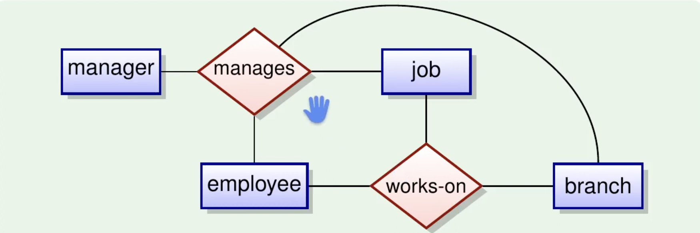
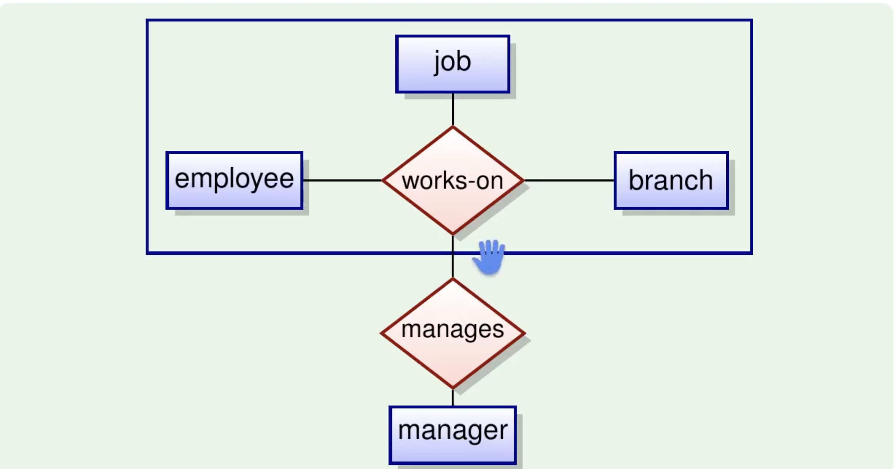

## 📘 Database Languages (DBMS) (DMTC)
- Database languages are a set of commands and rules used to create, manage, access, secure, and control data stored in a database.
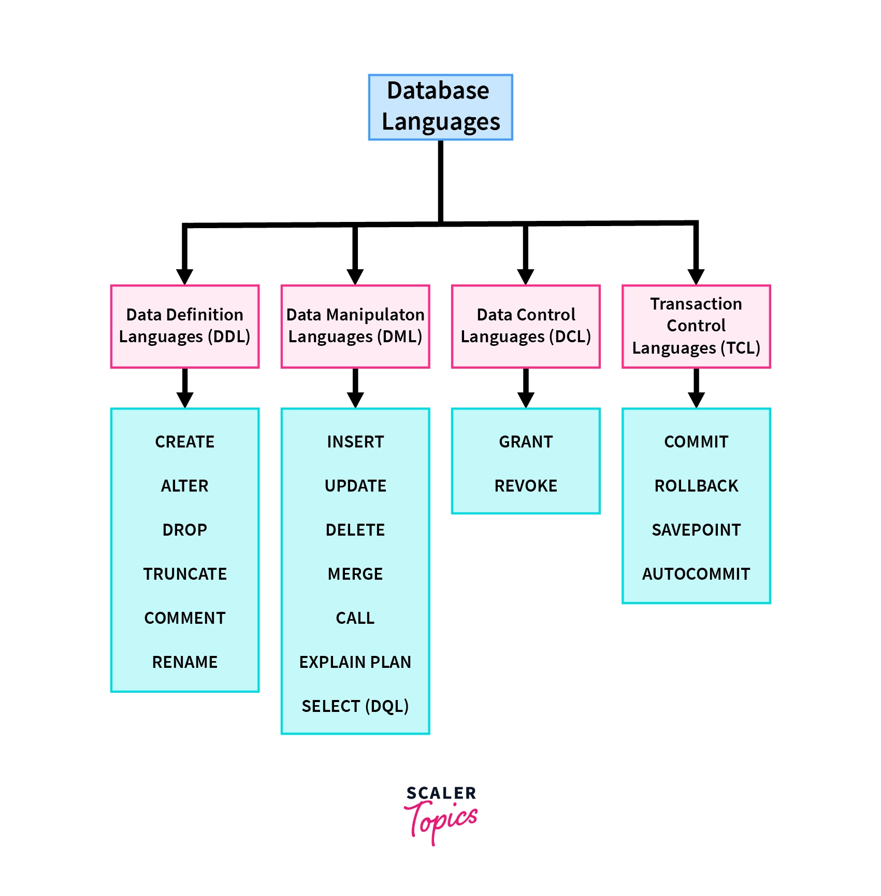

1. DDL or DATA DEFITION LANGUAGE : 
- Used to define and modify the database structure (schema).
- 📌 Commands:
    - CREATE
    - ALTER
    - DROP
    - **TRUNCATE**
    - RENAME

2. DATA MANUPLITION LANGUAGE
- Used to insert, update, delete, and retrieve data.
    - INSERT
    - UPDATE
    - DELETE
    - SELECT

3. DATA CONTROL LANGUAGE 
- Used to control access and permissions.
    - GRANT
    - REVOKE

4. TRANSACTION CONTROL LANGUAGE 
    - COMMIT
    - ROLLBACK
    - SAVEPOINT

2. **RELATIONAL MODEL**
The Relational Model is a data model in which data is organized into tables (relations) consisting of rows (tuples) and columns (attributes).
- 
| Term            | Meaning               |
| --------------- | --------------------- |
| Relation        | Table                 |
| Tuple           | Row                   |
| Attribute       | Column                |
| Degree          | Number of attributes  |
| Cardinality     | Number of tuples      |
| Domain          | Set of valid values   |
| Relation Schema | Structure of relation |

### 🔹 Keys in Relational Model
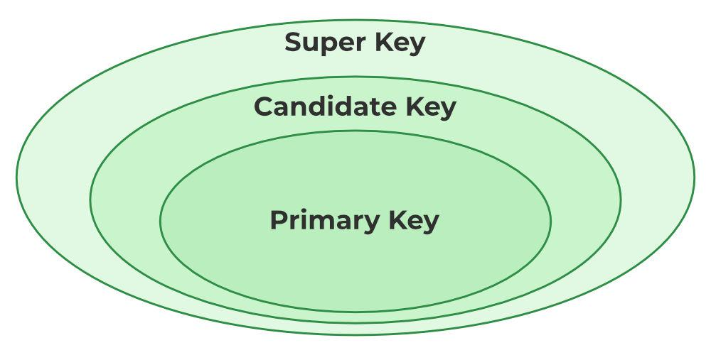
- EXAMPLE :
- **TABLE OF ID , NAME , AADHAR , PHONE** 

1. 🔑 Primary Key
- Uniquely identifies each tuple
- Cannot be NULL
- 📌 Example: StudentID

2. 🔑 Foreign Key
- Refers to primary key of another table
- Creates relationship between tables
- A Foreign Key is a column (or group of columns) in a table that refers to the Primary Key of another table.
- It is used to maintain referential integrity between two tables.
- 🔹 **Referential Integrity** Rules
    - You cannot insert a foreign key value that doesn’t exist in parent table
    - You cannot delete a parent row if it is referenced (unless CASCADE is used)
- Other Keys
    - Candidate Key
    - Super Key
    - Composite Key
    - Alternate Key
- EXAMPLE :
    - A STUDENT TABLE HAS A MENTOR FIELD WHICH IS MENTORID OF PROFFESOR .

| Feature          | Primary Key      | Foreign Key           |
| ---------------- | ---------------- | --------------------- |
| Uniqueness       | Yes              | No                    |
| NULL allowed     | No               | Yes                   |
| Identifies row   | Yes              | No                    |
| Number per table | One              | Multiple              |
| Purpose          | Entity integrity | Referential integrity |

3. A Super Key 
- is any set of one or more attributes that can uniquely identify a tuple in a relation.
📌 Example:
> STUDENT(StudentID, Email, Name)
- Possible super keys:
    - {StudentID}
    - {Email}
    - {StudentID, Name}
    - {Email, Name}
✔ May contain extra attributes
✔ Guarantees uniqueness

4. 2️⃣ Candidate Key
- A Candidate Key is a minimal super key — meaning no unnecessary attribute is present.
- 📌 From the previous example:
    - {StudentID} ✅
    - {Email} ✅
- ❌ {StudentID, Name} (not minimal)
- 
✔ Multiple candidate keys can exist
✔ One of them becomes the Primary Key
> In DBMS, a Non-Prime Attribute is an attribute that does not belong to any candidate key of a relation.

5. 4️⃣ Alternate Key
- All candidate keys not selected as the primary key are called Alternate Keys.
- Candidate Keys: {StudentID}, {Email}
- Primary Key: {StudentID}
- Alternate Key: {Email}
✔ Still enforces uniqueness

6. 5️⃣ Composite Key
- A Composite Key is a key formed using more than one attribute to uniquely identify a tuple.
- A Composite Key is a type of super key that consists of more than one attribute, and all attributes together are required to uniquely identify a record.
> ➡️ No single attribute alone can uniquely identify the tuple.
- Neither StudentID nor CourseID alone is unique
- Together, they uniquely identify a record
✔ Common in many-to-many relationships
- Example :
    - Friend-Requests : sendBy and To will be Forieign keys 
- ✔ Every Composite Key is a Super Key
- ❌ But not every Super Key is a Composite Key

| Key Type      | Uniqueness | Minimal | NULL Allowed |
| ------------- | ---------- | ------- | ------------ |
| Super Key     | Yes        | ❌       | No           |
| Candidate Key | Yes        | ✅       | No           |
| Primary Key   | Yes        | ✅       | No           |
| Alternate Key | Yes        | ✅       | No           |
| Composite Key | Yes        | Depends | No           |
| Foreign Key   | No         | —       | Yes          |

## Integrity Constraints 
- are rules enforced on a database to ensure that the data stored is accurate, valid, and consistent throughout its lifecycle.
    - Domain Constraint: Limits attribute values to a valid range
    - Entity Integrity: Primary key cannot be NULL
    - Referential Integrity: Foreign key must reference a valid primary key
    - Key Constraint: Ensures uniqueness
- 
| Aspect   | Key Constraints             | Referential Constraints |
| -------- | --------------------------- | ----------------------- |
| Scope    | Within one table            | Between two tables      |
| Purpose  | Uniqueness & identification | Relationship integrity  |
| Uses     | Primary, Unique keys        | Foreign keys            |
| Prevents | Duplicate records           | Orphan records          |

## ER TO RELATIONAL MODEL :
| ER Component          | Relational Mapping |
| --------------------- | ------------------ |
| Strong Entity         | Table              |
| Weak Entity           | Table + FK         |
| Simple Attribute      | Column             |
| Multivalued Attribute | Separate table     |
| 1:1 Relationship      | FK in one table    |
| 1:N Relationship      | FK in N-side       |
| M:N Relationship      | New table          |
| Derived Attribute     | Not stored         |

- if only Composite Attribute => same table 2 colums . eg : firstname and lastname .

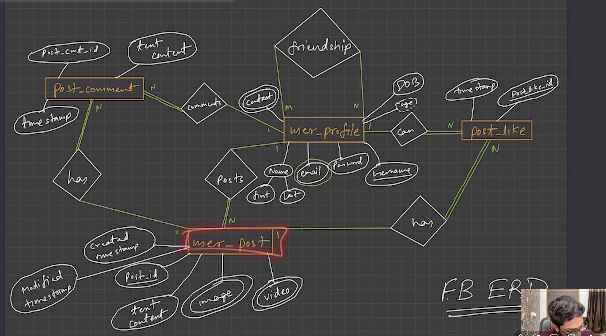
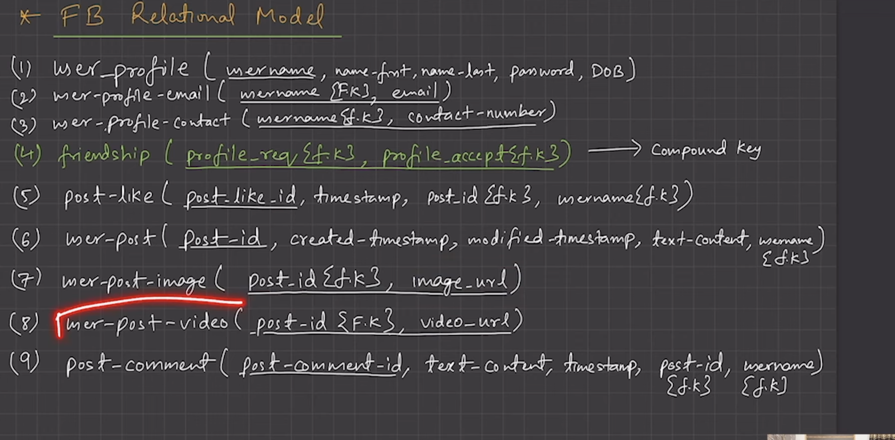

## 🔹 Levels of Abstraction in DBMS
- DBMS uses 3 levels of abstraction:
1. 1️⃣ Physical Level (Lowest Level)
- 📌 What it shows:
    - How data is actually stored in memory (disk, blocks, files, indexes)
    - 📌 Handled by: DBMS internal system
    - 📌 Hidden from users
- Example:
    - Data stored in B-trees
    - Indexing methods
    - File organization
- ➡️ User does not know how data is stored internally.
> Data stored in B+ Trees, blocks, pages on disk

2. 2️⃣ Logical Level (Conceptual Level)
- 📌 What it shows:
    - What data is stored and how it is logically related
- 📌 Describes:
    - Tables
    - Attributes
    - Relationships
    - Constraints
> STUDENT(StudentID, Name, Course, Marks)

3. 3️⃣ View Level (Highest Level)
- 📌 What it shows:
    - Only the required data to the user
    - 📌 Each user sees a customized view
- Example:
    - Student sees → Name, Marks
    - Admin sees → All details
    - Teacher sees → Roll No, Attendance
```sql
CREATE VIEW StudentView AS
SELECT Name, Course FROM Student;
```

