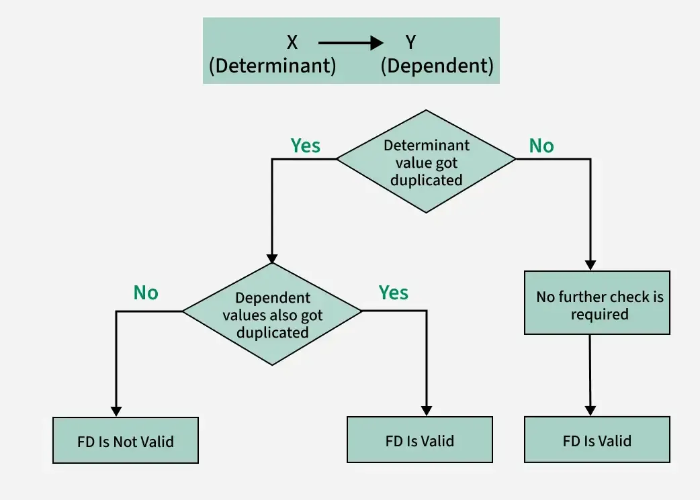
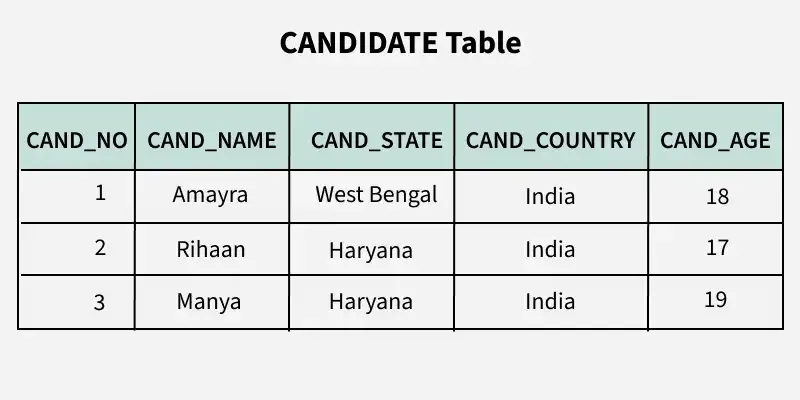
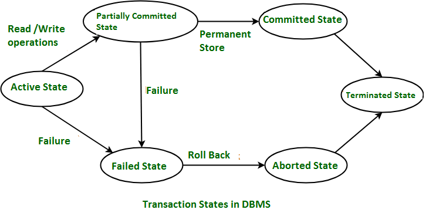
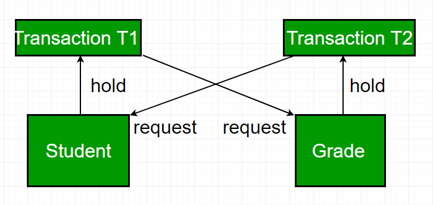

## Functional Dependency (FD) in DBMS

- In a relational database, a Functional Dependency (FD) describes a relationship between two sets of attributes in a table.
X→Y
- Here, X is the determinant and Y is the dependent.
> If two rows have the same value for attribute set X, then they must have the same value for attribute set Y.

### Types of Functional Dependencies
1. Trivial FD
X→Y where 
> Y⊆X
- Example: {RollNo, Name} → Name

2. Non-Trivial FD
> Y⊈X
- Example: RollNo → Name

3. Fully Functional Dependency
> Y depends on entire X (not a subset)
- Example: {StudentID, CourseID} → Grade

4. Partial Dependency
> Y depends on part of a composite key
- Example: {StudentID, CourseID} → StudentName
(depends only on StudentID)

5. Transitive Dependency
> If A → B and B → C, then A → C
- Example: RollNo → Dept and Dept → DeptHead

## NORMALISATION : 
- Normalization is the process of organizing data in a database to:
    - reduce data redundancy
    - eliminate anomalies (insertion, deletion, update)
    - ensure data integrity
- It is based on functional dependencies.

### Anomalies in DBMS
- Anomalies in a database are problems or inconsistencies that occur when a database is poorly designed or not normalized.
- They mainly arise due to data redundancy.

| Id    | Name    | Marks| Credits| Branch | Building | DeptHead    |
| ----- | ------- | ---- | ------ | ------ | -------- | --------    |
| 1     | Akash   | 90   | 9      | CSE    | B1       | Dr. Sharma  |
| 2     | Ravi    | 80   | 8      | ECE    | B2       | Dr. Rao     |
| 3     | Neha    | 34   | 4      | EE     | B3       | Dr. Shah    |

> WE SEE DATA REDUNDUNCY ALSO HERE BETWEEN BRANCH AND BUILDING.

#### Types of Anomalies
1. 1️⃣ Insertion Anomaly
- Problem: Cannot insert data without inserting unrelated data.
- 🔹 Example:
- FOR THIS DB OF COLLEGE WE CANT INSERT NEW BRANCH AND BUILDING AS WE NEED TO ADD STUDENTS FIRST.

2. 2️⃣ Deletion Anomaly
- Problem: Deleting a record unintentionally removes important data.
- EXAMPLE 
- If you delete Neha’s record, you also lose:
EE → Dr. Shah 

3. 3️⃣ Update (Modification) Anomaly
- Problem: Updating data in one place but not all causes inconsistency.
- 🔹 Example:
If Dr. Rao changes to Dr. Mehta, you must update multiple rows.
If one row is missed → inconsistent database.

### Why Anomalies Occur?
- Data redundancy
- Poor database design
- Table not normalized
- Mixing multiple entities in one table

### How to Remove Anomalies?
Solution → Normalization

### Anomalies vs Normal Forms
| Anomaly Type | Removed By |
| ------------ | ---------- |
| Insertion    | 2NF        |
| Deletion     | 3NF        |
| Update       | 3NF / BCNF |

## NORMALIZATION FORMS:

1. 🔹 First Normal Form (1NF)
> All attributes must have atomic (indivisible) values
- No repeating groups or multivalued attributes
- 
| RollNo | Name  | Subjects |
| ------ | ----- | -------- |
| 1      | Akash | DBMS, OS |
❌ Not in 1NF
- 
| RollNo | Name  | Subject |
| ------ | ----- | ------- |
| 1      | Akash | DBMS    |
| 1      | Akash | OS      |
✅ In 1NF

2. 🔹 Second Normal Form (2NF)
- Table must be in 1NF
> No partial dependency
(Non-prime attribute should depend on the whole primary key)
OR 
- non-key attribute depends on the entire composite primary key, not just part of it.
- 
| First Name    | Last Name  | Caste    |
| ------        | -----      | -------  |
| Akash Ahmad   | Malik      | Malik    |
| Rao Sahab     | Meer       | Meer     |
| Akash Ahmad   | Sharma     | Sharma   |

❌ Not in 2NF
- Caste(Non Prime) depends doesnt depend only on whole prime key (First Name + Last Name ) . It depends on Last Name only also.
OR 
- 
| EmpID | ProjectID | EmpName | ProjectName |
| ----- | --------- | ------- | ----------- |
| E01   | P101      | Akash   | Payroll     |
| E01   | P102      | Akash   | Attendance  |
| E02   | P101      | Rahul   | Payroll     |
- 
- PRIMARY KEY = EmpID + ProjectID
- FDs are :
    - EmpID -> EmpName
    - ProjectID -> ProjectName
- ❌ Step 4: Why this violates 2NF
    - EmpName depends only on EmpID (part of the key)
    - ProjectName depends only on ProjectID (part of the key)
    - Non-prime attributes depend on partial key
    - 👉 Partial Dependency exists → NOT in 2NF

3. 🔹 Third Normal Form (3NF)
- Table must be in 2NF
> No transitive dependency
- no non-key attribute should depend on another non-key attribute. Instead, all non-key attributes should depend directly on the primary key.
- EXAMPLE :
    - A -> B (A determines B)
    - B -> C (B determines C)

- CAND_NO → CAND_STATE
- CAND_STATE → CAND_COUNTRY

## 🔹 Boyce–Codd Normal Form (BCNF)
- Stronger than 3NF
> For every FD X → Y, X must be a super key
- super key is any set of one or more attributes that can uniquely identify a tuple in a relation.

## Transaction in DBMS
- A transaction is a sequence of database operations (read/write) that is treated as one single logical unit of work.
- It must be completed entirely or not executed at all.
> A transaction = all operations succeed → COMMIT, otherwise → ROLLBACK

### ACID Properties of Transaction
1. 🔹 Atomicity (all or nothing)
- Transaction is all or nothing
- Partial execution is not allowed
- SHADOW COPY : Pointer to the original is pointed to updated shadow(buffer) copy and shadow copy is deleted .

2. 🔹 Consistency
- Database moves from one valid state to another , BUT DB MUST BE CONSISTENT .
EXAMPLE :
- IF A TRANSFER IS HAPPENED , TOTAL AMOUNT OF MONEY WILL BE SAME AS TOTAL ADDED UPTO NOW .
A = A − 1000
B = B + 1000
==> OVERALL 0.

3. 🔹 Isolation
- Concurrent transactions do not interfere
- Intermediate results are hidden
> It ensures that the result of concurrent transactions is the same as if they were run one after another.
> Strong isolation means a transaction is executed as if it were the only transaction in the system, even though many transactions may run concurrently.
- 👉 In practice, strong isolation = Serializable isolation level.

4. 🔹 Durability
- Once committed, data remains permanent
- Even after system crash

###  Commit & Rollback
- COMMIT → Permanently saves changes
- ROLLBACK → Undoes changes since last commit

## TRANSACTION STATES :

1. 1️⃣ Active
- Transaction has started execution
- Read/write operations are being performed
- 📌 Example:
> UPDATE account SET balance = balance - 500

2. 2️⃣ Partially Committed
- Last statement executed
- Changes are not yet written permanently to the database
- ⚠️ Failure here → rollback required
> IN BUFFER FOR NOW .

3. 3️⃣ Committed
- Transaction completed successfully
- Changes are permanently saved to disk
- ✔️ Cannot be undone
- ✔️ Ensures Durability

4. 4️⃣ Failed
- Transaction cannot proceed
- Caused by:
    - System crash
    - Logical error
    - Deadlock
    - Constraint violation

5. 5️⃣ Aborted (Rolled Back)
- All changes made by the transaction are undone
- Database restored to previous consistent state
- 🔁 Transaction may be restarted or terminated

6. 6️⃣ Terminated
- Transaction leaves the system
- Resources (locks, memory) are released

## Concurrency in DBMS
- Concurrency in DBMS means multiple transactions executing at the same time while accessing a shared database.
> Increase performance and throughput without breaking data consistency.

### 🔄 Why Concurrency is Needed
- Multiple users access the DB simultaneously
- Better CPU & I/O utilization
- Faster response time
- High throughput systems (banks, e-commerce, social apps)

### ⚠️ Problems Caused by Concurrency
- If not controlled, concurrency can cause anomalies:
- 
| Problem             | Meaning                           |
| ------------------- | --------------------------------- |
| Lost Update         | One update overwrites another     |
| Dirty Read          | Reading uncommitted data          |
| Non-Repeatable Read | Same read gives different values  |
| Phantom Read        | New rows appear on re-read        |
| Race Condition      | Result depends on execution order |

### 📋 Transaction Schedules
- Serial Schedule → Transactions execute one by one (safe, slow)
- Concurrent Schedule → Transactions interleave (fast, risky)
    - ✔ A concurrent schedule is correct if it is serializable.

## DEADLOCK :
A deadlock occurs when two or more transactions wait indefinitely for each other to release locks, so none of them can proceed.

> 👉 Each transaction holds a resource and waits for another resource held by someone else.
- 🔁 Simple Example
    - T1 holds lock on Row A and waits for Row B
    - T2 holds lock on Row B and waits for Row A
- 🔒 Both wait forever → DEADLOCK

### 🧠 Necessary Conditions for Deadlock (Coffman Conditions)
- All four must be true for a deadlock to occur:
1. Mutual Exclusion
Resource can be held by only one transaction at a time.

2. Hold and Wait
Transaction holds one resource while waiting for another.

3. No Preemption
Resource cannot be forcibly taken away.

4. Circular Wait
Circular chain of transactions waiting for resources.

- 📌 Break any one → deadlock prevented.

## 🛠 Deadlock Prevention Techniques
1. 1️⃣ Eliminate Hold and Wait
- Transaction must request all required locks at once
- If any lock is unavailable → transaction waits without holding any lock
    - ✔ Simple
    - ❌ Poor resource utilization

2. 2️⃣ Allow Preemption
- If a transaction cannot get a lock, release its held locks
- Transaction is rolled back and restarted later
    - ✔ Prevents deadlock
    - ❌ Increased rollbacks

3. 3️⃣ Resource Ordering
- Assign a global order to data items
- Transactions must request locks in ascending order only
    - ✔ Prevents circular wait
    - ✔ Very effective

4. 4️⃣ Timestamp-Based Prevention
    1. 🔹 Wait–Die Scheme (Non - PreEmptive)
    - Older transaction waits
    - Younger transaction is aborted (dies)
    - 🧪 Example (Wait–Die)
        - T1 (older) requests resource held by T2 (younger) → T1 waits
        - T2 requests resource held by T1 → T2 is aborted

    2. 🔹 Wound–Wait Scheme (PreEmptive)
    - Older transaction aborts (wounds) younger one
    - Younger waits for older

- ✔ Prevents circular wait
- ✔ Common in DBMS

