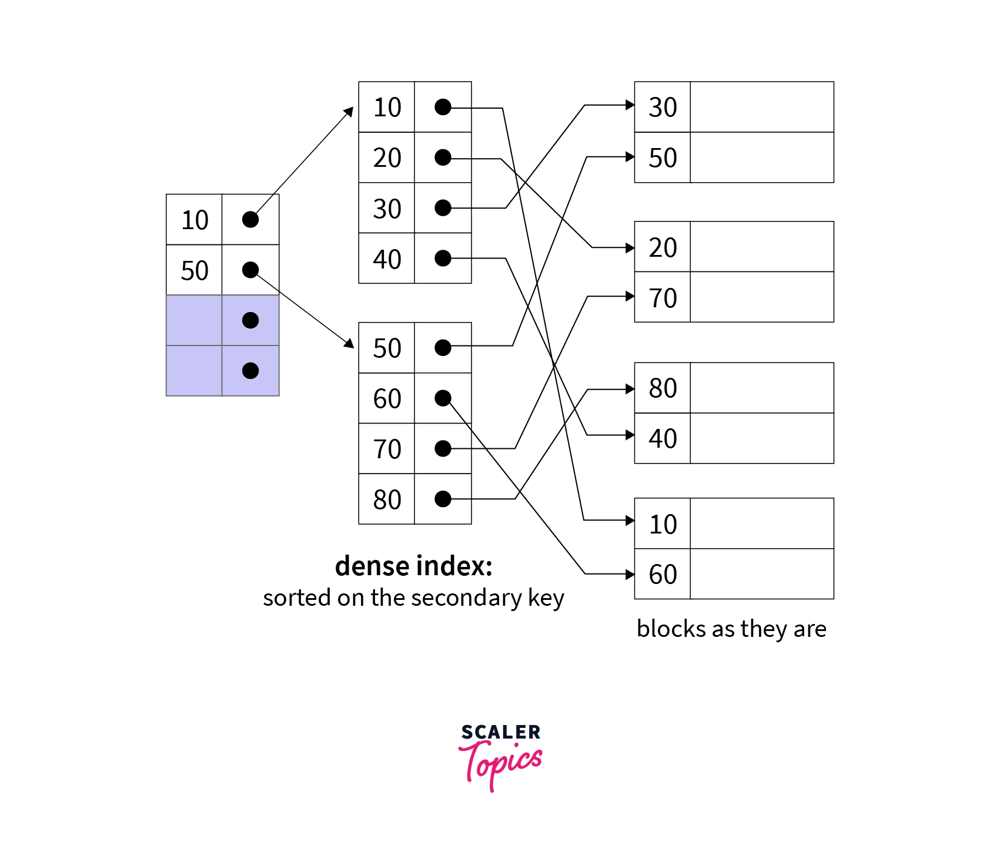

## Partitioning
- Partitioning is the technique of dividing a large database table into smaller, manageable pieces called partitions, while logically treating them as one single table.

### 🔍 Why Partitioning is Used
- Faster query performance (scan only required partitions)
- Better I/O and memory utilization
- Easy data management (backup, delete, archive)
- Supports very large tables (VLDBs)

## 1️⃣ Single-Level Partitioning (HLR)
- In single-level partitioning, a table is partitioned using only one partitioning method on one attribute.
- 👉 There is only one layer of partitioning.

### 🔹 Common Single-Level Types
1. Range partitioning
- In range partitioning, rows are placed into partitions based on a continuous range of values of a partition key. 
- EXAMPLE:
| Partition | Condition                |
| --------- | ------------------------ |
| P1        | order_date < 2024        |
| P2        | 2024 ≤ order_date < 2025 |
| P3        | order_date ≥ 2025        |

2. Hash partitioning :
- In hash partitioning, a hash function is applied to the partition key, and the result decides the partition.
- 🔹 Example
- Partition EMPLOYEE table using emp_id:
- hash(emp_id) % 4
| emp_id | Partition |
| ------ | --------- |
| 101    | P1        |
| 102    | P2        |
| 103    | P3        |
| 104    | P4        |
| 105    | P1        |

3. List partitioning : 
- EXAMPLE :
    - Country based Partioning.
- 
| Partition | Departments |
| --------- | ----------- |
| P1        | CSE, IT     |
| P2        | ECE, EE     |
| P3        | ME          |

## 2️⃣ Composite-Level Partitioning
- In composite-level partitioning, a table is partitioned using more than one partitioning method, applied in multiple levels.
- 👉 One partition is further sub-partitioned.

1. 2️⃣ Range–List Partitioning
SALES
 ├── 2024
 │    ├── North, East
 │    └── South, West
 └── 2025
      ├── North, East
      └── South, West

2. 3️⃣ List–Hash Partitioning
STUDENT
 ├── CSE
 │    ├── H1 (hash(roll_no))
 │    └── H2
 ├── ECE
 │    ├── H1
 │    └── H2

3. 1️⃣ Range–Hash
ORDERS
 ├── <2024
 │    ├── H1 (hash(roll_no))
 │    └── H2
 ├── >=2024 & <=2025
 │    ├── H1
 │    └── H2
 ├── >2025
 │    ├── H1
 │    ├── H2

4. 4️⃣ Hash–Range
LOGS
 ├── H1 (hash(user_id))
 │    ├── 2024
 │    └── 2025
 └── H2
      ├── 2024
      └── 2025

## SHARDING:
- Sharding is a *horizontal scaling* technique where a large database is split across multiple servers (nodes).
- Each shard holds a subset of rows, and together all shards form the complete database.
- 👉 Think of it as **partitioning across machines**, *not just inside one database*.
- uses **SHARD KEY**.

### 🎯 Why Sharding is Used
- Handle huge datasets (millions/billions of rows)
- Support high traffic & concurrency
- Improve read/write throughput
- Avoid single-machine limits (CPU, RAM, disk)
> Sharding on SingleStore (formerly MemSQL)
- In SingleStore, sharding is native and automatic.
- Data is horizontally distributed across multiple leaf nodes, while aggregator nodes handle queries and routing

### 🧩 How Sharding Works
- Choose a shard key (e.g., user_id)
- Decide a sharding strategy
- Route queries to the correct shard

### 🔹 Types of Sharding
1. 1️⃣ Range-Based Sharding
- Data is split by ranges of shard key values.
- Example: Users by ID
    - Shard 1 → user_id 1–100000
    - Shard 2 → user_id 100001–200000
- ✔ Good for range queries
- ❌ Risk of hotspot (uneven load)

2. 2️⃣ Hash-Based Sharding (Most Common)
- Apply a hash function on shard key.

3. 3️⃣ Directory-Based Sharding
- A lookup table maps shard keys to shards.
| user_id | shard   |
| ------- | ------- |
| 101     | Shard A |
| 102     | Shard C |
- Flexible but ❌ Directory becomes a bottleneck

4. 4️⃣ Geo / Location-Based Sharding
- Data split by geographic region.
    - India users → India shard
    - US users → US shard
✔ Low latency
✔ Data locality

| Feature          | Partitioning   | Sharding         |
| ---------------- | -------------- | ---------------- |
| Location         | Same DB/server | Multiple servers |
| Purpose          | Manageability  | Scalability      |
| Network involved | ❌              | ✅               |
| Fault isolation  | ❌              | ✅               |
| Complexity       | Low            | High             |

> Sharding alonside Replication prevents Single Point of Failure (SPOF)

## 📌 What is Indexing?
- Indexing is a technique used to speed up data retrieval in a database by creating a separate data structure (index) on one or more columns.
- 👉 Just like a book index, it lets the DBMS find rows without scanning the entire table.
### 🔍 Why Indexing is Needed
- 
    - Faster SELECT queries
    - Efficient search, sort, and join
    - Reduces disk I/O
    - Improves overall query performance
- 📌 Without indexing → Full table scan

### 🧩 Types of Indexing
1. 1️⃣ Primary Index
- Created on primary key
- Values are unique
- Automatically created in many DBMSs
- 📌 Example: RollNo
    1. Dense Index
    - A dense index is an index in which every search key value in the data file has one corresponding index entry.
    - 👉 One row = one index entry.
    - Its in random-access memory => Reduces Disk Operations .
    - Each index entry stores:
        - Search key
        - Pointer(s) to the actual record(s)
        EXAMPLE :
            | RollNo | Name  |
            | ------ | ----- |
            | 101    | Akash |
            | 102    | Ravi  |
            | 103    | Neha  |

            | Index Key | Record Pointer |
            | --------- | -------------- |
            | 101       | → Row 1        |
            | 102       | → Row 2        |
            | 103       | → Row 3        |
        - 📌 When is Dense Index Used?
            - When data is not sorted
            - When fast lookups are required
            - In secondary (non-clustered) indexes
            - In B+ Tree leaf nodes
    
    2. Sparse Index?
    - A sparse index is an index that does NOT contain an entry for every record in the data file.
    - Instead, it stores index entries for only some search key values—usually one per data block.
    - 👉 One index entry → many records
    - EXAMPLE :
            | RollNo | Name  |
            | ------ | ----- |
            | 101    | Akash |
            | 102    | Ravi  |
            | 103    | Neha  |
            | 104    | Aman  |
            | 105    | Riya  |

            | Index Key | Points to |
            | --------- | --------- |
            | 101       | Block 1   |
            | 104       | Block 2   |
    - 📌 DBMS:
        - Finds nearest index key ≤ search key
        - Scans the data block sequentially
    - 📌 When is Sparse Index Used?
        - When table is large
        - When data is stored in sorted order
        - To save index storage space
        - In primary / clustered indexing

| Feature             | Dense Index   | Sparse Index |
| ------------------- | ------------- | ------------ |
| Index entries       | Every record  | Some records |
| Search speed        | Faster        | Slower       |
| Storage             | More          | Less         |
| Data order required | ❌ No          | ✅ Yes        |
| Usage               | Non-clustered | Clustered    |

2. Secondary Indexing:

- A secondary index is an index created on a non-primary key attribute to improve search performance on columns that are not used for physical ordering of the table.
- 👉 It is also called a Non-Clustered Index.
- Example
    - STUDENT table
    | RollNo (PK) | Name  | Dept |
    | ----------- | ----- | ---- |
    | 101         | Akash | CSE  |
    | 102         | Ravi  | ECE  |
    | 103         | Neha  | CSE  |
    - Secondary Index on Dept
    | Dept | Pointer(s) |
    | ---- | ---------- |
    | CSE  | → 101, 103 |
    | ECE  | → 102      |
    - 📌 Multiple rows can share the same index key value.
- 🧠 Key Characteristics
    - Built on non-primary attributes
    - Duplicate values allowed
    - Does not define physical order of data
    - Usually a dense index
    - Multiple secondary indexes can exist on one table
- 
| Feature         | Primary Index      | Secondary Index       |
| --------------- | ------------------ | --------------------- |
| Built on        | Primary key        | Non-primary key       |
| Duplicate keys  | ❌ Not allowed      | ✅ Allowed             |
| Data order      | Defines order      | No effect             |
| Count per table | One                | Many                  |
| Index type      | Sparse / clustered | Dense / non-clustered |

3. Clustered Index?
- A clustered index is an index that defines the physical order of data rows in a table.
- The table’s records are stored on disk in the same order as the clustered index key.
- 👉 Data is the index. (They are stored together)
- 
| EmpID | Name  |
| ----- | ----- |
| 101   | Akash |
| 102   | Ravi  |
| 103   | Neha  |
- Clustered index on EmpID
- Rows are physically sorted by EmpID

### Key Characteristics
- Only ONE clustered index per table
- Determines physical storage order
- Usually implemented as a sparse index
- Very fast for range queries
- Often created on primary key (but not mandatory)

### 🧩 How It Works
- Index entry points to the first record of a data block
- Remaining records in the block are sequential
- To find a record:
    - Search clustered index
    - Scan within the data block

| Feature          | Clustered Index       | Non-Clustered Index |
| ---------------- | --------------------- | ------------------- |
| Physical order   | Defines it            | Does not affect it  |
| Number per table | 1                     | Many                |
| Storage          | Data + index together | Separate structure  |
| Range queries    | Very fast             | Slower              |
| Space            | Less (often sparse)   | More (dense)        |

### ❌ Drawbacks
- Insert/update may be slower (reordering)
- Changing clustered key is expensive
- Only one clustered index allowed

