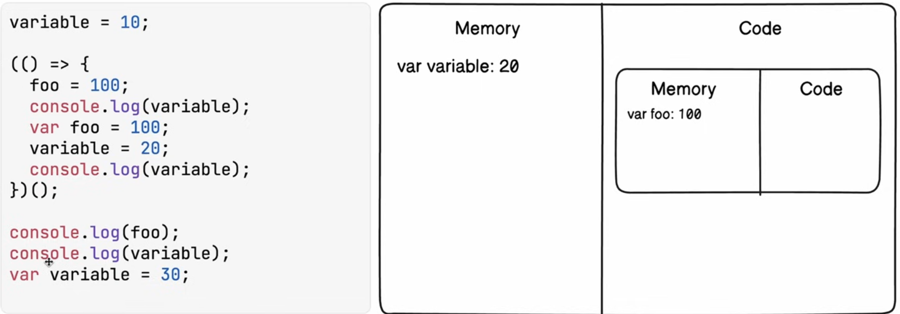

## IIFE : Immediate Involde fn execution


## 
```js
for(let i=0;i<10;i++){
    setTimeout(()=>{
        console.log(i)
    } , 0) 
}
```
> 0->9
- let' has local scope , it creates new var for every fn.

## 
```js
for(var i=0;i<10;i++){
    setTimeout(()=>{
        console.log(i)
    } , 0) 
}
```
- i' is shared by all . and all fn from call stack start poping i=10 tab tak.
> 10 10 times.

