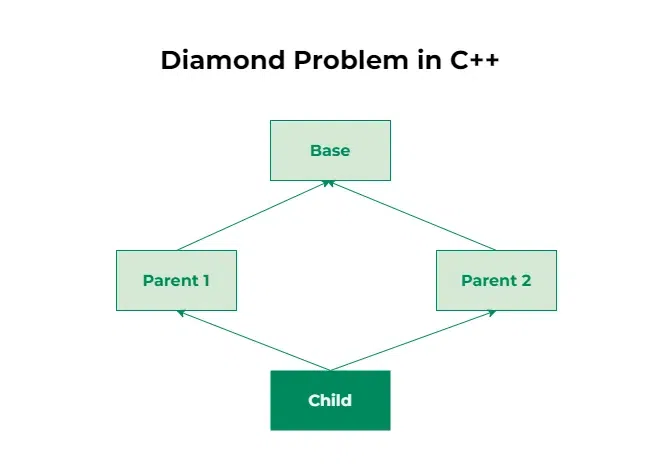

## Early Binding | Late Binding 
| Feature                | Early Binding | Late Binding    |
| ---------------------- | ------------- | --------------- |
| Binding time           | Compile time  | Runtime         |
| Speed                  | Faster        | Slightly slower |
| Uses virtual keyword   | ❌ No          | ✅ Yes           |
| Polymorphism           | ❌ No          | ✅ Yes           |
| Function call decision | Pointer type  | Object type     |


## A fully encapsulated class 
- is a class in which all data members are declared private and are accessed only through public methods (getters and setters).
```cpp
#include <iostream>
using namespace std;

class Student {
private:
    int rollNo;
    string name;

public:
    // Setter functions
    void setRollNo(int r) {
        rollNo = r;
    }

    void setName(string n) {
        name = n;
    }

    // Getter functions
    int getRollNo() {
        return rollNo;
    }

    string getName() {
        return name;
    }
};

int main() {
    Student s;
    s.setRollNo(101);
    s.setName("Akash");

    cout << s.getRollNo() << " " << s.getName();
}
```


## Diamond Problem


```cpp

// C++ Program to illustrate the diamond problem
#include <iostream>
using namespace std;

// Base class
class Base {
public:
    void fun() { cout << "Base" << endl; }
};

// Parent class 1
class Parent1 : public Base {
public:
};

// Parent class 2
class Parent2 : public Base {
public:
};

// Child class inheriting from both Parent1 and Parent2
class Child : public Parent1, public Parent2 {
};

int main()
{
    Child* obj = new Child();
    obj->fun(); // Abiguity arises, as Child now has two copies of fun()
    return 0;
}
```

### Solution to the Diamond Problem in C++
C++ addresses the Diamond Problem using virtual inheritance. Virtual inheritance ensures that there is only one instance of the common base class, eliminating the ambiguity.
```cpp
// C++ Program to illustrate the use of virtual inheritance
// to resolve the diamond problem in multiple inheritance
#include <iostream>
using namespace std;

// Base class
class Base {
public:
    void fun() { cout << "Base" << endl; }
};

// Parent class 1 with virtual inheritance
class Parent1 : virtual public Base {
public:
};

// Parent class 2 with virtual inheritance
class Parent2 : virtual public Base {
public:
};

// Child class inheriting from both Parent1 and Parent2
class Child : public Parent1, public Parent2 {
};

int main()
{
    Child* obj = new Child();
    obj->fun(); // No ambiguity due to virtual inheritance
    return 0;
}
```

## A static method (static member function) 
- is a function that belongs to the class rather than to any specific object of the class.
> In simple words: it can be called without creating an object

### 🔹 Key Characteristics
- Declared using the keyword static
- Can be called using class name
- Can access only static data members
- Does not have access to this pointer
```cpp
#include <iostream>
using namespace std;

class MathUtils {
public:
    static int add(int a, int b) {
        return a + b;
    }
};

int main() {
    cout << MathUtils::add(5, 3);  // 8
}
```
```cpp
class Counter {
public:
    static int count;

    static void increment() {
        count++;
    }
};

int Counter::count = 0;
```

## 🔹 Can a constructor be private?
> ✅ Yes, a constructor can be private.
- But it is used only in special design cases, not for normal object creation.

### 🧠 Why make a constructor private?
- A private constructor prevents objects from being created directly using new or stack allocation.
- Used when you want to:
1. Control object creation
2. Allow only one instance (Singleton)
3. Use factory methods
4. Prevent inheritance

## Singleton Class 
```cpp
#include <iostream>
using namespace std;

class Singleton {
private:
    static Singleton* instance;  // static pointer
    Singleton() {}               // private constructor

public:
    static Singleton* getInstance() {
        if (instance == nullptr) {
            instance = new Singleton();
        }
        return instance;
    }

    void show() {
        cout << "Singleton Object Created";
    }
};

// initialize static member
Singleton* Singleton::instance = nullptr;

int main() {
    Singleton* s1 = Singleton::getInstance();
    Singleton* s2 = Singleton::getInstance();

    s1->show();
    cout << endl;

    cout << s1 << endl;
    cout << s2 << endl;   // same address
}
```

## const
- The const keyword is used to declare that a value cannot be changed after initialization.
> In simple words: const makes things read-only

### 🔹 Why const is Used
- Prevents accidental modification
- Improves code safety
- Helps compiler optimize
- Makes code self-documenting

1. 1️⃣ const Data Members (Class Level)
```cpp
A const data member cannot be modified after initialization.
class Student {
    const int rollNo;

public:
    Student(int r) : rollNo(r) {}   // must use constructor
};
```

2. 2️⃣ const Member Functions (Very Important)
- A const member function guarantees it will not modify the object.
```cpp
class Account {
    double balance;

public:
    double getBalance() const {
        return balance;   // allowed
    }
};
```
> Applies to class methods

3. 3️⃣ const Objects
> A const object can call only const member functions
```cpp
const Account acc;
acc.getBalance();   // ✅ allowed
// acc.deposit(100); ❌ not allowed
```

4. 4️⃣ const with Function Parameters (OOP Style)
```cpp
void print(const Account& acc) {
    cout << acc.getBalance();
}
```

| Feature      | `const` Parameter   | `const` Member Function |
| ------------ | ------------------- | ----------------------- |
| Applies to   | Passed object       | Calling object          |
| Location     | Function parameter  | After function name     |
| Protects     | Argument            | Object state            |
| Who enforces | Compiler            | Compiler                |
| Typical use  | Safe object passing | Read-only methods       |

## 🔹 Types of Constructors in C++
- A constructor is a special member function of a class that is automatically called when an object is created.
- Its name is same as the class name and it has no return type.
1. 1️⃣ Default Constructor
class Test {
public:
    Test() {
        cout << "Default constructor called" << endl;
    }
};
✔ Called automatically when object is created
✔ If no constructor is written, compiler provides one

2. 2️⃣ Parameterized Constructor:
A constructor that accepts parameters to initialize data members.
class Test {
public:
    int x;
    Test(int a) {
        x = a;
    }
};

3. 3️⃣ Copy Constructor
Used to create a new object from an existing object.
```cpp
class Test {
public:
    int x;
    Test(int a) {
        x = a;
    }

    Test(const Test& t) { // PASS BY REFRENCE IS IMP ELSE INFINITE LOOP . 
        x = t.x;
    }
};
```
✔ Prevents shallow copy
✔ Important for dynamic memory

4. Private Constructor
- A constructor declared private to restrict object creation.
```cpp
class Test {
private:
    Test() {}

public:
    static Test create() {
        return Test();
    }
};
```
✔ Used in Singleton pattern
