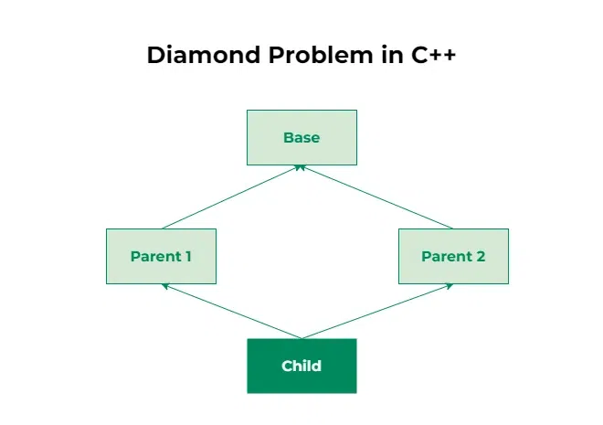

## Early Binding | Late Binding 
| Feature                | Early Binding | Late Binding    |
| ---------------------- | ------------- | --------------- |
| Binding time           | Compile time  | Runtime         |
| Speed                  | Faster        | Slightly slower |
| Uses virtual keyword   | ❌ No          | ✅ Yes           |
| Polymorphism           | ❌ No          | ✅ Yes           |
| Function call decision | Pointer type  | Object type     |


## A fully encapsulated class 
- is a class in which all data members are declared private and are accessed only through public methods (getters and setters).
```cpp
#include <iostream>
using namespace std;

class Student {
private:
    int rollNo;
    string name;

public:
    // Setter functions
    void setRollNo(int r) {
        rollNo = r;
    }

    void setName(string n) {
        name = n;
    }

    // Getter functions
    int getRollNo() {
        return rollNo;
    }

    string getName() {
        return name;
    }
};

int main() {
    Student s;
    s.setRollNo(101);
    s.setName("Akash");

    cout << s.getRollNo() << " " << s.getName();
}
```


## Diamond Problem

```cpp

// C++ Program to illustrate the diamond problem
#include <iostream>
using namespace std;

// Base class
class Base {
public:
    void fun() { cout << "Base" << endl; }
};

// Parent class 1
class Parent1 : public Base {
public:
};

// Parent class 2
class Parent2 : public Base {
public:
};

// Child class inheriting from both Parent1 and Parent2
class Child : public Parent1, public Parent2 {
};

int main()
{
    Child* obj = new Child();
    obj->fun(); // Abiguity arises, as Child now has two copies of fun()
    return 0;
}
```

### Solution to the Diamond Problem in C++
C++ addresses the Diamond Problem using virtual inheritance. Virtual inheritance ensures that there is only one instance of the common base class, eliminating the ambiguity.
```cpp
// C++ Program to illustrate the use of virtual inheritance
// to resolve the diamond problem in multiple inheritance
#include <iostream>
using namespace std;

// Base class
class Base {
public:
    void fun() { cout << "Base" << endl; }
};

// Parent class 1 with virtual inheritance
class Parent1 : virtual public Base {
public:
};

// Parent class 2 with virtual inheritance
class Parent2 : virtual public Base {
public:
};

// Child class inheriting from both Parent1 and Parent2
class Child : public Parent1, public Parent2 {
};

int main()
{
    Child* obj = new Child();
    obj->fun(); // No ambiguity due to virtual inheritance
    return 0;
}
```
### Memory layout of D (problematic):
1. Initial :
```yml
D
├── B
│   └── A::x
└── C
    └── A::x
2. Now: 

D
├── shared A::x   ✅ only ONE
├── B (ref → A)
└── C (ref → A)
```

## A static method (static member function) 
- is a function that belongs to the class rather than to any specific object of the class.
> In simple words: it can be called without creating an object

### 🔹 Key Characteristics
- Declared using the keyword static
- Can be called using class name
- Can access only `static` data members
- Does not have access to `this` pointer.
```cpp
#include <iostream>
using namespace std;

class MathUtils {
public:
    static int add(int a, int b) {
        return a + b;
    }
};

int main() {
    cout << MathUtils::add(5, 3);  // 8
}
```
```cpp
class Counter {
public:
    static int count;
    static void increment() {
        count++;
    }
};
int Counter::count = 0;
```
## 🔹 Can a constructor be private?
> ✅ Yes, a constructor can be private.
- But it is used only in special design cases, not for normal object creation.

### 🧠 Why make a constructor private?
- A private constructor prevents objects from being created directly using new or stack allocation.
- Used when you want to:
1. Control object creation
2. Allow only one instance (Singleton)
3. Use factory methods
4. Prevent inheritance

## Singleton Class 
- A Singleton class ensures that only one object (instance) of the class is created throughout the lifetime of the program, and provides a global access point to that instance.
- 🔹 Why do we need Singleton?
    - Shared resources (Logger, Configuration, Cache)
    - Database connection manager
    - Thread pool
    - Device driver access
- 👉 Prevents multiple conflicting instances
### 🔑 Core Rules of Singleton
- Private constructor → cannot create object directly
- Static instance → single shared object
- Public static method → access point
- **Disable copy & assignment**
```cpp
#include <iostream>
using namespace std;

class Singleton {
private:
    static Singleton* instance;  // static pointer
    Singleton() {}               // private constructor

public:
    static Singleton* getInstance() {
        if (instance == nullptr) {
            instance = new Singleton();
        }
        return instance;
    }

    // Disable copy
    Singleton(const Singleton&) = delete;
    Singleton& operator=(const Singleton&) = delete;

    void show() {
        cout << "Singleton Object Created";
    }
};

// initialize static member
Singleton* Singleton::instance = nullptr;

int main() {
    Singleton* s1 = Singleton::getInstance();
    Singleton* s2 = Singleton::getInstance();

    s1->show();
    cout << endl;

    cout << s1 << endl;
    cout << s2 << endl;   // same address
}
```
```c
class Singleton {
private:
    Singleton() {}

public:
    static Singleton& getInstance() {
        static Singleton instance; // created once
        return instance;
    }

    Singleton(const Singleton&) = delete;
    Singleton& operator=(const Singleton&) = delete;
};

- usage :

Singleton& s1 = Singleton::getInstance();
Singleton& s2 = Singleton::getInstance();

cout << (&s1 == &s2);  // true

```

## const
- The const keyword is used to declare that a value cannot be changed after initialization.
> In simple words: const makes things read-only

### 🔹 Why const is Used
- Prevents accidental modification
- Improves code safety
- Helps compiler optimize
- Makes code self-documenting

1. 1️⃣ const Data Members (Class Level)
```cpp
A const data member cannot be modified after initialization.
class Student {
    const int rollNo;

public:
    Student(int r) : rollNo(r) {}   // must use constructor
};
```

2. 2️⃣ const Member Functions (Very Important)
- A const member function guarantees it will not modify the object.
```cpp
class Account {
    double balance;

public:
    double getBalance() const {
        return balance;   // allowed
    }
};
```
> Applies to class methods

3. 3️⃣ const Objects
> A const object can call only const member functions.
```cpp
const Account acc;
acc.getBalance();   // ✅ allowed
// acc.deposit(100); ❌ not allowed
```

4. 4️⃣ const with Function Parameters (OOP Style)
```cpp
void print(const Account& acc) {
    cout << acc.getBalance();
}
```

| Feature      | `const` Parameter   | `const` Member Function |
| ------------ | ------------------- | ----------------------- |
| Applies to   | Passed object       | Calling object          |
| Location     | Function parameter  | After function name     |
| Protects     | Argument            | Object state            |
| Who enforces | Compiler            | Compiler                |
| Typical use  | Safe object passing | Read-only methods       |

## 🔹 Types of Constructors in C++
- A constructor is a special member function of a class that is automatically called when an object is created.
- Its name is same as the class name and it has no return type.

1. 1️⃣ Default Constructor
class Test {
public:
    Test() {
        cout << "Default constructor called" << endl;
    }
};
✔ Called automatically when object is created
✔ If no constructor is written, compiler provides one

2. 2️⃣ Parameterized Constructor:
A constructor that accepts parameters to initialize data members.
class Test {
public:
    int x;
    Test(int a) {
        x = a;
    }
};

3. 3️⃣ Copy Constructor
Used to create a new object from an existing object.
```cpp
class Test {
public:
    int x;
    Test(int a) {
        x = a;
    }

    Test(const Test& t) { // PASS BY REFRENCE IS IMP ELSE INFINITE LOOP . 
        x = t.x;
    }
};
```
✔ Prevents shallow copy
✔ Important for dynamic memory
> ✔️ It must take reference, otherwise infinite recursion

4. Private Constructor
- A constructor declared private to restrict object creation.
```cpp
class Test {
private:
    Test() {}

public:
    static Test create() {
        return Test();
    }
};
```
✔ Used in Singleton pattern

## An enum (short for enumeration) 
- is a user-defined data type used to define a set of named constant values.
- 👉 It makes code more readable, meaningful, and safer than using plain integers.
> An enum is a user-defined data type that consists of a fixed set of named integral constants.

## Inheritance   vs  Composition

| Aspect                | Inheritance     | Composition   |
| --------------------- | --------------- | ------------- |
| Relationship          | IS-A            | HAS-A         |
| Coupling              | Tight           | Loose         |
| Flexibility           | Low             | High          |
| Reuse                 | Via subclass    | Via objects   |
| Change impact         | Risky           | Safer         |
| Preferred in practice | ❌ Often avoided | ✅ Recommended |

```c
class Engine {
public:
    void start() {}
};

class Car {
    Engine engine;   // Car HAS-A Engine
public:
    void startCar() {
        engine.start();
    }
};
```

## Static Memory  vs Dynamic Memory
| Feature         | Static Memory  | Dynamic Memory |
| --------------- | -------------- | -------------- |
| Allocation Time | Compile time   | Runtime        |
| Size            | Fixed          | Flexible       |
| Memory Area     | Stack / Data   | Heap           |
| Speed           | Faster         | Slower         |
| Deallocation    | Automatic      | Manual         |
| Resize          | ❌ No           | ✅ Yes          |
| Risk            | Stack overflow | Memory leak    |

- in RAM obv cz it a process.

## 🔹 Can a Derived Class Override a Private Virtual Function?
[text](LB/codes/virtualPrivateFn.cpp)

## Upcasting   and  Downcasting  
| Feature     | Upcasting      | Downcasting    |
| ----------- | -------------- | -------------- |
| Direction   | Derived → Base | Base → Derived |
| Implicit    | ✅              | ❌              |
| Safe        | ✅              | ⚠️             |
| Needs cast  | ❌              | ✅              |
| Best method | Automatic      | `dynamic_cast` |

```c
Animal* a = new Dog();     // Upcasting
Dog* d = dynamic_cast<Dog*>(a);  // Downcasting

if (d) {
    d->sound();           // Dog barks
}
```

## Global Variable   and   Static Variable    
| Feature            | Global Variable       | Static Variable           |
| ------------------ | --------------------- | ------------------------- |
| Declaration        | Outside all functions | Inside function / outside |
| Scope              | Whole program         | Function or file only     |
| Lifetime           | Entire program        | Entire program            |
| Value retention    | ❌                     | ✅                         |
| File accessibility | Across files          | ❌ (file-restricted)       |
| Default value      | 0                     | 0                         |
| Memory             | Data / BSS segment    | Data / BSS segment        |


## vbptr vs vtable  OR Virtual inheritance vs Runtime Poly
1. 🔹 Virtual inheritance
- Solves the diamond problem
- Ensures only ONE shared base-class subobject
- Removes data/member ambiguity
- Affects object layout and construction

2. 🔹 vtable
- Solves runtime polymorphism
- Used for virtual function dispatch
- Has nothing to do with duplicate base subobjects

> ⚠️ vbptr ≠ vtable

## Forward Declaration (C++)
- Forward declaration means telling the compiler in advance that something exists, without giving its full definition yet.

### Why is Forward Declaration needed?
- To resolve circular dependency between classes
- To let the compiler know the name and type before actual definition
- To reduce compile time
- example :
1. 1️⃣ Forward Declaration of a Class
```cpp
class B;   // forward declaration

class A {
    B* obj;   // allowed (pointer/reference)
};
```
2. 2️⃣ When Forward Declaration is NOT enough
```c
class B;  

class A {
    B obj;   // ❌ ERROR (size of B unknown)
};
```
3. Forward Declaration with Friend Function
```c
class B;   // forward declaration

class A {
    friend void add(A, B);
};

class B {
    friend void add(A, B);
};
```
- Key Rules (Very Important ⭐)
- Forward declaration allows:
    - ✔️ pointers
    - ✔️ references
- Does NOT allow:
    - ❌ object creation
    - ❌ access to members

## Lifecycle of an Object
The object lifecycle is the sequence of events from object creation to destruction, including memory allocation, initialization, usage, and deallocation.

### 🔄 Object Lifecycle Stages
1. 1️⃣ Declaration
- The object name is introduced.

2. 2️⃣ Instantiation (Creation)
- Memory is allocated
- Constructor is called

3. 3️⃣ Initialization
- Constructor initializes data members

4. 4️⃣ Usage
- Object methods are called
- Object performs operations

5. 5️⃣ Destruction
- Destructor is called
- Memory is released

> Declaration → Instantiation → Initialization → Usage → Destruction

| Stack Object         | Heap Object        |
| -------------------- | ------------------ |
| Automatic allocation | Dynamic allocation |
| Auto destruction     | Manual deletion    |
| Faster               | Slightly slower    |


## 4️⃣ Does Data Get Copied in Derived Class?
- ❌ NO copying happens
- What actually happens?
    - Base class data becomes part of the derived object
    - Memory is directly included, not copied
---
[ A::x ][ B::y ]
---
- ✔️ No duplication
- ✔️ No pointers (except vptr for virtual functions)

## How can we make a C++ class such that objects of it can only be created using new operator? If user tries to create an object directly, the program produces compiler error.

- By making destructor private
```c

// Objects of test can only be created using new
class Test
{
private:
    ~Test() {}
friend void destructTest(Test* );
};
 
// Only this function can destruct objects of Test
void destructTest(Test* ptr)
{
    delete ptr;
}
 
int main()
{
    // create an object
    Test *ptr = new Test;
 
    // destruct the object
    destructTest (ptr);
 
    return 0;
}
```

- Cant make construcotr private cz initlization is to be done using 'new' not friend fn.
