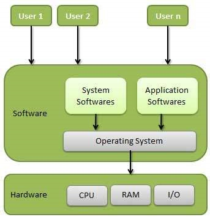

## Operating System
An Operating System is *system software* that acts as an interface between the user/applications and computer hardware.

- It manages all hardware resources and provides services so applications can run smoothly.
> Basically its like common code required to run applications.

## Why OS?
1. Bulky and complex app. (Hardware interaction code must be in app’s code base)
2. Resource exploitation by 1 App.
3. No memory protection.

## OS Functions :
An operating system function -
- Access to the computer hardware.
- interface between the user and the computer hardware
- Resource management (Aka, Arbitration) (memory, device, file, security, process etc)
- Hides the underlying complexity of the hardware. (Aka, Abstraction)
- facilitates execution of application programs by providing isolation and protection.

## OS goals –
• Maximum CPU utilization
• Less process starvation
• Higher priority job execution

## Types:
1. Single process OS :  only 1 process executes at a time from the ready queue. [Oldest]

2. Batch-processing OS:
Example:
- If multiple users submit programs written in FORTRAN, COBOL, or Assembly, they are collected, sorted, and run together as a batch to save setup and processing time.
- Example: Early IBM mainframe systems
- Used in: Payroll systems, old banking systems

3. 3️⃣ Multiprogramming Operating System
    - Multiple programs stay in memory
    - CPU switches(**CONTEXT SWITCHING**) when one waits for I/O
    - Improves CPU utilization
- Used in: General-purpose computers
> Max CPU utli ✅ , Starvation is there ❌, Higher priority maintainted(Interrupt maro n get CPU) ✅

4. 4️⃣ Multitasking Operating System
> - Multiprogramming + Time quantum
- One user runs multiple applications
- Can be preemptive or cooperative
- Examples:
    - Windows
    - macOS
### How Multitasking Works
- CPU executes one process for a small time slice
- Saves its state (context switching)
- Switches to another process
- Repeats very fast (milliseconds)

> Max CPU ✅ , No Starvation ✅ , Higher Priority maintainted ✅.

### Types of Multitasking
1. 🔹 Preemptive Multitasking
- OS decides when a task stops
- Uses CPU scheduling algorithms
- More stable & secure
- Examples:
    - Windows
    - Linux
    - macOS

2. 🔹 Cooperative Multitasking
- A task voluntarily gives up CPU
- If one app hangs → whole system slows
- Example: Old Mac OS (pre-OS X)

### How is Time Quantum Decided? ⏱️
- The time quantum (time slice) is the maximum CPU time a process gets in Round Robin / preemptive multitasking before being preempted.
- 👉 The Operating System kernel, based on system design and workload (Not the user, not the process) decides Time Quantum 
- Typical Values (Exam-Oriented)
    - 1–10 ms → Desktop / interactive OS
    - 10–100 ms → Server systems
    - RTOS → Fixed & predictable

## MultiProcessing : 
A Multiprocessing Operating System uses more than one CPU (or core) to execute multiple processes simultaneously.

### How Multiprocessing Works
- Tasks are divided among multiple CPUs
- Each CPU executes a different process at the same time
- OS handles load balancing and synchronization

> Max CPU ✅ , No Starvation ✅ , Higher Priority maintainted ✅.

### Types of Multiprocessing
1. 1️⃣ Symmetric Multiprocessing (SMP)
- All CPUs are equal
- One shared memory
- Any CPU can run any process
- Examples:
    - Linux
    - Windows
- 📌 Most modern systems use SMP

2. 2️⃣ Asymmetric Multiprocessing (AMP)
- One master CPU controls others
- Master assigns tasks to slave CPUs
- Simpler but less flexible
- Used in:
- Embedded systems
- Old architectures

3. NUMA (Non-Uniform Memory Access) :
- Memory is divided; each processor has its own local memory for faster access.  | High-performance servers, supercomputers |

| Multiprocessing         | Multitasking     |
| ----------------------- | ---------------- |
| Multiple CPUs           | Single CPU       |
| True parallel execution | CPU time sharing |
| Higher throughput       | Faster response  |
| Hardware-dependent      | Software-based   |

## Distributed Operating System
- A Distributed Operating System manages a group of independent computers (nodes) and makes them appear to users as one single unified system.
> 👉 Multiple machines + one OS view.

### How It Works (Simple)
- Nodes are connected via a network
- OS handles:
    - Process placement
    - Inter-node communication
    - Load balancing
    - Failure recovery

### Types of Distributed OS
1. 1️⃣ Client–Server Model
- Servers provide services
- Clients request services
- Example: Web applications, databases

> 👉 The Operating System works on both the client and the server, but with different roles.

2. 2️⃣ Peer-to-Peer (P2P) Model
- All nodes act as equals
- No central control
Used in: File sharing systems

> 👉 In P2P, the Operating System runs on every node, and each node acts as both a client and a server.

## Real Time OS (RTOS)
- A Real-Time Operating System (RTOS) is an OS designed to respond to events within a guaranteed, fixed time limit (deadline).

### Types of RTOS
1. 1️⃣ Hard RTOS
- Missing a deadline = system failure
- Used in safety-critical systems
- Examples:
    - VxWorks
    - QNX
- Use cases:
✈️ Aircraft control, 🚗 ABS, 🏥 pacemakers

2. 2️⃣ Soft RTOS
- Deadlines are important but occasional misses allowed
- Performance degrades, system doesn’t fail
- Examples:
    - FreeRTOS
    - RTLinux
- Use cases:
🎮 Multimedia, 📺 streaming, 📱 telecom

## Multithreading 
- is a technique where multiple threads (lightweight units of execution) run within the same process, sharing the same memory and resources.
- 👉 Multiple threads = multiple tasks running concurrently inside one program.
- 
| Process         | Thread        |
| --------------- | ------------- |
| Heavyweight     | Lightweight   |
| Separate memory | Shared memory |
| Slow creation   | Fast creation |
| IPC required    | No IPC needed |
| More overhead   | Less overhead |

> 📌 A process can have many threads, but a thread belongs to only one process.
- How Multithreading Works
- Threads share:
    - Code
    - Data
    - Heap
- Threads have their own:
    - Stack
    - Registers
    - Program counter
- ➡️ OS scheduler schedules threads, not just processes (in modern OS).

| Multithreading          | Multiprocessing          |
| ----------------------- | ------------------------ |
| Shared memory           | Separate memory          |
| Faster communication    | Safer (no shared memory) |
| Less overhead           | More overhead            |
| Complex synchronization | Less synchronization     |

## Components of OS
1. User Space :

2. Kernel :
- Heart of the operating system
- Runs in privileged (kernel) mode
- Functions:
    - CPU scheduling
    - Memory management
    - Process & thread management
    - Device control
- 📌 Without the kernel, the OS cannot function.


## Types of Kernels:
1. Monolithic : 
> Entire OS runs in kernel space
- a. All functions are in kernel itself.
- b. Bulky in size.
- c. Memory required to run is high.
- d. Less reliable, one module crashes -> whole kernel is down.
- e. High performance as communication is fast. (Less user mode, kernel mode overheads)
- f. Eg. Linux, Unix, MS-DOS.

2. Micro Kernel
- a. Only major functions are in kernel.
    - i. Memory mgmt.
    - ii. Process mgmt.
- b. File mgmt. and IO mgmt. are in User-space.
- c. smaller in size.
- d. More Reliable
- e. More stable
- f. Performance is slow.
> ❌ Slower (message passing overhead)
- h. Eg. L4 Linux, Symbian OS, MINIX etc.

3. 3️⃣ Hybrid Kernel
- Combines monolithic + microkernel
- Some services in kernel, some in user space
- Advantages
- ✅ Balance of performance & stability
- Disadvantages
- ❌ Complex design
- Examples
    - Windows
    - macOS

## Why macOS kernel is more monolithic than microkernel ??
- macOS uses the XNU kernel, which is often described as **hybrid**.
- But in practice, it behaves much closer to a monolithic kernel than a true microkernel.
- In macOS:
    - BSD services (file system, networking, process management) run inside kernel space
    - Many device drivers also run in kernel space
    - Communication is mostly direct function calls, not message passing
- 📌 This violates core microkernel principles.

### 3️⃣ Why macOS is closer to Monolithic
- macOS behaves monolithic because:
1. 🔹 Large Kernel Space
    - File systems
    - Networking stack
    - Process management
    - Drivers (via IOKit)
- All execute in kernel mode.

2. 🔹 Performance-First Design
- Microkernels suffer from IPC[ Inter Process Communication ] overhead
- Apple optimized for:
    - Desktop performance
    - Low latency
    - Smooth UI
- ➡️ So services were moved into kernel space.

| Aspect          | User Mode   | Kernel Mode        |
| --------------- | ----------- | ------------------ |
| Access level    | Limited     | Full               |
| Hardware access | ❌ No        | ✅ Yes             |
| Stability       | High        | Critical           |
| Examples        | Apps, Shell | Scheduler, Drivers |
|                 |  , Music ,  |                    |
|                 | Chrome      |                    |
| Crash impact    | App crashes | System crash       |

## How user interacts with kernel ?
- System calls.

## System calls.
| Category                    | Examples                                            | Description                                  |
| --------------------------- | --------------------------------------------------- | -------------------------------------------- |
| **Process Control**         | `fork()`, `exec()`, `exit()`, `wait()`              | Create, terminate, or manage processes       |
| **File Management**         | `open()`, `read()`, `write()`, `close()`, `lseek()` | Manage files and directories                 |
| **Device Management**       | `ioctl()`, `read()`, `write()`                      | Request or release device access             |
| **Information Maintenance** | `getpid()`, `alarm()`, `sleep()`, `gettimeofday()`  | Get or set system data                       |
| **Communication**           | `pipe()`, `shmget()`, `send()`, `recv()`            | Facilitate inter-process communication (IPC) |


## System Call Interface (SCI)
> 👉 It is the bridge between user mode and kernel mode.
```yml
User Program
   ↓  (system call)
System Call Interface
   ↓  (mode switch)
Kernel (executes request)
   ↓
Result returned to User Program
```
- EXAMPLE
    - in user mode , we write code in code editor.
    - to save we pass it via SCI .
    - SCI determines where to save and compile it in kernel mode .

## How Operating System Boots up?
- Booting is the process of starting a computer and loading the operating system into the main memory (RAM) from storage.

⚙️ Steps of OS Booting
1. POWER ON 
2. CPU Loads BIOS or UEFI
3. BIOS Runs Tests and Hardware Init
    1. Loads some settings from a Memory Area ( backed by CMOS Battery ).
    2. Program Loads With settings (POST - Power On Self Test) 
> 📌 If POST fails → system beeps / error
4. 3️⃣ Boot Device Selection
- Firmware looks for:
    - HDD / SSD
    - USB
    - Network (PXE)
- 📌 Boot order is set in BIOS/UEFI settings
5. Bootloader Execution
- A small program that loads the OS kernel
- Examples:
    - GRUB (Linux)
    - Windows Boot Manager
    - macOS Boot.efi
- Bootloader tasks:
    - Loads kernel into RAM
    - Passes hardware info to kernel
    - Allows OS selection (dual boot)
6. OS is Initilized and Takes control.