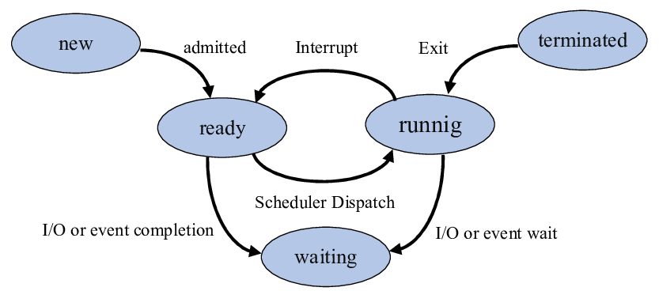

## 1️⃣ Program
- A program is a passive set of instructions
- Stored on disk (HDD/SSD)
- Not executing
- 📌 Example:
    - a.out
    - node index.js
    - chrome.exe
- 👉 Program = static code

## 2️⃣ Process
- A process is a program in execution
    - Active entity
    - Has its own memory and resources
- 📌 When you run a program → it becomes a process
- Each process has:
    - 1️⃣ Program Code (Text Section)
        - The actual instructions to execute
    - 2️⃣ Data Section
        - Global variables
        - Static variables
    - 3️⃣ Heap
        - Dynamic memory allocation (malloc, new)
        - Grows upward
    - 4️⃣ Stack
        - Function calls
        - Local variables
        - Return addresses
    - 5️⃣ CPU Context
        - Program Counter (PC)
        - CPU registers
        - Stack pointer
    - 6️⃣ Process Control Block (PCB) ← VERY IMPORTANT
- 👉 Process = running instance of a program

### PCB :
- PCB (Process Control Block)?
- PCB is a data structure maintained by the OS that stores everything about a process.
- Contains:
    1. Process ID (PID)
    2. Process State (Ready, Running, Waiting)
    3. Program Counter
    3. CPU Registers
    4. Scheduling info (priority)
    5. Memory info
    6. I/O status
    7. Accounting info
### Basic Process States (5-State Model)
1. 1️⃣ New
- Process is being created
- PCB (Process Control Block) is allocated
- Not yet ready to run
> Processes are in **JOB QUEUE**
- 📌 Example: Program just started

2. 2️⃣ Ready
- Process is loaded in memory
- Waiting for CPU time
- All resources available except CPU
- LTS (Long term Scheduler) moves the process from New->Ready.
> Processes are in **Ready QUEUE**
- 📌 Stored in Ready Queue

3. 3️⃣ Running
- Process is currently executing on CPU
- Only one process per CPU/core can be running at a time
- STS (Short term Scheduler[📌 Uses scheduling algorithms like: FCFS , SJF , Priority , Round Robin]) selects the process from Ready .
- Dispatcher allocates the CPU to the process.
- 📌 Can be preempted by scheduler

4. 4️⃣ Waiting / Blocked
- Process is waiting for an event or I/O
- CPU is not required right now
- Medium-Term Scheduler (MTS) suspends and resuems processes 
> Processes are in **Blocked QUEUE**
- 📌 Example:
    - Waiting for disk read
    - Waiting for user input

5. 5️⃣ Terminated (Exit)
- Process has finished execution
- OS releases all resources
- PCB is deleted

> 📌 Scheduler decides who, dispatcher does how

## Why Windows Doesn’t Need LTS
1. 1️⃣ Demand Paging Replaces LTS
- Windows loads only required pages into RAM
- Full program is not loaded at once
- 📌 Memory admission is dynamic, not pre-decided.
> If memory is insufficient → OS uses virtual memory, not job rejection

## Degree of Multiprogramming (OS Goal 4)
The degree of multiprogramming is the number of processes that are present in main memory (RAM) at the same time.
> 👉 It indicates how many programs the OS can keep ready to run.
- Intent is to make ready queue a mix of CPU Bound and IO Bound processes.

| Multiprogramming             | Multiprocessing     |
| ---------------------------- | ------------------- |
| Multiple processes in memory | Multiple CPUs/cores |
| Time sharing                 | Parallel execution  |
| Software concept             | Hardware concept    |

> More processes in memory → better CPU usage (until memory becomes a bottleneck).

## What is Swap Space?
👉 When RAM is full, the OS moves inactive pages/processes to swap space to free RAM for active ones.
### How Swap Space Works
1. Swap Out
- Inactive pages/processes moved from RAM → disk (swap space)
2. Swap In
- Required pages moved back from disk → RAM

## 3️⃣ Thread
- A thread is the smallest unit of execution
- Exists inside a process
- Multiple threads can exist in one process
> 👉 It is often called a lightweight process.
- Threads share:
    - Code
    - Data
    - Heap
    - Open files
- Threads have their own:
    - Stack
    - Registers
    - Program counter
- 👉 Thread = execution path inside a process

| Feature        | Program | Process  | Thread |
| -------------- | ------- | -------- | ------ |
| Nature         | Passive | Active   | Active |
| Stored on disk | ✅       | ❌        | ❌      |
| Execution      | ❌       | ✅        | ✅      |
| Memory         | ❌       | Separate | Shared |
| Overhead       | None    | High     | Low    |

## How does an Operating System create a Process?
- A process is created when the OS turns a program (static code) into a running instance with its own resources.
### Step-by-Step Process Creation
1. 1️⃣ Program Invocation
./a.out
node app.js
2. 2️⃣ System Call to Kernel
- The request enters kernel mode via a system call.
- Common calls:
- fork() – create a new process (copy)
- exec() – replace process image with a new program
- 📌 In practice, many OSs use fork → exec.
3. 3️⃣ Create Process Control Block (PCB)
- OS creates a PCB containing:
    - PID (Process ID)
    - Process state (new/ready)
    - Program counter & registers
    - Scheduling info (priority)
    - Open files
    - Memory pointers
- 👉 PCB = identity card of the process
4. 4️⃣ Allocate Memory
- OS allocates an address space:
    - Code (text)
    - Data
    - Heap
    - Stack
- Sets up virtual memory mappings.
5. 5️⃣ Load Program into Memory
- Program code is loaded from disk
- Libraries are linked (statically/dynamically)
- Program counter set to entry point (main)
6. 7️⃣ Add to Ready Queue
- Process state → Ready
- Waiting for CPU
7. 8️⃣ CPU Scheduling
- Scheduler selects the process
- Context switch happens
- Process state → Running
> ✅ Process starts executing!

## Process Architecture :
High Address
+------------------+
|      Stack       |
|        ↓         |
+------------------+
|      Heap        |
|        ↑         |
+------------------+
|      Data        |
+------------------+
|      Code        |
+------------------+
Low Address

1. Text / Code Segment
- Compiled instructions
2. Data Segment
- Global & static variables
3. Heap
- Dynamic memory allocation (malloc, new)
- Shared by all threads in the process
4. Stack
- Function calls
- Local variables
- Return addresses
- Each thread has its own stack

## TYPES OF PROCESS 
1. Orphan Process : 
- An orphan process is a child process whose parent process has terminated, while the child is still running.
> 👉 Parent dies first → child becomes orphan.

### How an Orphan Process is Created
- Parent process creates a child (fork)
- Parent terminates before the child
- Child continues execution
- OS reassigns the child to a system parent

### Who Adopts Orphan Processes?
- On UNIX-like systems (e.g., Linux):
- Orphans are adopted by init (PID 1) or systemd
- The OS ensures:
    - Child is monitored
    - Resources are cleaned when it exits
- 📌 This prevents resource leaks.

2. Zombie Process :
- A zombie process is a child process that has finished execution, but still has an entry in the process table because its parent has not collected its exit status.
> 👉 Child is dead, parent is alive.

### How a Zombie Process is Created
- Parent creates a child (fork)
- Child finishes execution (exit)
- Parent does not call wait() / waitpid()
- OS keeps child’s PID & exit status
> ➡️ Child becomes a zombie for that time till parent doesnt call wait.

