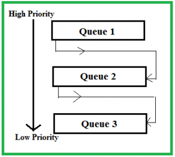

## SCHEDULING ALGORITHMS :
### Classification of Scheduling Algorithms
1. 🔹 Non-Preemptive
- Once CPU is allocated, process runs till completion or I/O wait
- Simple but poor responsiveness

2. 🔹 Preemptive
- CPU can be taken away by OS
- Better responsiveness, more complex

| **Metric**  | **Full Form**           | **Formula**                         | **Meaning (1-line)**            |
| ----------- | ----------------------- | ----------------------------------- | ------------------------------- |
| **AT**      | Arrival Time            | Given                               | Time when process enters system |
| **BT**      | Burst Time              | Given                               | CPU time required               |
| **CT**      | Completion Time         | From Gantt chart                    | Time when process finishes      |
| **TAT**     | Turnaround Time         | **CT − AT**                         | Total time in system            |
| **WT**      | Waiting Time            | **TAT − BT**<br>or **CT − AT − BT** | Time waiting in ready queue     |
| **RT**      | Response Time           | **First CPU Start − AT**            | Time till first CPU response    |
| **Avg WT**  | Average Waiting Time    | ΣWT / n                             | Mean waiting time               |
| **Avg TAT** | Average Turnaround Time | ΣTAT / n                            | Mean turnaround time            |
| **Avg RT**  | Average Response Time   | ΣRT / n                             | Mean response time              |

### 
1. 1️⃣ First Come First Serve (FCFS)
- Type: Non-preemptive
- How it works
    - Processes executed in order of arrival
- Advantages
    - ✅ Simple
    - ✅ No starvation
- Disadvantages
    - ❌ Convoy effect : Convoy Effect is a situation in CPU scheduling where many short processes wait behind one long CPU-bound process, causing poor CPU utilization and high waiting time. 
    - ❌ Poor average waiting time
- 📌 Used in: Batch systems (rare today)

2. 2️⃣ Shortest Job First (SJF)
- Type: Non-preemptive
- How it works
    - Process with smallest CPU burst executes first
- Advantages
- ✅ Minimum average waiting time (optimal)
- Disadvantages
    - ❌ Burst time prediction needed
    - ❌ Starvation possible

3. 3️⃣ Shortest Remaining Time First (SRTF)
- Type: Preemptive version of SJF
- How it works
    - Process with least remaining time runs
    - New shorter job can preempt running process
- Advantages
- ✅ Best response time
- Disadvantages
    - ❌ High overhead
    - ❌ Starvation

4. 4️⃣ Priority Scheduling
- Type: Preemptive / Non-preemptive
- How it works
    - Highest-priority process runs first
- Advantages
    - ✅ Important tasks handled first
- Disadvantages
    - ❌ Starvation of low-priority jobs
    - 📌 Solution: Aging : Aging gradually increases the priority of a process the longer it waits in the ready queue.
    - Also Convoy effect.

5. 5️⃣ Round Robin (RR)
- Type: Preemptive
- How it works
    - Each process gets fixed time quantum
- After quantum expires → moved to back of queue(FCFS).
- Advantages
    - ✅ Fair.
    - ✅ Good response time.
- Disadvantages
    - ❌ Context switching overhead
- 📌 Used in: Time-sharing systems

6. 6️⃣ Multilevel Queue Scheduling
- Multilevel Queue Scheduling is a CPU scheduling technique where the ready queue is permanently divided into multiple queues, each for a different type of process.
- No movement between queues
| Queue        | Type of Process          | Scheduling Used     |
| ------------ | ------------------------ | ------------------- |
| Q1 (Highest) | System processes         | Preemptive Priority |
| Q2           | Interactive / Foreground | Round Robin         |
| Q3           | Batch / Background       | FCFS                |
> 👉 CPU first serves Q1, then Q2, then Q3

7. 7️⃣ Multilevel Feedback Queue (MLFQ)
- Most powerful & modern
- How it works
    - Processes can move between queues
    - Priority changes based on behavior
- 👉 It is designed to combine priority scheduling + Round Robin + aging.


### Working :
- New processes start in the highest-priority queue
- If a process:
    - Uses too much CPU → it is demoted
    - Waits too long → it is promoted (aging)
- Thus, priorities are dynamic
- Advantages
    - ✅ No starvation
    - ✅ Adaptive
📌 Used by: Modern OSs

| Algorithm   | Preemptive | Starvation | Use Case     |
| ----------- | ---------- | ---------- | ------------ |
| FCFS        | ❌          | ❌          | Batch        |
| SJF         | ❌          | ✅          | Short jobs   |
| SRTF        | ✅          | ✅          | Interactive  |
| Priority    | Both       | ✅          | Real-time    |
| Round Robin | ✅          | ❌          | Time-sharing |
| MLFQ        | ✅          | ❌          | Modern OS    |

### Which OS uses what?
- Linux → CFS (MLFQ-like)
- Windows → Priority + RR
- macOS → Priority-based, adaptive

# Thread Context Scheduling (Thread Context Switching)
- Thread context scheduling is the process by which the CPU switches execution from one thread to another by saving the current thread’s state and restoring another thread’s state.
- 👉 It allows multiple threads to share the CPU efficiently.
- A thread context includes:
    - Program Counter (PC)
    - CPU registers
    - Stack pointer
    - Thread state (Running, Ready, Waiting)
- NO Memory pointers as threads share same memory.
- This information is stored in a Thread Control Block (TCB).

| Feature              | Thread Switch  | Process Switch  |
| -------------------- | -------------- | --------------- |
| Memory Space         | Shared         | Different       |
| Speed                | Faster         | Slower          |
| Overhead             | Low            | High            |
| Address Space Change | No             | Yes             |
| Used in              | Multithreading | Multiprocessing |
| Cache Flushing       | No             | Yes             |

## Concurrency
- Concurrency means multiple tasks make progress during the same time period, but not necessarily at the same instant.
    - One CPU
    - Tasks take turns using the CPU
    - Achieved through context switching

| Feature         | Concurrency          | Parallelism              |
| --------------- | -------------------- | ------------------------ |
| Execution       | Interleaved          | Simultaneous             |
| CPU Requirement | Single or multi-core | Multi-core required      |
| Goal            | Responsiveness       | Speed & performance      |
| Implementation  | Time-slicing         | Multiple cores           |
| Example         | Multitasking OS      | Parallel data processing |

## Race Condition (Operating Systems)
- A race condition occurs when two or more threads/processes access shared data at the same time, and the final result depends on the order of execution.
- The output becomes unpredictable because operations are not synchronized.
> A race condition occurs when multiple processes or threads try to read and write shared data concurrently, and the final result depends on the timing of execution.

### ✅ Solutions to the Critical Section Problem
- The critical section problem occurs when multiple processes/threads access shared data at the same time, causing race conditions.
- A correct solution must satisfy three conditions:
- ✅ Requirements of a Correct Solution
1. **Mutual Exclusion**– Only one process enters the critical section at a time
2. **Progress** – If no process is in the critical section, one must be allowed to enter
3. **Bounded Waiting** – No process should wait forever

### Does a Single Flag Solve the Critical Section Problem?
- NO 
```c
int flag = 0;   // 0 = free, 1 = busy

Process P1:
while (flag == 1);
flag = 1;
// critical section
flag = 0;

Process P2:
while (flag == 1);
flag = 1;
// critical section
flag = 0;
```

### How to prevent Race Condition :
1. Atomic Operation
- An atomic operation is an operation that executes completely or not at all — it cannot be interrupted by other threads or processes.
- Common Atomic Operations
    - test-and-set
    - compare-and-swap (CAS)
    - fetch-and-add
    - atomic increment / decrement
- Used heavily in:
    - Locks
    - Semaphores
    - Spinlocks
    - Mutexes
> An atomic operation is an indivisible operation that completes entirely without interruption, ensuring safe access to shared data.

2. Peterson’s Algorithm
- A single flag fails because both processes can check the flag before either sets it, leading to a race condition.
- 🔹 Idea Behind Two Flags
- Each process:
    - Announces its intention to enter the critical section
    - Gives priority to the other process
    - Waits if the other process also wants to enter
- This guarantees:
    - Mutual exclusion
    - Progress
    - Bounded waiting
```c
boolean flag[2];
int turn;

Process P0:
flag[0] = true;
turn = 1;
while (flag[1] && turn == 1);
   // critical section
flag[0] = false;

Process P1:
flag[1] = true;
turn = 0;
while (flag[0] && turn == 0);
   // critical section
flag[1] = false;
```
- Disadvantages of Peterson:
| Limitation             | Explanation              |
| ---------------------- | ------------------------ |
| Limited to 2 processes | Not scalable             |
| Busy waiting           | Wastes CPU               |
| Hardware assumptions   | Not valid on modern CPUs |
| No priority handling   | Can cause inefficiency   |
| Not practical          | Used only for theory     |


3. Mutual Exclusion (Locks)
```yml
mutex.lock();
### critical section
mutex.unlock();
```
- Disadvantges of Locks:
| Disadvantage         | Explanation                       |
| -------------------- | --------------------------------- |
| Deadlock             | Circular waiting for locks        |
| Starvation           | Some threads never get CPU        |
| Priority inversion   | Low-priority blocks high-priority |
| Busy waiting         | Wastes CPU cycles                 |
| Poor scalability     | Limits parallelism                |
| Debugging difficulty | Hard to reproduce issues          |

### Condition Variables
- Locks alone only provide mutual exclusion, but they cannot make a thread wait efficiently for a condition.
- Condition variables allow:
    - Threads to sleep (wait) until a condition is satisfied
    - Another thread to signal when the condition becomes true
- This avoids busy waiting.
| Operation     | Meaning                               |
| ------------- | ------------------------------------- |
| `wait()`      | Releases lock & sleeps until signaled |
| `signal()`    | Wakes one waiting thread              |
| `broadcast()` | Wakes all waiting threads             |
```c
lock(mutex);
while (condition == false) {
    wait(condition, mutex);
}
// critical section
unlock(mutex);
```

3. Semaphores
- A semaphore is a synchronization tool used to control access to shared resources by multiple processes or threads.
- 👉 It is basically a counter with two atomic operations:
- wait() / P() → decrease value i.e wait(){s--;}
- signal() / V() → increase value i.e signal(){s++;}
| Operation  | Description                             |
| ---------- | --------------------------------------- |
| `wait()`   | Decrements value; blocks if value < 0   |
| `signal()` | Increments value; wakes waiting process |

#### 🔹 Types of Semaphores
1. 1️⃣ Binary Semaphore (Mutex)
- Value can be 0 or 1
- Used for mutual exclusion
```c
wait(mutex);
// critical section
signal(mutex);
```
- Only one process enters critical section
- ❌ No counting capability
- Binary Semaphore is equi to Locks

2. 2️⃣ Counting Semaphore
- Value can be any non-negative integer
- Controls access to multiple instances of a resource
```c
semaphore S = 3;   // 3 identical resources
```
> If 3 threads acquire it → next thread must wait.

| Feature         | Semaphore         | Mutex            |
| --------------- | ----------------- | ---------------- |
| Value           | Integer           | Binary           |
| Ownership       | No owner          | Owner-based      |
| Multiple access | Yes               | No               |
| Use case        | Resource counting | Mutual exclusion |

## Classical Problems in Operating Systems (Synchronization Problems)

1. 1️⃣ Producer–Consumer Problem
- One or more producers produce data
- One or more consumers consume data
- Shared buffer has limited size
- In this problem, we have:
    - Producers: Generate data items and place them in a shared buffer.
    - Consumers: Remove and process data items from the buffer.
- The main challenge is to ensure:
    - A producer does not add data to a full buffer.
    - A consumer does not remove data from an empty buffer.
    - Multiple producers and consumers do not access the buffer simultaneously, preventing race conditions.
```yml
Problem Statement
Consider a fixed-size buffer shared between a producer and a consumer.

The producer generates an item and places it in the buffer.
The consumer removes an item from the buffer.
> The buffer is the critical section. At any moment:

A producer cannot place an item if the buffer is full.
A consumer cannot remove an item if the buffer is empty.
```
- To manage this, we use three semaphores:
1. mutex – ensures mutual exclusion when accessing the buffer.
2. full – counts the number of filled slots in the buffer.
3. empty – counts the number of empty slots in the buffer.

```cpp
mutex = 1;    // binary semaphore for mutual exclusion
full = 0;     // initially no filled slots
empty = n;    // buffer size

## Producer
do {
    // Produce an item
    wait(empty);    // Check for empty slot
    wait(mutex);    // Enter critical section
    // Place item in buffer
    signal(mutex);  // Exit critical section
    signal(full);   // Increase number of full slots
}while(1);

## Consumer 
do {
    wait(full);
    wait(mutex);
    // critical section
    signal(empty);
    signal(mutex);
}while(1);

```

2. 2️⃣ Readers–Writers Problem
- Multiple readers can read simultaneously
- Writer needs exclusive access
- Avoid writer starvation
- 🔹 Types:
    - Reader Priority – readers favored
    - Writer Priority – writers favored
- Fair solution – no starvation
- 📌 Used in databases, file systems
