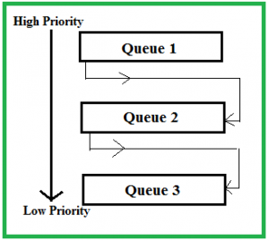

## SCHEDULING ALGORITHMS :
### Classification of Scheduling Algorithms
1. 🔹 Non-Preemptive
- Once CPU is allocated, process runs till completion or I/O wait
- Simple but poor responsiveness

2. 🔹 Preemptive
- CPU can be taken away by OS
- Better responsiveness, more complex

| **Metric**  | **Full Form**           | **Formula**                         | **Meaning (1-line)**            |
| ----------- | ----------------------- | ----------------------------------- | ------------------------------- |
| **AT**      | Arrival Time            | Given                               | Time when process enters system |
| **BT**      | Burst Time              | Given                               | CPU time required               |
| **CT**      | Completion Time         | From Gantt chart                    | Time when process finishes      |
| **TAT**     | Turnaround Time         | **CT − AT**                         | Total time in system            |
| **WT**      | Waiting Time            | **TAT − BT**<br>or **CT − AT − BT** | Time waiting in ready queue     |
| **RT**      | Response Time           | **First CPU Start − AT**            | Time till first CPU response    |
| **Avg WT**  | Average Waiting Time    | ΣWT / n                             | Mean waiting time               |
| **Avg TAT** | Average Turnaround Time | ΣTAT / n                            | Mean turnaround time            |
| **Avg RT**  | Average Response Time   | ΣRT / n                             | Mean response time              |

### 
1. 1️⃣ First Come First Serve (FCFS)
- Type: Non-preemptive
- How it works
    - Processes executed in order of arrival
- Advantages
    - ✅ Simple
    - ✅ No starvation
- Disadvantages
    - ❌ Convoy effect : Convoy Effect is a situation in CPU scheduling where many short processes wait behind one long CPU-bound process, causing poor CPU utilization and high waiting time. 
    - ❌ Poor average waiting time
- 📌 Used in: Batch systems (rare today)

2. 2️⃣ Shortest Job First (SJF)
- Type: Non-preemptive
- How it works
    - Process with smallest CPU burst executes first
- Advantages
- ✅ Minimum average waiting time (optimal)
- Disadvantages
    - ❌ Burst time prediction needed
    - ❌ Starvation possible

3. 3️⃣ Shortest Remaining Time First (SRTF)
- Type: Preemptive version of SJF
- How it works
    - Process with least remaining time runs
    - New shorter job can preempt running process
- Advantages
- ✅ Best response time
- Disadvantages
    - ❌ High overhead
    - ❌ Starvation

4. 4️⃣ Priority Scheduling
- Type: Preemptive / Non-preemptive
- How it works
    - Highest-priority process runs first
- Advantages
    - ✅ Important tasks handled first
- Disadvantages
    - ❌ Starvation of low-priority jobs
    - 📌 Solution: Aging : Aging gradually increases the priority of a process the longer it waits in the ready queue.
    - Also Convoy effect.

5. 5️⃣ Round Robin (RR)
- Type: Preemptive
- How it works
    - Each process gets fixed time quantum
- After quantum expires → moved to back of queue(FCFS).
- Advantages
    - ✅ Fair.
    - ✅ Good response time.
- Disadvantages
    - ❌ Context switching overhead
- 📌 Used in: Time-sharing systems

6. 6️⃣ Multilevel Queue Scheduling
- Multilevel Queue Scheduling is a CPU scheduling technique where the ready queue is permanently divided into multiple queues, each for a different type of process.
- No movement between queues
| Queue        | Type of Process          | Scheduling Used     |
| ------------ | ------------------------ | ------------------- |
| Q1 (Highest) | System processes         | Preemptive Priority |
| Q2           | Interactive / Foreground | Round Robin         |
| Q3           | Batch / Background       | FCFS                |
> 👉 CPU first serves Q1, then Q2, then Q3

7. 7️⃣ Multilevel Feedback Queue (MLFQ)
- Most powerful & modern
- How it works
    - Processes can move between queues
    - Priority changes based on behavior
- 👉 It is designed to combine priority scheduling + Round Robin + aging.
- High priority queues have lesser time quantum and lower have more . Increases as we go down .
- The multilevel Feed Back Queue scheduling algorithm is used and the queue time quantum '2' seconds and in each level it is incremented by '5' seconds
Q1 = 2
Q2 = 7
Q3 = 12
Q4 = 17
Q5 = 22
- Process moves down and final execution at last queue if very big (low priority below).


### Working :
- New processes start in the highest-priority queue
- If a process:
    - Uses too much CPU → it is demoted
    - Waits too long → it is promoted (aging)
- Thus, priorities are dynamic
- Advantages
    - ✅ No starvation
    - ✅ Adaptive
📌 Used by: Modern OSs

| Algorithm   | Preemptive | Starvation | Use Case     |
| ----------- | ---------- | ---------- | ------------ |
| FCFS        | ❌          | ❌          | Batch        |
| SJF         | ❌          | ✅          | Short jobs   |
| SRTF        | ✅          | ✅          | Interactive  |
| Priority    | Both       | ✅          | Real-time    |
| Round Robin | ✅          | ❌          | Time-sharing |
| MLFQ        | ✅          | ❌          | Modern OS    |

### Which OS uses what?
- Linux → CFS (MLFQ-like)
- Windows → Priority + RR
- macOS → Priority-based, adaptive.

# Thread Context Scheduling (Thread Context Switching)
- Thread context scheduling is the process by which the CPU switches execution from one thread to another by saving the current thread’s state and restoring another thread’s state.
- 👉 It allows multiple threads to share the CPU efficiently.
- A thread context includes:
    - Program Counter (PC)
    - CPU registers
    - Stack pointer
    - Thread state (Running, Ready, Waiting)
- NO Memory pointers as threads share same memory.
- This information is stored in a Thread Control Block (TCB).

| Feature              | Thread Switch  | Process Switch  |
| -------------------- | -------------- | --------------- |
| Memory Space         | Shared         | Different       |
| Speed                | Faster         | Slower          |
| Overhead             | Low            | High            |
| Address Space Change | No             | Yes             |
| Used in              | Multithreading | Multiprocessing |
| Cache Flushing       | No             | Yes             |

## Concurrency
- Concurrency means multiple tasks make progress during the same time period, but not necessarily at the same instant.
    - One CPU
    - Tasks take turns using the CPU
    - Achieved through context switching

| Feature         | Concurrency          | Parallelism              |
| --------------- | -------------------- | ------------------------ |
| Execution       | Interleaved          | Simultaneous             |
| CPU Requirement | Single or multi-core | Multi-core required      |
| Goal            | Responsiveness       | Speed & performance      |
| Implementation  | Time-slicing         | Multiple cores           |
| Example         | Multitasking OS      | Parallel data processing |

## Race Condition (Operating Systems)
- A race condition occurs when two or more threads/processes access shared data at the same time, and the final result depends on the order of execution.
- The output becomes unpredictable because operations are not synchronized.
> A race condition occurs when multiple processes or threads try to read and write shared data concurrently, and the final result depends on the timing of execution.

### ✅ Solutions to the Critical Section Problem
- The critical section problem occurs when multiple processes/threads access shared data at the same time, causing race conditions.
- A correct solution must satisfy three conditions:
- ✅ Requirements of a Correct Solution
1. **Mutual Exclusion**– Only one process enters the critical section at a time
2. **Progress** – If no process is in the critical section, one must be allowed to enter
3. **Bounded Waiting** – No process should wait forever

### Does a Single Flag Solve the Critical Section Problem?
- NO 
```c
int flag = 0;   // 0 = free, 1 = busy

Process P1:
while (flag == 1); // busy wait similar to Spinlock
flag = 1;
// critical section
flag = 0;

Process P2:
while (flag == 1);
flag = 1;
// critical section
flag = 0;
```
#### 🔹 Problem with Single Flag Solution ❌
- Although it tries to ensure mutual exclusion, it fails in real systems.
- ❌ Race Condition Example:
    - Process P1 checks flag == 0
    - Context switch happens before P1 sets flag = 1
    - Process P2 also checks flag == 0
    - Both enter the critical section → Violation of mutual exclusion

### How to prevent Race Condition : 
1. Atomic Operation
- An atomic operation is an operation that executes completely or not at all — it cannot be interrupted by other threads or processes.
- Common Atomic Operations
    - test-and-set
    - compare-and-swap (CAS)
    - fetch-and-add
    - **atomic increment** / decrement
    - **XCHG** (Exchange) in MICRO-PROCESSOR 8086.
- Used heavily in:
    - Locks
    - Semaphores
    - Spinlocks
    - Mutexes
> An atomic operation is an indivisible operation that completes entirely without interruption, ensuring safe access to shared data.
- 🔹 Example (Conceptual)
- Without atomic operation:
    - x = x + 1;   // Not atomic
        - This involves:
        - Read x
        - Increment
        - Write back
        - Another thread may interrupt in between → race condition
- With atomic operation:
    - atomic_increment(x);
    - Entire operation executes safely in one step.

2. Peterson’s Algorithm
- A single flag fails because both processes can check the flag before either sets it, leading to a race condition.
> Peterson’s Algorithm is a software-based solution to the critical section problem for two processes.
It ensures mutual exclusion, progress, and bounded waiting without using hardware support.
- 🔹 Idea Behind Two Flags
- Each process:
    - Announces its intention to enter the critical section
    - Gives priority to the other process
    - Waits if the other process also wants to enter
- This guarantees:
    - Mutual exclusion
    - Progress
    - Bounded waiting
```c
boolean flag[2];
int turn;

Process P0:
flag[0] = true;
turn = 1;
while (flag[1] && turn == 1);
   // critical section
flag[0] = false;

Process P1:
flag[1] = true;
turn = 0;
while (flag[0] && turn == 0);
   // critical section
flag[1] = false;
```
- Disadvantages of Peterson:
| Limitation             | Explanation              |
| ---------------------- | ------------------------ |
| Limited to 2 processes | Not scalable             |
| Busy waiting           | Wastes CPU               |
| Hardware assumptions   | Not valid on modern CPUs |
| No priority handling   | Can cause inefficiency   |
| Not practical          | Used only for theory     |


3. Mutual Exclusion (Locks)
- Mutual Exclusion ensures that when one process is executing its critical section, no other process is allowed to enter its critical section at the same time.
- 🔹 What Is a Lock?
- A lock is a synchronization mechanism used to enforce mutual exclusion.
    - Before entering the critical section → a process acquires the lock
    - After finishing → it releases the lock
- Only one process/thread can hold the lock at a time.
```yml
mutex.lock();
### critical section
mutex.unlock();
```
- Disadvantges of Locks:
| Disadvantage         | Explanation                       |
| -------------------- | --------------------------------- |
| Deadlock             | Circular waiting for locks        |
| Starvation           | Some threads never get CPU        |
| Priority inversion   | Low-priority blocks high-priority |
| Busy waiting         | Wastes CPU cycles                 |
| Poor scalability     | Limits parallelism                |
| Debugging difficulty | Hard to reproduce issues          |

### **Atomic Operation**  vs   **Mutual Exclusion (Mutex / Lock)**    
| Aspect             | **Atomic Operation**                                                            | **Mutual Exclusion (Mutex / Lock)**                                                       |
| ------------------ | ------------------------------------------------------------------------------- | ----------------------------------------------------------------------------------------- |
| **Definition**     | An operation that executes **completely in a single step** without interruption | A mechanism that **ensures only one thread/process** accesses a shared resource at a time |
| **Execution**      | Happens **indivisibly** (cannot be interrupted)                                 | Requires acquiring and releasing a lock                                                   |
| **Used for**       | Simple operations (increment, compare, swap)                                    | Protecting **critical sections**                                                          |
| **Overhead**       | Very low                                                                        | Higher (locking, unlocking, context switches)                                             |
| **Blocking**       | Non-blocking                                                                    | Can block threads                                                                         |
| **Example**        | `atomic_increment(x)`                                                           | `lock(mutex); x++; unlock(mutex);`                                                        |
| **Implementation** | Hardware-supported (CPU instructions)                                           | Software-based (mutex, semaphore, monitor)                                                |
| **Deadlock risk**  | ❌ No                                                                            | ✅ Yes (if used incorrectly)                                                               |

### Condition Variables
- Locks alone only provide mutual exclusion, but they cannot make a thread wait efficiently for a condition.
- Condition variables allow:
    - Threads to sleep (wait) until a condition is satisfied
    - Another thread to signal when the condition becomes true
- This avoids busy waiting.
| Operation     | Meaning                               |
| ------------- | ------------------------------------- |
| `wait()`      | Releases lock & sleeps until signaled |
| `signal()`    | Wakes one waiting thread              |
| `broadcast()` | Wakes all waiting threads             |
```c
lock(mutex);
while (condition == false) {
    wait(condition, mutex);
}
// critical section
unlock(mutex);
```
### 🔹 Key Idea
- A thread:
    - Checks a condition
    - If the condition is false → goes to sleep
    - Another thread signals when the condition becomes true
    - Sleeping thread wakes up and continues

3. Semaphores
- A semaphore is a synchronization tool used to control access to shared resources by multiple processes or threads.
> A semaphore is a synchronization mechanism used to control access to **shared resources** in a concurrent system. It helps prevent race conditions by allowing only a limited number of processes or threads to access a resource at the same time.

- 👉 It is basically a counter with two atomic operations:
- wait() / P() → decrease value i.e wait(){s--;}
- signal() / V() → increase value i.e signal(){s++;}

| Operation  | Description                             |
| ---------- | --------------------------------------- |
| `wait()`   | Decrements value; blocks if value < 0   |
| `signal()` | Increments value; wakes waiting process |

#### 🔹 Types of Semaphores
1. 1️⃣ Binary Semaphore (Mutex)
- Value can be 0 or 1
- Used for mutual exclusion
```c
wait(mutex);
// critical section
signal(mutex);
```
- Only one process enters critical section
- ❌ No counting capability
- Binary Semaphore is equi to Locks

2. 2️⃣ Counting Semaphore
- Value can be any non-negative integer
- Controls access to multiple instances of a resource
#### 🔹 Why Do We Need Counting Semaphore?
- When:
    - There are multiple instances of a resource
    - And multiple processes want to use them simultaneously
→ We use a counting semaphore.
### Examples:
- Printer pool (3 printers)
- Database connections
- Buffer slots
- Memory blocks
```c
semaphore S = 3;   // 3 identical resources
Queue<process> q;

wait(S):
    S = S - 1
    if (S < 0)
        block the process and put in queue

signal(S):
    S = S + 1
    if (S <= 0)
        wake up one blocked process from queue
```
> If 3 threads acquire it → next thread must wait.

| Feature         | Semaphore         | Mutex            |
| --------------- | ----------------- | ---------------- |
| Value           | Integer           | Binary           |
| Ownership       | No owner          | Owner-based      |
| Multiple access | Yes               | No               |
| Use case        | Resource counting | Mutual exclusion |

| Feature           | **Semaphore**                           | **Mutex**                    |
| ----------------- | --------------------------------------- | ---------------------------- |
| **Meaning**       | Signaling mechanism                     | Mutual Exclusion lock        |
| **Purpose**       | Control access to **limited resources** | Protect **critical section** |
| **Ownership**     | No ownership                            | Owned by a thread            |
| **Locking**       | Any thread can signal                   | Only owner can unlock        |
| **Value Type**    | Integer (0, 1, or more)                 | Binary (0 or 1)              |
| **Used For**      | Synchronization & resource counting     | Mutual exclusion             |
| **Blocking**      | When count = 0                          | When locked                  |
| **Typical Use**   | Producer–Consumer                       | Critical section protection  |
| **Deadlock Risk** | Lower                                   | Higher if misused            |

- EXAMPLE :
1. 
- BINARY SEMAPHORE OR MUTEX : Multiple Aadhar centres cant update 1 Aadhars of a Person.
- COUNTING SEMAPHORE :  2 PRINTERS AND 6 COMPUTERS IN A COMPUTER SHOP. 
2. 
- Mutex:
    - 🔑 One bathroom key — only one person allowed inside.
- Semaphore:
    - 🚗 Parking lot with 5 slots — 5 cars can enter.
3. 
Example Use	: 
- Mutex:
    - Protect shared variable	
- Semaphore:
    - Producer–Consumer problem

## Classical Problems in Operating Systems (Synchronization Problems)
1. 1️⃣ Producer–Consumer Problem.
- One or more producers produce data
- One or more consumers consume data
- Shared buffer has limited size
- In this problem, we have:
    - Producers: Generate data items and place them in a shared buffer.
    - Consumers: Remove and process data items from the buffer.
- The main challenge is to ensure:
    - A producer does not add data to a full buffer.
    - A consumer does not remove data from an empty buffer.
    - Multiple producers and consumers do not access the buffer simultaneously, preventing race conditions.
### 🧠 Key Problems to Solve
1. Mutual Exclusion
→ Only one process accesses buffer at a time
- SOLVED USING mutex.

2. Synchronization
→ Producer waits if buffer is full
→ Consumer waits if buffer is empty
- SOLVED USING semaphore full and empty.
=>  full for Buffer overflow
and empty for Buffer underflow.

```yml
Problem Statement
Consider a fixed-size buffer shared between a producer and a consumer.

The producer generates an item and places it in the buffer.
The consumer removes an item from the buffer.
> The buffer is the critical section. At any moment:

A producer cannot place an item if the buffer is full.
A consumer cannot remove an item if the buffer is empty.
```
### SOLUTION :
| Semaphore | Purpose            | Initial Value |
| --------- | ------------------ | ------------- |
| `mutex`   | Mutual exclusion   | 1             |
| `empty`   | Count empty slots  | N             |
| `full`    | Count filled slots | 0             |

```cpp
mutex = 1;    // binary semaphore for mutual exclusion
full = 0;     // initially no filled slots
empty = n;    // buffer size

## Producer
do {
    // Produce an item
    wait(empty);    // Check for empty slot
    wait(mutex);    // Enter critical section
    // Place item in buffer
    signal(mutex);  // Exit critical section
    signal(full);   // Increase number of full slots
}while(1);

## Consumer 
do {
    wait(full);
    wait(mutex);
    // critical section
    signal(empty);
    signal(mutex);
}while(1);
```
#### 🔹 Example (Real-Life)
- Producer → A factory producing items
- Consumer → A shop selling items
- Buffer → Warehouse
➡ Producer puts items in warehouse
➡ Consumer takes items from warehouse
➡ Warehouse has limited space

2. 2️⃣ Readers–Writers Problem
- Multiple readers can read simultaneously
- Writer needs exclusive access
- Avoid writer starvation
- 🔹 Types:
    - Reader Priority – readers favored
    - Writer Priority – writers favored
- Fair solution – no starvation
- 📌 Used in databases, file systems

```yml
📌 Problem Statement

There is a shared data resource:
Readers → Only read the data (do NOT modify it)
Writers → Modify (write/update) the data

❗ Challenge:
Multiple readers can read simultaneously.
Only one writer can access the resource at a time.
No reader should read while a writer is writing.
```

### 🔐 Example (Readers–Priority using Semaphores)
```cpp
semaphore mutex = 1;   // Protects read_count
semaphore wrt = 1;     // Controls writing
int read_count = 0;

Writer() {
    wait(wrt);
    // WRITING...
    signal(wrt);
}

Reader() {
    wait(mutex);
    read_count++;
    if (read_count == 1) wait(wrt);     // First reader locks writer
    signal(mutex);

    // READING...

    wait(mutex);
    read_count--;
    if (read_count == 0) signal(wrt);   // Last reader releases writer
    signal(mutex);
}
```

### Writer Priority :
int readCount = 0            // Number of active readers
> semaphore readTry = 1        // Blocks readers when writer arrives
semaphore resource = 1       // Controls access to shared data
semaphore rmutex = 1         // Protects readCount

- Reader
```c
wait(readTry)                // Check if writer is waiting
wait(rmutex)                 // Lock readCount
readCount++                  // Reader enters

if readCount == 1 then
    wait(resource)           // First reader blocks writer

signal(rmutex)
signal(readTry)

READ DATA                    // Reading section

wait(rmutex)
readCount--                  // Reader leaves
if readCount == 0 then
    signal(resource)         // Last reader allows writer
signal(rmutex)

```
- Writer
```c
wait(readTry)                // Stop new readers
wait(resource)               // Get exclusive access

WRITE DATA                   // Writing section

signal(resource)
signal(readTry)
```
### ✅ 3️⃣ Fair (Starvation-Free) Readers–Writers
int readCount = 0
semaphore serviceQueue = 1   // Ensures FIFO order
semaphore resource = 1       // Controls shared data
semaphore rmutex = 1         // Protects readCount

- Reader
```c
wait(serviceQueue)           // Wait in line
wait(rmutex)
readCount++                  // Reader enters

if readCount == 1 then
    wait(resource)           // First reader locks resource

signal(rmutex)
signal(serviceQueue)

READ DATA

wait(rmutex)
readCount--                  // Reader exits
if readCount == 0 then
    signal(resource)         // Last reader releases resource
signal(rmutex)
```

- Writer
```c
wait(serviceQueue)           // Get turn fairly
wait(resource)               // Lock resource

WRITE DATA

signal(resource)
```

3. 3️⃣ Dining Philosophers Problem
- The Dining Philosopher Problem is a classic synchronization problem introduced by Edsger Dijkstra in 1965.
```yml
Problem Statement
K philosophers sit around a circular table.
Each philosopher alternates between thinking and eating.
There is one chopstick between each philosopher (total K chopsticks).
A philosopher must pick up two chopsticks (left and right) to eat.
Only one philosopher can use a chopstick at a time.
```
> The challenge: Design a synchronization mechanism so that philosophers can eat without causing deadlock (all waiting forever) or starvation (some never get a chance to eat).

- Issues:
    - Deadlock
    - Starvation
- Solutions:
    - Limit number of philosophers eating
    - Resource hierarchy
    - Asymmetric pickup
    - Semaphore solution
```c
semaphore chopstick[5] = {1,1,1,1,1};

Philosopher(i):
while(true) {
   think();
   wait(chopstick[i]);             // pick left chopstick
   wait(chopstick[(i+1)%5]);       // pick right chopstick

   eat();

   signal(chopstick[i]);           // put left chopstick
   signal(chopstick[(i+1)%5]);     // put right chopstick
}
```
> STILL DEADLOCK CONDITION OCCOURS => IF ALL PICK THEIR RIGHT => DEADLOCK
#### Solutions:
1. Only 4 or N-1 Philospers sit on table
2. Philospher only pick chopstick if both are available
3. Odd Philosper picks Left and Even picks Right 

#### ✅ 5. Deadlock-Free Solution Using Semaphore (Waiter)
- Add a waiter (mutex) to control entry.
```c
semaphore waiter = 1;

wait(waiter);
wait(chopstick[i]);
wait(chopstick[(i+1)%5]);
signal(waiter);

EAT

signal(chopstick[i]);
signal(chopstick[(i+1)%5]);
```
✔ Prevents deadlock
> ✔ Only one philosopher can pick forks at a time


