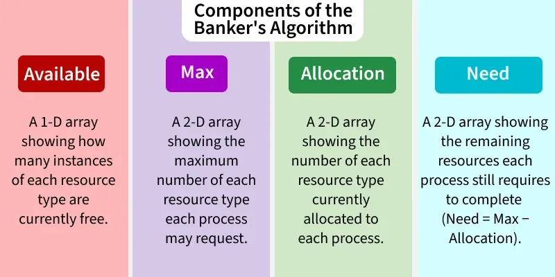
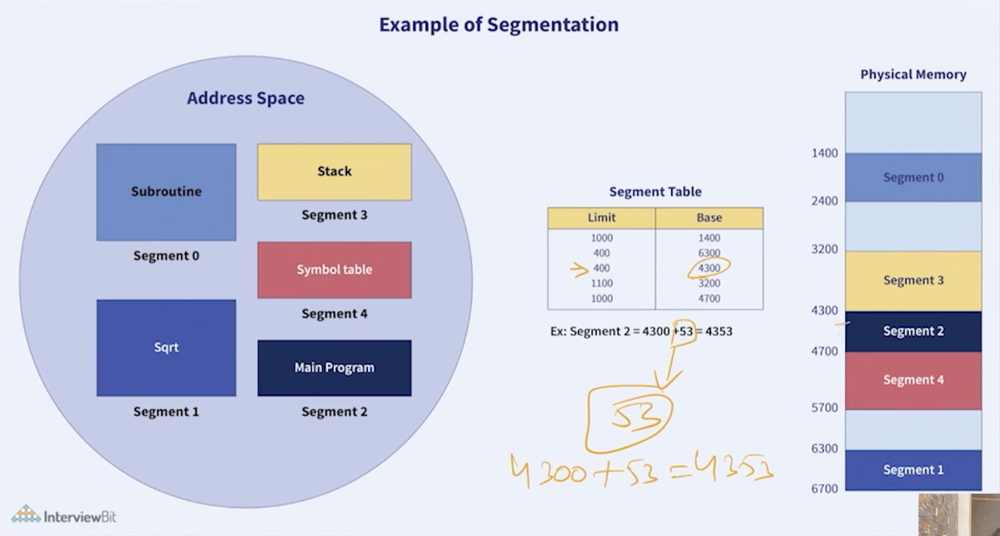

## Deadlock
- A deadlock is a situation in which two or more processes are permanently blocked because each process is holding a resource and waiting for another resource held by another process.
> “Everyone waits forever, and nothing moves.”

### 🔁 Classic Example
- Process P1 holds Resource R1 and waits for R2
- Process P2 holds Resource R2 and waits for R1
> ➡️ Neither can proceed → Deadlock

### 🔒 Necessary Conditions for Deadlock (Coffman Conditions)
> All four must occur simultaneously:

1. 1️⃣ Mutual Exclusion
- At least one resource must be non-shareable(which means that only one process can use the resource at any given time)
🧠 Example: Printer, File, Mutex

2. 2️⃣ Hold and Wait
- A process holds one resource while waiting for another

3. 3️⃣ No Preemption
- Resources cannot be forcibly taken from a process

4. 4️⃣ Circular Wait
- A circular chain exists in RAG(Resource Allocation Graph)
- P1 → waits for P2 → waits for P3 → … → waits for P1

> ✅ If even one condition is prevented → Deadlock cannot occur

## 1️⃣ Deadlock Prevention
- Break one of the four conditions.
| Condition        | How to Prevent                |
| ---------------- | ----------------------------- |
| Mutual Exclusion | Make resources sharable       |
| Hold & Wait      | Request all resources at once |
| No Preemption    | Force release of resources    |
| Circular Wait    | Impose resource ordering      |

## 2️⃣ Deadlock Avoidance
- Ensure system never enters unsafe state.

1. 📌 Banker’s Algorithm
- Banker's Algorithm is a resource allocation and deadlock avoidance algorithm used in operating systems. It ensures that a system remains in a safe state by carefully allocating resources to processes while avoiding unsafe states that could lead to deadlocks.

## 3️⃣ Deadlock Detection 
    - Allow deadlocks
    - Detect using Wait-for Graph
- Recover by:
    - Killing processes
    - Resource preemption
1. If Resources Have a Single Instance
- In this case for Deadlock detection, we can run an algorithm to check for the cycle in the Resource Allocation Graph. The presence of a cycle in the graph is a sufficient condition for deadlock. 
- In the above diagram, resource 1 and resource 2 have single instances. There is a cycle R1 → P1 → R2 → P2. So, Deadlock is Confirmed. 

2. If There are Multiple Instances of Resources
- Detection of the cycle is necessary but not a sufficient condition for deadlock detection, in this case, the system may or may not be in deadlock varies according to different situations.
- For systems with multiple instances of resources, algorithms like Banker's Algorithm can be adapted to periodically check for deadlocks.

## Deadlock Recovery
- A traditional operating system such as Windows doesn't deal with deadlock recovery as it is a time and space-consuming process. Real-time operating systems use Deadlock recovery. 

- Killing The Process: 
- Killing all the processes involved in the deadlock. Killing process one by one. After killing each process check for deadlock again and keep repeating the process till the system recovers from deadlock. Killing all the processes one by one helps a system to break circular wait conditions.

- Resource Preemption: Resources are preempted from the processes involved in the deadlock, and preempted resources are allocated to other processes so that there is a possibility of recovering the system from the deadlock. In this case, the system goes into starvation.

## 4️⃣ Ignore Deadlock (Ostrich Algorithm)
- Used in most operating systems like Windows & Linux
- Reason: Deadlocks are rare and handling them is costly

## Memory Management
- Memory Management is the function of the operating system that manages primary memory (RAM) by keeping track of:
- Which parts of memory are in use
    - Which process is using which part
    - Allocating and deallocating memory efficiently.

### 🎯 Objectives of Memory Management
- Efficient use of RAM
- Prevent memory conflicts
- Support multiprogramming
- Provide protection and isolation
- Enable virtual memory

##  Logical Address Space and Physocal Address Space
- The logical address (also called virtual address) is the address generated by the CPU during program
> Logical Address = 0x00401000
- The physical address is the actual location in RAM where data or instructions are stored.
> Physical Address = 0x1A3F2000
> CPU → Logical Address → MMU → Physical Address → RAM
| Feature       | Logical Address | Physical Address |
| ------------- | --------------- | ---------------- |
| Generated by  | CPU             | Memory Unit      |
| Visibility    | Program/User    | Hardware         |
| Also called   | Virtual Address | Real Address     |
| Address Space | Per process     | System-wide      |
| Can be same?  | ❌ (Usually)     | ✅                |

### 🧱 Types of Memory Management
1. ***1️⃣ Contiguous Memory Allocation***
- Each process occupies a single continuous block of memory.
- Types:
    - Fixed Partitioning
        - ❌ Internal fragmentation (unused space inside partition)
        - ❌ Limited number of processes
    - Variable Partitioning : 
        - ❌ External fragmentation (free memory scattered)
- 📌 Problems:
    - External Fragmentation
    - Limited flexibility.

### Solution of External Fragmentation
1. Compaction
- Moving all the processes toward the top or towards the bottom to make free available memory in a single continuous place is called compaction.

### Memory allocation algorithms : 
- Memory allocation algorithms decide how free memory blocks are assigned to processes in contiguous memory allocation.
- 🧠 Main Types of Allocation Algorithms

1. 1️⃣ First Fit
- ➡️ Allocates the first block of memory that is large enough.
- 🔹 How it works:
    - Scan memory from the beginning
    - Allocate the first hole ≥ requested size
- ✅ Advantages
    - Fast
    - Simple to implement
- ❌ Disadvantages
    - Causes external fragmentation
    - Memory near the beginning gets filled quickly
- 📌 Most commonly used

2. 4️⃣ Next Fit
- ➡️ Similar to First Fit, but continues search from **last allocated position**.
- ✅ Advantages
    - Faster than First Fit in some cases
- ❌ Disadvantages
    - Still causes fragmentation

3. 2️⃣ Best Fit
- ➡️ Allocates the smallest hole that is sufficient for the request.
- 🔹 How it works:
    - Search entire memory
    - Choose the smallest suitable block
- ✅ Advantages
    - Minimizes wasted space
- ❌ Disadvantages
    - Slower (searches full list)
    - Creates many tiny unusable holes.

4. 3️⃣ Worst Fit
- ➡️ Allocates the largest available block.
- 🔹 How it works:
    - Chooses the biggest free block
    - Leaves large remaining space
- ✅ Advantages
    - Reduces small unusable fragments
- ❌ Disadvantages
    - Wastes large memory blocks
    - Poor overall utilization.

| Algorithm | Speed    | Fragmentation | Efficiency |
| --------- | -------- | ------------- | ---------- |
| First Fit | Fast     | Medium        | Good       |
| Best Fit  | Slow     | High          | Poor       |
| Worst Fit | Slow     | High          | Poor       |
| Next Fit  | Moderate | Medium        | Fair       |

2. ***2️⃣ Non-Contiguous Memory Allocation***
- A process is divided into parts stored in non-adjacent memory locations.
- Types:
    - ✔ Paging
    - ✔ Segmentation
    - ✔ Segmentation with Paging.

### 📄 Paging
- Memory is divided into fixed-size pages(pagesize = framesize)
- Physical memory is divided into frames
- Pages can be stored in any free frame
- Uses page table for address translation
- 📌 Example:
    - Logical address → (page number, offset)
    - Physical address → (frame number, offset)
> To keep track of where each page is stored in memory, the operating system uses a page table. This table shows the connection between the logical page numbers and the physical page frames (actual locations in RAM).
- Every process has its own Page Table in PTBR (Page Table Base Register) which is in PCB.

### ⚙️ How Address Translation Works
- CPU generates a logical address
- MMU (Memory Management Unit):
    - Uses PTBR to locate the page table
    - Finds frame number using page number
- Combines frame number + offset → physical address

### 🚀 To Improve Speed: TLB
- Since page tables in RAM are slow to access, systems use:
#### 🧠 TLB (Translation Lookaside Buffer)
- Small, fast cache inside CPU
- Stores recent page table entries
- If page found in TLB → no memory access needed

### Advantages:
    - No external fragmentation
    - Easy memory allocation
- Disadvantage:
    - Internal fragmentation

## Problems with Paging
1. 🚫 1. Internal Fragmentation
- Pages have fixed size
- Last page of a process may not be fully used
➡️ Wasted memory inside the page

2. 🐌 2. Page Table Overhead
- Each process needs its own page table
- Large processes ⇒ very large page tables
- Consumes extra memory

3. Slower Memory Access (Two-Level Access)
- For each memory access:
- Access page table
- Access actual memory
- ⏳ This doubles memory access time
➡️ Solved partially using TLB

4. TLB Miss Penalty
If page is not found in TLB:
Page table lookup needed
Slower performance

5. The process broke into chunks of page size will be at diff locations and this happens to every function in the program => Overhead.

## Segmentation : 
- Segmentation is a non-contiguous memory management technique where a program is divided into logical units called segments, such as:
    - Code
    - Data
    - Stack
    - Heap
- Each segment represents a logical part of the program, unlike paging which divides memory into fixed-size blocks.

### 🧩 Structure of Segmentation
- Each logical address is divided into:
> < Segment Number , Offset >
- Segment Number → identifies the segment
- Offset → location inside the segment

### 📦 Segment Table
- Each process has a segment table containing:
    - Base address → starting physical address of the segment
    - Limit → length (size) of the segment
- 📌 Address Translation:
    - Physical Address = Base + Offset

### ✅ Advantages of Segmentation
✔ Matches logical program structure
✔ Supports protection & sharing
✔ No internal fragmentation
✔ Easier memory protection per segment

### ❌ Disadvantages
- ❌ External fragmentation
- ❌ More complex memory management
- ❌ Segment tables consume memory

