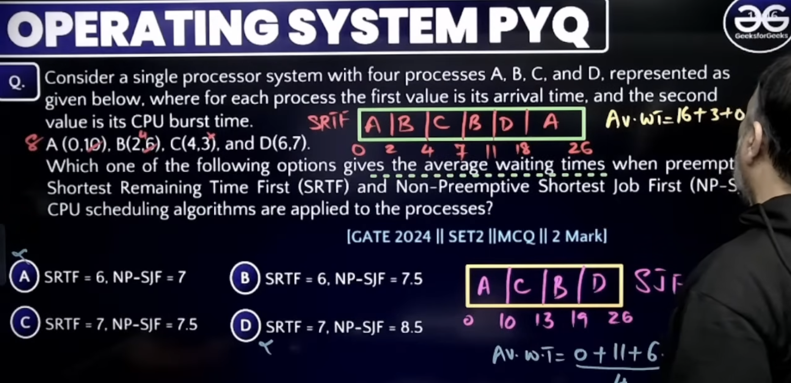
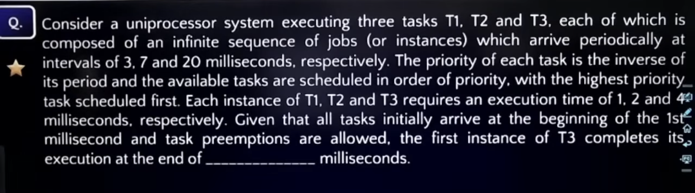
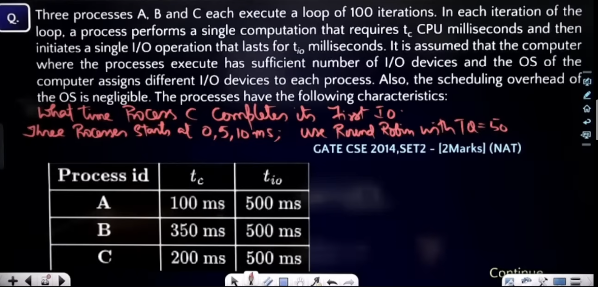

# OS Scheduling:

> The waiting time for preemptive is calaculated by seeing when CPU was allocated - AT and also if it was premeted and watited for more time.

# Context Switching between Threads of same process :
> Thread Context: Each thread has its own PC, Stack, Stack Pointer and CPU Registers.
> Shared by threads of the same process: Code, Data, Heap, Address Space/Page Table and open files/resources.
- Therefore:
- Thread switch within SAME process:
PC                  → Save/Restore ✅
Stack Pointer       → Save/Restore ✅
General Registers   → Save/Restore ✅
Page Table / PTBR   → No change    ❌

# CPU Scheduling & Starvation
| Algorithm                    | Starvation? | Why?                                                   |
| ---------------------------- | ----------- | ------------------------------------------------------ |
| **FCFS / FIFO**              | ❌ No        | Every process eventually gets its turn                 |
| **Round Robin (RR)**         | ❌ No        | Every process gets CPU for a time quantum              |
| **Priority Scheduling**      | ✅ Yes       | Low-priority processes may keep waiting                |
| **Shortest Job First (SJF)** | ✅ Yes       | Long jobs may keep waiting if short jobs keep arriving |

# CPU Scheduling 
1. Arrival Time (AT)
Time at which a process enters the ready queue.

2. Burst Time (BT)
Total CPU execution time required by a process.

3. Completion Time (CT)
Time at which the process finishes execution.

4. Turnaround Time (TAT)
Total time from arrival to completion.
> TAT = CT-AT.
- It includes both waiting time + CPU execution time.
> TAT=WT+BT

5. Waiting Time (WT)
- Time a process spends waiting in the Ready Queue for CPU.

6. Response Time (RT)
- Time from process arrival until it gets the CPU for the first time.
> RT=First CPU Start Time−AT

# IMP CONCEPT:

- AT is before start of 1 sec and answer is start of 13th sec or end of 12th sec.

# 

# User-Level Threads vs Kernel-Level Threads
| Feature                 | **User-Level Threads (ULT)**                                                | **Kernel-Level Threads (KLT)**                            |
| ----------------------- | ----------------------------------------------------------------------------| --------------------------------------------------------- |
| **Managed by**          | User-level thread library                                                   | Operating system kernel                                   |
| **Kernel awareness**    | Kernel does **not know** individual threads                                 | Kernel **knows and manages** threads                      |
| **Creation**            | Faster                                                                      | Slower                                                    |
| **Context switching**   | Faster, because kernel is not involved                                      | Slower, requires kernel involvement                       |
| **System calls**        | A blocking system call can block the **entire process**                     | Only the calling thread is blocked                        |
| **Multicore execution** | Usually cannot achieve true parallelism if kernel sees only one process     | Threads can run **simultaneously on multiple CPUs/cores** |
| **Scheduling**          | Thread library schedules threads                                            | Kernel schedules threads                                  |
| **Overhead**            | Low                                                                         | Higher                                                    |
| **Portability**         | More portable                                                               | More OS-dependent                                         |
| **Implementation**      | Easier                                                                      | More complex                                              |
| **Example**             | POSIX threads implemented entirely in user space, some green-thread systems | Windows threads, Linux kernel threads                     |

# 

> Since IO is sufficent => all processes can do io at same time.

# 

