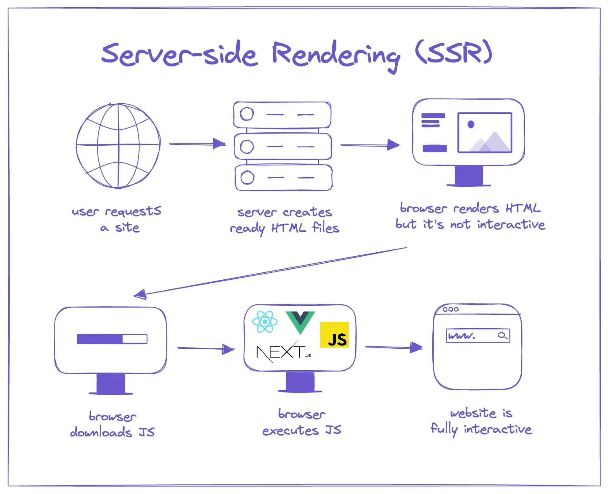
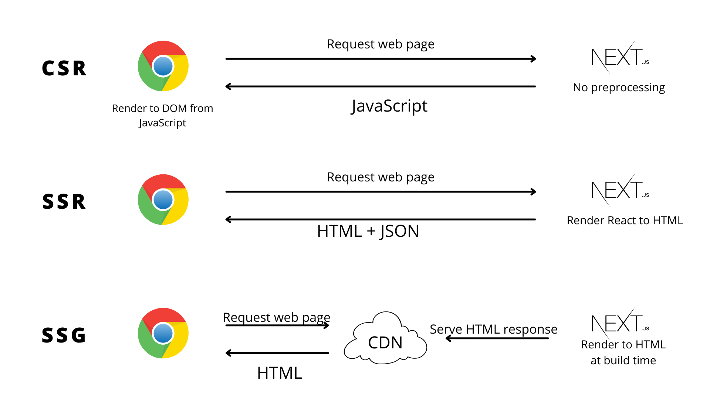
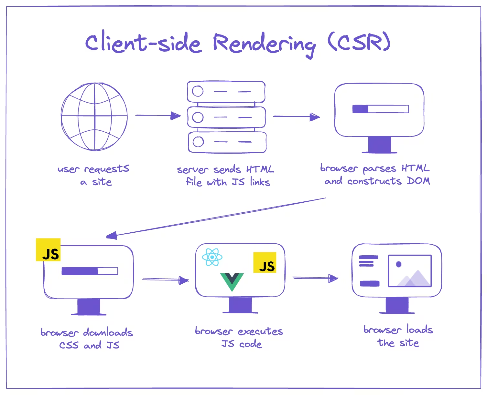

## Next.js 
- is a React framework used to build fast, SEO-friendly, production-ready web applications.
- It extends React by handling routing, rendering, performance optimization, and backend APIs out of the box.

### 🔹 What Problems Next.js Solves
1. Rendering Flexibility
- SSR (Server-Side Rendering) → Better SEO & faster first load 
    - SSR renders the page on the server at request time, giving fresh data and better SEO.

- SSG (Static Site Generation) → Ultra-fast pages
    - SSG generates pages at build time, resulting in extremely fast static pages.
- ISR (Incremental Static Regeneration) → Update static pages without rebuild


2. File-Based Routing
- No manual router setup
- Files = routes (/app, /pages)

3. Backend in the Same Project
- API Routes / Server Actions
- Lets you build full-stack apps without a separate backend

4. Performance Optimizations (Automatic)
- Image optimization
- Code splitting
- Prefetching
- Font optimization

5. SEO & Core Web Vitals
- Better LCP, FCP, CLS
- Metadata handling for search engines

> Next.js is a React framework that enables server-side rendering, static generation, and full-stack development with built-in performance and SEO optimizations.

## 3️⃣ What happens when you run next build?
- Depending on the page, Next.js decides how to render it.
| Type    | Where rendered     | Example               |
| ------- | ------------------ | --------------------- |
| **SSG** | Build time         | Blogs, landing pages  |
| **SSR** | On every request   | Dashboard, auth pages |
| **ISR** | Build + revalidate | Feeds, products       |
| **CSR** | Browser            | Forms, modals         |

## 5️⃣ Request flow (important)
- Example: user opens /dashboard
1. Browser → requests /dashboard
2. Next.js server:
- Runs page.tsx on server
- Fetches data (DB / API)
- Generates HTML
- Server → sends HTML
3. Browser:
- Shows content instantly
- Downloads JS
- React hydrates the page

> 📌 Hydration = HTML becomes interactive

## 
> In Next.js, every page is SSG by default unless you make it dynamic.

| Requirement               | Use           |
| ------------------------- | ------------- |
| Same for everyone         | **SSG**       |
| Needs auth / cookies      | **SSR**       |
| Updates every few minutes | **ISR**       |
| Heavy interactivity       | **CSR**       |
| SEO important             | **SSG / SSR** |
> In Next.js, pages are SSG by default. Pages become SSR when they depend on request-time data like cookies, headers, or no-store fetches. ISR is used when static pages need periodic updates.

## HTML5
> HTML5 introduced semantic tags, native audio/video, powerful form controls, client-side storage, graphics APIs, and modern web APIs—making the web faster, cleaner, and plugin-free.

1. 🧱 1. New Semantic Elements (Structure & Meaning)
| Tag                         | Purpose                          |
| --------------------------- | -------------------------------- |
| `<header>`                  | Top section of a page or section |
| `<footer>`                  | Bottom section                   |
| `<nav>`                     | Navigation links                 |
| `<section>`                 | Logical section of content       |
| `<article>`                 | Independent content (blog, post) |
| `<aside>`                   | Side content (ads, tips)         |
| `<main>`                    | Main content of page             |
| `<figure>` / `<figcaption>` | Images with captions             |


2. 🎥 2. Native Multimedia Support (No Plugins)
| Feature    | Description              |
| ---------- | ------------------------ |
| `<audio>`  | Embed audio              |
| `<video>`  | Embed video              |
| `<source>` | Multiple formats support |
| `<track>`  | Subtitles/captions       |

3. 🧾 3. New Form Input Types & Attributes
| Type           | Use              |
| -------------- | ---------------- |
| `email`        | Email validation |
| `url`          | URL input        |
| `number`       | Numeric input    |
| `date`, `time` | Date/time picker |
| `range`        | Slider           |
| `color`        | Color picker     |
| `search`       | Search field     |

4. 🧠 4. Graphics & Drawing APIs
| Feature     | Purpose                  |
| ----------- | ------------------------ |
| `<canvas>`  | Draw graphics using JS   |
| SVG support | Scalable vector graphics |

5. 💾 5. Client-Side Storage (Better than Cookies)
| Storage          | Size    | Persistent? |
| ---------------- | ------- | ----------- |
| `localStorage`   | ~5–10MB | Yes         |
| `sessionStorage` | ~5MB    | Tab-based   |
| IndexedDB        | Large   | Yes         |

## CSS3
- CSS3 is the latest evolution of CSS, split into modules (instead of one big spec), allowing faster improvements.

1. Advanced Layout Systems (Biggest Upgrade)
    1. 🔹 Flexbox (1-Dimensional Layout)
    - Used for rows OR columns
    2. Grid
    - Used for rows AND columns

    2. 2. Responsive Design (Mobile-First Web)
    🔹 Media Queries

2. 🖱️ 9. UI & Interaction Features
| Feature          | Use                |
| ---------------- | ------------------ |
| `cursor`         | Custom cursor      |
| `resize`         | Resizable elements |
| `outline-offset` | Accessibility      |
| `pointer-events` | Control clicks     |

> CSS3 introduced Flexbox, Grid, animations, media queries, advanced selectors, and visual effects—enabling responsive, modern, and performance-optimized web design.

## CSR (Client-Side Rendering)?
- CSR means the browser (client) is responsible for rendering the UI using JavaScript after loading a minimal HTML file.

### 🧠 How CSR Works (Step-by-Step)
1. Browser requests a page
2. Server sends a basic HTML file (mostly empty <div id="root">)
    - Browser parses HTML and Builds DOM.
3. Browser downloads JavaScript bundle
4. JavaScript fetches data (API calls)
5. JavaScript renders HTML in the browser
> 📌 First meaningful content appears after JS executes

| Feature       | CSR     | SSR    |
| ------------- | ------- | ------ |
| Rendering     | Browser | Server |
| First Load    | Slow    | Fast   |
| SEO           | Weak    | Strong |
| Server Load   | Low     | Higher |
| JS Dependency | High    | Medium |

### 🧑‍💻 When to Use CSR?
- ✅ Best for:
    - Dashboards
    - Authenticated apps
    - Admin panels
    - Real-time apps
- ❌ Avoid for:
    - Content-heavy blogs
    - SEO-focused sites

> <div id="root"></div>   <!-- initial DOM -->

> CSR is a rendering approach where the browser uses JavaScript to build the UI after the page loads, commonly used in SPAs like React apps.

## SSR (Server-Side Rendering)?
- SSR (Server-Side Rendering) means the server generates the complete HTML for a page and sends it to the browser already rendered.


### 🧠 How SSR Works (Step-by-Step)
- Browser requests a page
- Server fetches required data
- Server renders HTML
- Fully-rendered HTML is sent to browser
- Browser displays content immediately
- JavaScript loads and hydrates the page (adds interactivity)

### ✅ Advantages of SSR
✔ Faster First Contentful Paint (FCP)
✔ Excellent SEO
✔ Better performance on low-end devices
✔ Works well for content-heavy pages

### ❌ Disadvantages of SSR
❌ Higher server load
❌ Slower navigation between pages
❌ More complex setup
❌ Server must be running at all times

### 🧑‍💻 When to Use SSR?
- ✅ Best for:
    - Blogs & articles
    - E-commerce product pages
    - Marketing websites
    - SEO-critical pages
- ❌ Avoid for:
    - Highly interactive dashboards
    - Internal tools
### DOM 
- Browser parses HTML
- Browser builds full DOM instantly
- Page is visible
- JS loads and hydrates the DOM
```jsx
<div id="root">
  <h1>Posts</h1>
</div>   <!-- DOM exists immediately -->
```
> 📍 DOM exists before JavaScript

> Next.js – Hybrid SSR/SSG/CSR

> SSR is a rendering technique where the server sends fully-rendered HTML to the browser, improving SEO and initial load performance.

## Hydration 
> Hydration is when the browser’s JavaScript “wakes up” a server-rendered HTML page and adds interactivity without rebuilding the DOM.
- In SSR, the browser receives:
    - ✔ Fully-rendered HTML (content visible)
    - ❌ No interactivity yet (buttons don’t work) 
- Hydration solves this by:
    - Attaching event listeners
    - Linking React/Vue state to DOM
    - Enabling dynamic updates

### 🆚 Hydration vs Rendering
| Aspect      | Rendering | Hydration         |
| ----------- | --------- | ----------------- |
| Creates DOM | Yes       | ❌ No              |
| Uses JS     | Yes       | Yes               |
| Purpose     | Build UI  | Add interactivity |
| Happens in  | CSR       | SSR               |
> 📌 Hydration does NOT recreate DOM

### ⚠️ Hydration Mismatch (Common Issue)
- Occurs when:
    - Server HTML ≠ Client render output
    - Random values (Date.now(), Math.random())
    - Browser-only APIs used on server
- 🛑 Results in:
    - Warnings
    - DOM re-render
    - Performance loss
> Hydration is the process of attaching JavaScript behavior to server-rendered HTML so the page becomes interactive without rebuilding the DOM.


## SSG (Static Site Generation)?
- SSG is a rendering technique where HTML pages are generated at build time, stored as static files, and served directly to users — no server rendering per request.
> SSG is a technique where pages are pre-rendered into static HTML during build time and served instantly to users.

### 🔄 How SSG Works (Step-by-Step)
- Developer runs build
- Framework fetches data
- HTML pages are pre-generated
- HTML files are stored on CDN
- User requests page
- CDN serves static HTML instantly
> 📌 No computation at request time

### ❌ Disadvantages of SSG
❌ Data can become stale
❌ Rebuild required for updates
❌ Not suitable for user-specific content

### 🧑‍💻 Best Use Cases
- ✅ Perfect for:
    - Blogs
    - Documentation
    - Landing pages
    - Portfolio websites
- ❌ Avoid for:
    - Dashboards
    - Authenticated content
    - Real-time data

## ISR (Incremental Static Regeneration)?
- ISR is a hybrid rendering technique where static pages are regenerated in the background after deployment, without rebuilding the entire site.
- Think of ISR as SSG + controlled freshness.
> ISR allows static pages to be updated incrementally after build time by regenerating them in the background at a fixed interval or on demand.

> ISR is suitable for **dates** that change infrequently (like daily updates), but not for real-time or per-user time data.

