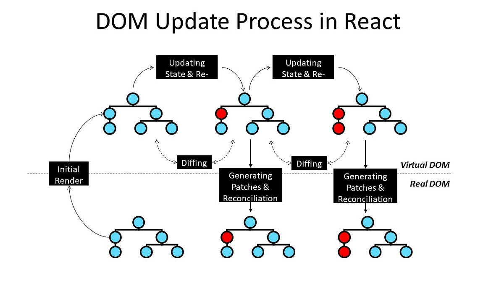
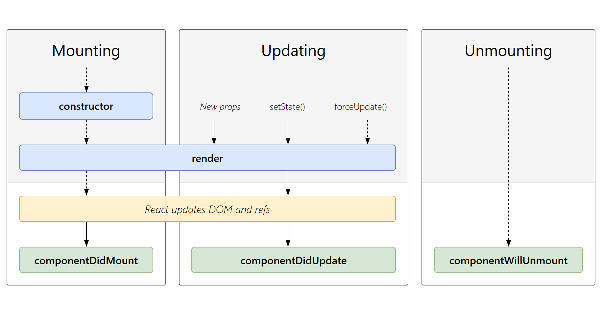

## ✅ 1. React Component Lifecycle (Functional Components)
- In class components, lifecycle had 3 phases:
1. Mounting – component appears
2. Updating – state/props change
3. Unmounting – component removed
> In functional components, lifecycle is handled using [useEffect].

| Class Lifecycle      | Functional Equivalent                |
| -------------------- | ------------------------------------ |
| componentDidMount    | `useEffect(() => {}, [])`            |
| componentDidUpdate   | `useEffect(() => {}, [dep])`         |
| componentWillUnmount | `return () => {}` inside `useEffect` |

```js
useEffect(() => {
  const intervalId = setInterval(() => {
    console.log("Running...");
  }, 1000);

  return () => {
    clearInterval(intervalId); // stops interval on unmount
  };
}, []);
```


## ✅ 2. Difference Between useState vs useEffect

| Feature          | `useState`              | `useEffect`                 |
| ---------------- | ----------------------- | --------------------------- |
| Purpose          | Store data              | Run side effects            |
| Runs on          | User action / re-render | After render                |
| Used for         | UI state, form values   | API calls, timers           |
| Causes re-render | ✅ Yes                   | ❌ No (unless state updated) |

> useState → Stores data
> useEffect → Runs logic after render (side effects like API calls, timers )

## ✅ 3. What is Virtual DOM?
- The Virtual DOM is a lightweight copy of the real DOM stored in memory.
- ✅ How It Works:
1. React creates a Virtual DOM snapshot
- When state changes → new Virtual DOM created
- React diffs old vs new (Reconciliation)
- Only changed nodes update in the real DOM

- ✅ Why It’s Fast:
    - No full page reload
    - Only minimal updates
    - Efficient UI rendering

## ✅ 4. Controlled vs Uncontrolled Components
1. ✅ Controlled Component
- Form data is controlled by React state.
```js
<input value={name} onChange={e => setName(e.target.value)} />
```
- ✅ Fully predictable
- ✅ Easy validation
- ❌ More re-renders

2. ✅ Uncontrolled Component
- Form uses DOM directly via ref.
```js
<input ref={inputRef} />
```
- ✅ Less re-renders
- ❌ Hard validation
- ❌ No real-time control

| Feature        | Controlled  | Uncontrolled |
| -------------- | ----------- | ------------ |
| Data stored in | React State | DOM          |
| Validation     | Easy        | Hard         |
| Best for       | Forms       | Quick input  |


## Flexbox vs Grid (CSS Layout)
| Feature     | Flexbox            | Grid              |
| ----------- | ------------------ | ----------------- |
| Layout Type | 1D (row OR column) | 2D (row & column) |
| Best for    | Navbar, cards      | Full page layout  |
| Alignment   | Easy               | Powerful          |
| Control     | Less               | More              |


## ✅ 9. What is Prop Drilling? How Do You Avoid It?  
- Passing data through unnecessary levels.
- Problems:
  - Messy code
  - Hard debugging
  - Poor scalability

- ✅ Solutions:
1. Context API
2. Global State Management (Redux, Zustand, MobX)
3. Component composition

## ✅ 10. Lazy Loading & Code Splitting
1. ✅ Lazy Loading
- Loading components only when needed.
- const Dashboard = React.lazy(() => import('./Dashboard'));

2. ✅ Code Splitting
- Breaking app bundle into smaller chunks.
- Faster load time
- Less JS blocking
- Better performance
- ✅ Used with:
- 
<Suspense fallback={<Loader />}>
  <Dashboard />
</Suspense>


| Concept                  | Key Purpose           |
| ------------------------ | --------------------- |
| Virtual DOM              | Fast UI updates       |
| useState vs useEffect    | State vs Side Effects |
| Controlled Components    | Form control          |
| Tailwind CSS             | Utility-first CSS     |
| Flex vs Grid             | Layout system         |
| Form Validation          | Data integrity        |
| Performance Optimization | Faster React apps     |
| Prop Drilling            | Poor data flow        |
| Lazy Loading             | Faster initial load   |
| Code Splitting           | Smaller JS bundles    |


## Virtual DOM : 



## React Lifecycle
- The React lifecycle describes the stages a component goes through from creation → update → removal.
- In modern React, this is handled mostly with Hooks (not class methods).




3. Unmounting:
```jsx
useEffect(() => {
  return () => {
    console.log("Component unmounted");
  };
}, []);
```
- Used for:
  - Cleanup
  - Removing event listeners
  - Clearing intervals
  - Cancelling API requests

## 
- ReactDOM.render() is used to inject a component’s rendered output into a real DOM node like a <div> in index.html.
- React supports conditional rendering in JSX using ternary (? :) operators or logical &&, allowing UI elements to show/hide dynamically.


## Pure Function?
- A pure function is a function that:
  - Always returns the same output for the same input
  - Does not cause any side effects
> If both conditions are met → the function is pure.
- EXAMPLE : 
```JS
function add(a, b) {
  return a + b;
}
```

## fragments
- ragments in React let you group multiple elements without adding extra nodes to the DOM.
- Normally, a React component must return a single parent element. Fragments solve this problem cleanly.
```JS
function List() {
  return (
    <>
      <li>Apple</li>
      <li>Banana</li>
    </>
  );
}
```
- 3️⃣ Fragment with key (Important!)
items.map(item => (
  <React.Fragment key={item.id}>
    <h3>{item.name}</h3>
    <p>{item.desc}</p>
  </React.Fragment>
));
> ⚠️ Short syntax (<> </>) does NOT support keys.
> Fragments let React components return multiple elements without extra wrappers.

## How do you handle persistent state in React apps?
Persistent state ensures that certain data remains available even after page reloads or across sessions. Common approaches include:
1. localStorage or sessionStorage: Save state that persists across page reloads.
2. Combine state hooks with effects: Use useState or useReducer together with useEffect to sync state with storage.
3. IndexedDB: For larger or more complex client-side storage needs.
4. Backend storage: Store state on a server/database via APIs for server-side persistence.
5. State management libraries: Use Redux, Zustand, or Context API with persistence middleware.
6. Cookies: Suitable for small pieces of data, like authentication tokens.

## ✅ How Parent gets data from Child
- 🔑 Solution: Callback Functions (Lifting State Up)
- Parent:
  - Owns the state
  - Passes a function to the child
- Child:
  - Calls that function with data
```js
function Parent() {
  const [message, setMessage] = React.useState("");

  const handleChildData = (data) => {
    setMessage(data);
  };

  return (
    <>
      <Child sendData={handleChildData} />
      <p>Message from child: {message}</p>
    </>
  );
}
```
```js
function Child({ sendData }) {
  return (
    <button onClick={() => sendData("Hello from Child!")}>
      Send Data to Parent
    </button>
  );
}
```
