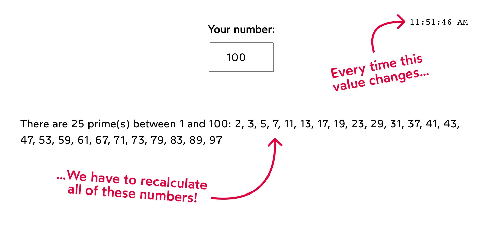

## Hooks:
- Hooks allow functions to have access to state and other React features without using classes.
- They provide a more direct API to React concepts like props, state, context, refs, and lifecycle.
> Hooks are functions that let you "hook into" React state and lifecycle features from functional components.
- 👉 Introduced in React 16.8
- React Hooks are functions that let you use React features (state, lifecycle, context, etc.) inside functional components — without writing class components.

1. **1️⃣ useState – Manage State**
- Used to store and update local component state.
- useState is a React Hook that lets you add a state variable to your component.
- useState returns an array with exactly two values:
    - The current state. During the first render, it will match the initialState you have passed.
    - The set function that lets you update the state to a different value and trigger a re-render.
- 
“In Strict Mode, React calls your initializer twice”
----------------------------------------------------------------
- React will call your initializer function twice in development
### ❓ Why does React do this?
- To help you find impure logic, such as:
    - Mutating variables
    - Making API calls inside state initialization
    - Changing global values
- React is checking:
    - “If I run this twice, does it break?”
-
--------------------------------------------------------

2. **2️⃣ useEffect – Side Effects**
- Handles side effects like API calls, subscriptions, DOM updates, and timers.
- 🔹 Syntax:
```js
useEffect(() => {
  // side effect
  return () => {
    // cleanup
  };
}, [dependencies]);
```
### 🔹 Runs:
- On mount
- On dependency change
- On unmount (cleanup)

###
- if no dependencies is passed => only mount pe render .[]
- if not even [] is written => every re-render pe call hoga.

3. **3️⃣ useContext** – Global State Sharing
- Used to share data globally without prop drilling.
> useContext is a React Hook that allows you to access data from a Context object without passing props manually through every component level.
### PROBLEM : prop drilling.
```js
<App user={user}>
  <Navbar user={user}>
    <Profile user={user}>
      <User user={user} />
    </Profile>
  </Navbar>
</App>
```
### SOLUTION :
```js
// 1️⃣ Create Context
import { createContext } from "react";
export const UserContext = createContext();
```
```js
// 2️⃣ Provide Context (Provider)
import {UserContext}  from './UserContext'
function App() {
  const user = { name: "Akash", role: "Admin" };

  return (
    <UserContext.Provider value={user}>
      <Dashboard />
    </UserContext.Provider>
  );
}
```
```js
// 3️⃣ Consume Context (useContext)
import { useContext } from "react";

function Dashboard() {
  const user = useContext(UserContext);
  return <h1>Hello, {user.name}</h1>;
}
```
### 🔹 What Actually Happens Internally?
- createContext() creates a global data container
- Provider puts the value into that container
- useContext() **subscribes** the component to changes
- When value changes → component re-renders.

### 🔹 When Should You Use useContext?
- ✔ Theme (dark/light mode)
- ✔ User authentication
- ✔ Language (i18n)
- ✔ Global settings
- ✔ App-wide configuration

4. 4️⃣ **useRef** – DOM & Mutable Values
- The useRef Hook allows you to persist values between renders.
- It can be used to store a mutable value that does not cause a re-render when updated.
- It can be used to access a DOM element directly.
> useRef is a React Hook that lets you store a mutable value that does NOT cause a re-render when it changes.
- It returns a mutable object with a single property: 
  - use .current to acesses variable.
> const ref = useRef(initialValue);

| Feature                | Explanation                            |
| ---------------------- | -------------------------------------- |
| Persistent             | Value remains same across renders      |
| Mutable                | You can change `.current` freely       |
| No re-render           | Updating `.current` does NOT re-render |
| DOM access             | Used to access DOM elements            |
| Stores previous values | Yes                                    |

### 
1. Storing Mutable Values (Without Re-render) or PERSIST DATA ACROSS RE-RENDER.
```js
import { useRef, useState } from "react";

function Counter() {
  const [count, setCount] = useState(0);
  const renderCount = useRef(0);

  renderCount.current++;

  return (
    <>
      <h2>Count: {count}</h2>
      <h3>Renders: {renderCount.current}</h3>

      <button onClick={() => setCount(count + 1)}>+</button>
    </>
  );
}

```
- ✔ Useful for:
    - Timers
    - Previous values
    - Counters
    - Flags

2. 🔹 1️⃣ Accessing DOM Elements (Most Common Use)
```js
import { useRef } from "react";

function InputFocus() {
  const inputRef = useRef(null);

  const focusInput = () => {
    inputRef.current.focus();
  };

  return (
    <>
      <input ref={inputRef} />
      <button onClick={focusInput}>Focus Input</button>
    </>
  );
}
```
> 📌 useRef gives direct access to the real DOM node. No need to write document...

3. 🔹 3️⃣ Tracking Previous State Value
```js
function Example({ value }) {
  const prevValue = useRef();

  useEffect(() => {
    prevValue.current = value;
  }, [value]);

  return (
    <p>
      Current: {value}, Previous: {prevValue.current}
    </p>
  );
}
```

5. **5️⃣ useMemo** – Performance Optimization
- Memoizes expensive computations to avoid unnecessary recalculations.
> useMemo is a React Hook used to memoize (cache) the result of a calculation so that it does not re-run unnecessarily on every render.
```js
const memoizedValue = useMemo(() => {
  return expensiveCalculation();
}, [dependencies]);
```
- The function runs only when dependencies change
- Otherwise, React returns the cached result


```js
const allPrimes = React.useMemo(() => {
  const result = [];

  for (let counter = 2; counter < selectedNum; counter++) {
    if (isPrime(counter)) {
      result.push(counter);
    }
  }

  return result;
}, [selectedNum]);
```
- useMemo takes two arguments:
    - A chunk of work to be performed, wrapped up in a function
    - A list of dependencies
- Tho 
    - I've extracted two new components, Clock and PrimeCalculator. By branching off from App, these two components each manage their own state. A re-render in one component won't affect the other.
```js
function App() {
  return (
    <>
      <Clock />
      <PrimeCalculator />
    </>
  );
}
```
- EXAMPLE :
    - IF WE HAVE A DATA OF 10000 USERS APP AND SEARCH BAR.

6. 6️⃣ **useCallback** – Memoized Functions
- Prevents unnecessary re-creation of functions, useful for optimization.
> useCallback is a React Hook used to memoize a function, so that the same function instance is reused between renders unless its dependencies change.
```js
const memoizedFunction = useCallback(() => {
  // function logic
}, [dependencies]);
```
- React returns the same function reference
- Only recreates the function if dependencies change

> Automatically memoize values, functions, and components — so you don’t have to manually use useMemo or useCallback.
---
| Feature  | useCallback      | useMemo                |
| -------- | ---------------- | ---------------------- |
| Returns  | Function         | Value                  |
| Purpose  | Memoize function | Memoize value          |
| Use case | Event handlers   | Expensive computations |

---

| Feature          | useCallback         | React.memo            |
| ---------------- | ------------------- | --------------------- |
| What it memoizes | Function            | Component             |
| Prevents         | Function recreation | Component re-render   |
| Used inside      | Components          | Component definitions |
| Works on         | Callbacks           | Props comparison      |
| Common use       | Event handlers      | Child components      |

7. Custom Hooks 
- are your own reusable Hooks that let you extract and share logic between React components.
- They are just functions, but:
  - their name must start with use
  - they can use other Hooks (useState, useEffect, useContext, etc.)
> A custom hook is a JavaScript function that starts with use and allows you to reuse stateful logic across multiple React components.
### EXAMPLE :
```js
import { useState } from "react";

function useCounter(initialValue = 0) {
  const [count, setCount] = useState(initialValue);

  const increment = () => setCount(c => c + 1);
  const decrement = () => setCount(c => c - 1);

  return { count, increment, decrement };
}
```
```js
function Counter() {
  const { count, increment, decrement } = useCounter(10);

  return (
    <>
      <h2>{count}</h2>
      <button onClick={increment}>+</button>
      <button onClick={decrement}>-</button>
    </>
  );
}
```
## 
| Hook          | Purpose                     |
| ------------- | --------------------------- |
| `useState`    | Local state                 |
| `useEffect`   | Side effects                |
| `useContext`  | Global state                |
| `useRef`      | DOM access / mutable values |
| `useMemo`     | Optimize calculations       |
| `useCallback` | Memoize functions           |
| `useReducer`  | Complex state logic         |

- The useReducer is a React hook used to manage complex state logic in functional components. It works similarly to Redux: you define a reducer function that takes the current state and an action, and returns a new state.
> useReducer is a React Hook used for managing complex state logic using a reducer function and dispatched actions.

