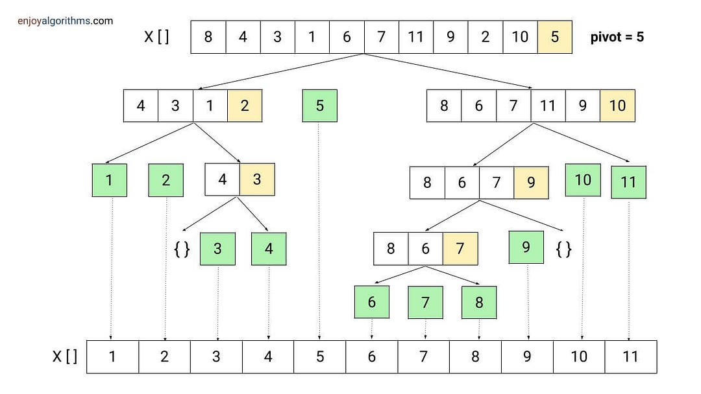
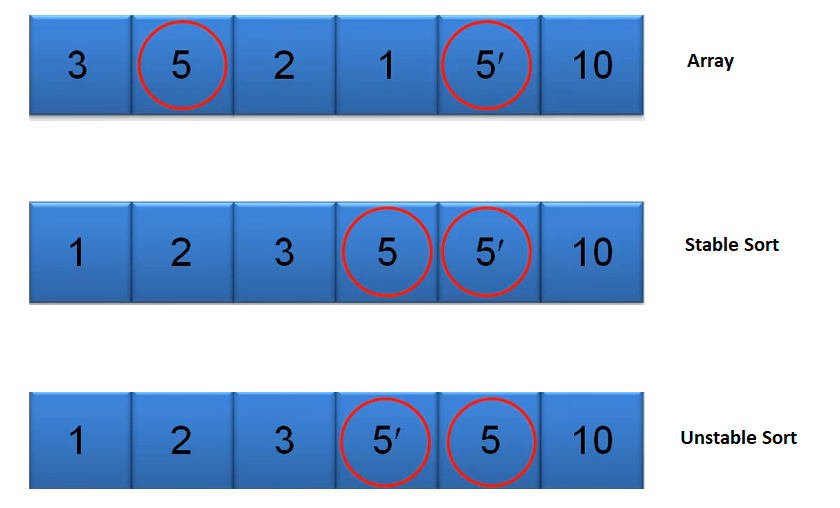

| Algorithm          | Best Case | Average | Worst | Space | Stable | In-Place |
| ------------------ | --------- | ------- | ----- | ----- | ------ | -------- |
| **Bubble Sort**    | O(n)      | O(n²)   | O(n²) | O(1)  | ✅ Yes  | ✅ Yes    |
| **Insertion Sort** | O(n)      | O(n²)   | O(n²) | O(1)  | ✅ Yes  | ✅ Yes    |
| **Selection Sort** | O(n²)     | O(n²)   | O(n²) | O(1)  | ❌ No   | ✅ Yes    |

## Bubble Sort 
- is one of the simplest sorting algorithms.
- It works by repeatedly swapping adjacent elements if they are in the wrong order—just like bubbles rising to the surface 🫧.
```c
void bubbleSort(int arr[], int n) {
    for (int i = 0; i < n - 1; i++) {
        bool swapped = false;

        for (int j = 0; j < n - i - 1; j++) {
            if (arr[j] > arr[j + 1]) {
                // Swap
                int temp = arr[j];
                arr[j] = arr[j + 1];
                arr[j + 1] = temp;
                swapped = true;
            }
        }

        // If no swaps, array is already sorted
        if (!swapped)
            break;
    }
}
```
> 📌 Idea: Largest element “bubbles” to the end after each pass.

## 🟢 2. Insertion Sort (C++)
> 📌 Idea: Insert each element into its correct position in the sorted part.
```c
void insertionSort(int arr[], int n) {
    for (int i = 1; i < n; i++) {
        int key = arr[i];
        int j = i - 1;

        while (j >= 0 && arr[j] > key) {
            arr[j + 1] = arr[j];
            j--;
        }
        arr[j + 1] = key;
    }
}
```

3. 🟠 3. Selection Sort (C++)
> 📌 Idea: Repeatedly select the minimum element and place it at the front.
```c
void selectionSort(int arr[], int n) {
    for (int i = 0; i < n - 1; i++) {
        int minIndex = i;

        for (int j = i + 1; j < n; j++) {
            if (arr[j] < arr[minIndex]) {
                minIndex = j;
            }
        }

        int temp = arr[i];
        arr[i] = arr[minIndex];
        arr[minIndex] = temp;
    }
}
```
## 🔵 Merge Sort (C++)
- Divide array into halves
- Sort each half
- Merge sorted halves
- 
| Case    | Time       |
| ------- | ---------- |
| Best    | O(n log n) |
| Average | O(n log n) |
| Worst   | O(n log n) |
- 
| Feature        | Merge Sort | Quick Sort |
| -------------- | ---------- | ---------- |
| Time (Best)    | O(n log n) | O(n log n) |
| Time (Average) | O(n log n) | O(n log n) |
| Time (Worst)   | O(n log n) | O(n²)      |
| Space          | O(n)       | O(log n)   |
|                |            | O(n)(worst)|
| Stable         | ✅ Yes      | ❌ No       |
| In-Place       | ❌ No       | ✅ Yes      |
```c
class Solution {
public:
    void merge(vector<int>& arr, int left, int mid, int right) {
        int n1 = mid - left + 1;
        int n2 = right - mid;

        vector<int> L(n1), R(n2);

        for (int i = 0; i < n1; i++)
            L[i] = arr[left + i];
        for (int j = 0; j < n2; j++)
            R[j] = arr[mid + 1 + j];

        int i = 0, j = 0, k = left;

        while (i < n1 && j < n2) {
            if (L[i] <= R[j]) {   // <= keeps stability
                arr[k++] = L[i++];
            } else {
                arr[k++] = R[j++];
            }
        }

        while (i < n1) arr[k++] = L[i++];
        while (j < n2) arr[k++] = R[j++];
    }

    void mergeSort(vector<int>& arr, int left, int right) {
        if (left < right) {
            int mid = left + (right - left) / 2;

            mergeSort(arr, left, mid);
            mergeSort(arr, mid + 1, right);
            merge(arr, left, mid, right);
        }
    }
};
```

## 🟢 Quick Sort (C++)
- Quick Sort is a Divide and Conquer sorting algorithm that:
    - Chooses a pivot
    - Partitions the array around the pivot
    - Recursively sorts the left and right subarrays
- It is one of the fastest sorting algorithms in practice.


| Case    | Time       |
| ------- | ---------- |
| Best    | O(n log n) |
| Average | O(n log n) |
| Worst   | O(n²)      |

```c
class Solution {
public:
    int partition(vector<int>& arr, int low, int high) {
        int pivot = arr[high];   // choose last element as pivot
        int i = low - 1;

        for (int j = low; j < high; j++) {
            if (arr[j] < pivot) {
                i++;
                swap(arr[i], arr[j]);
            }
        }
        swap(arr[i + 1], arr[high]);
        return i + 1;  // pivot index
    }

    void quickSort(vector<int>& arr, int low, int high) {
        if (low < high) {
            int pi = partition(arr, low, high);
            quickSort(arr, low, pi - 1);
            quickSort(arr, pi + 1, high);
        }
    }
};
```


### Stable sort .


- (5, A), (3, B), (5, C), (3, D)
- (3, B), (3, D), (5, A), (5, C)

> “Quick Sort is unstable because equal elements may be swapped across the pivot during partitioning.”

| Feature    | Merge Sort        | Quick Sort     |
| ---------- | ----------------- | -------------- |
| Time       | Always O(n log n) | Avg O(n log n) |
| Worst Case | Same              | O(n²)          |
| Space      | O(n)              | O(log n)       |
| Stable     | ✅                 | ❌              |
| In-place   | ❌                 | ✅              |

