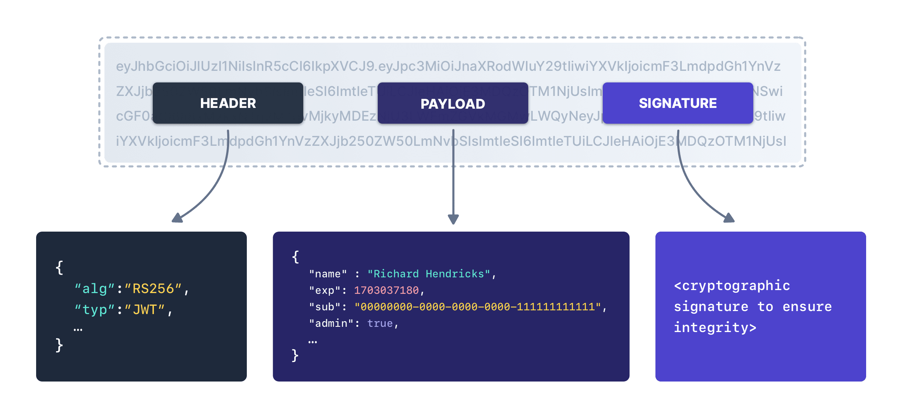

## terminal :
command + j

## Stateless Authentication Mechanism — Meaning
A stateless authentication mechanism is an authentication approach where the server does not store any session information about the user.
Instead, all required authentication data is sent by the client with every request.
> In stateless authentication, each request is self-contained and the server does not remember the user between requests.
- User logs in → server issues a JWT
- Client stores the token (usually in Authorization header)
- Every request includes the token
- Server verifies the token, not a session
    - ✔ No session stored in database
    - ✔ No server-side memory of users

## Cookies 
- are small pieces of data stored in the user’s browser by a website to remember information across requests.

### 🔹 Why Cookies Are Needed
- HTTP is stateless → the server forgets everything after a response.
    - Cookies help maintain state.

### Cookies in Authentication
- Used in stateful authentication
- Server stores session → cookie stores session ID
- Example:
    - Login → server creates session
    - Cookie stores sessionId
    - Server checks session on each request
    
| Feature        | Cookies | Local Storage |
| -------------- | ------- | ------------- |
| Sent to server | ✅ Yes   | ❌ No          |
| Size limit     | ~4 KB   | ~5–10 MB      |
| Auto attach    | ✅ Yes   | ❌ No          |
| Security flags | ✅ Yes   | ❌ No          |

## Stateless vs Session based auth
| Feature                | **Session-based Authentication** | **Stateless Authentication (JWT / Token)** |
| ---------------------- | -------------------------------- | ------------------------------------------ |
| State stored on server | ✅ Yes (session data)             | ❌ No                                       |
| Client stores          | Session ID (cookie)              | Token (JWT)                                |
| Server memory usage    | High (many sessions)             | Low                                        |
| Scalability            | ❌ Hard (sticky sessions)         | ✅ Easy                                     |
| Horizontal scaling     | Difficult                        | Easy                                       |
| CSRF risk              | Higher                           | Lower (with proper setup)                  |
| Mobile / API friendly  | ❌ Less                           | ✅ Yes                                      |
| Logout handling        | Easy (destroy session)           | Hard (token expiry / blacklist)            |
| Typical use            | Traditional web apps             | REST APIs, microservices                   |

## DOM 
- is a tree representation of an HTML document.

## A JWT (JSON Web Token) 
- is a compact, self-contained, and secure token used to authenticate and authorize users in web applications.
> JWT is a stateless authentication mechanism used to securely transmit user information between client and server.

### 🔁 How JWT Authentication Works
1. User logs in with credentials
2. Server verifies credentials
3. Server generates JWT and sends it to client
4. Client stores JWT (localStorage / cookies)
5. Client sends JWT in Authorization header
    - Authorization: Bearer <token>
6. Server verifies JWT and allows access

### ✅ Advantages of JWT
- Stateless authentication (no server-side session)
- Scales well (microservices)
- Fast & compact
- Works across domains

> JWT is a stateless, token-based authentication method that securely transfers user claims between client and server.
### Structure  :
- A JWT has three parts, separated by dots (.):
> HEADER.PAYLOAD.SIGNATURE
> eyJhbGciOiJIUzI1NiIsInR5cCI6IkpXVCJ9.
eyJ1c2VySWQiOjQyLCJyb2xlIjoiYWRtaW4ifQ.
SflKxwRJSMeKKF2QT4fwpMeJf36POk6yJV_adQssw5c

1. HEADER
- Describes how the token is signed.
- Example:
{
  "alg": "HS256",
  "typ": "JWT"
}
- alg → Signing algorithm (HS256, RS256)
- typ → Token type (JWT)
> 👉 Base64Url encoded

2. 2️⃣ Payload (Claims)
- Contains user data + metadata(“Data about data.”).
- Example:
{
  "userId": 42,
  "role": "admin",
  "exp": 1710000000
}
- Types of Claims
    - Registered: exp, iat, iss
    - Public: role, email
    - Private: app-specific data
    - ⚠️ Important: Payload is encoded, not encrypted
    - ❌ Do NOT store passwords or secrets

3. 3️⃣ Signature
- Ensures the token was not tampered with.
HMACSHA256(
  base64Header + "." + base64Payload,
  secretKey
)
- ✔ Verifies integrity
- ✔ Prevents data modification

## API
- An API is a set of rules that allows one software to talk to another software.

## cloud service models
> IaaS → Infrastructure only
- 
    - Virtual machines
    - Storage
    - Networking
        - AWS EC2
        - Google Compute Engine
> PaaS → Platform to run your code
- 
    - You deploy code, platform handles the rest.
    - 🛠️ You manage
        - Application code
        - Data
    - Render
    - Vercel
> SaaS → Ready-to-use software
- 
    - Gmail
    - Google Docs

## Authentication vs authorisation

### Authentication
Verifies the identity of a user.
- Examples:
    - Login with username & password
    - OTP verification
    - Google / GitHub OAuth login

### Authorization
What are you allowed to do?
- Examples:
    - Can you access admin panel?
    - Can you edit/delete a post?
    - Can you view private data?

| Feature      | Authentication        | Authorization        |
| ------------ | --------------------- | -------------------- |
| Question     | Who are you?          | What can you do?     |
| Happens when | First                 | After authentication |
| Purpose      | Identity verification | Permission control   |
| Example      | Login                 | Role-based access    |
| Data used    | Credentials           | Roles / permissions  |
| Failure      | Invalid user          | Access denied        |

## API (Application Programming Interface) 
- is a set of rules that allows two software systems to communicate with each other.
> An API tells how to ask for data and what you will get back.
> An API is a contract that defines how software components communicate; a URL is just one part of an API endpoint, not the API itself.

## What is REST(Representational State Transfer)
- REST is an architectural style used to design APIs that communicate over HTTP in a simple, scalable way.

### 🔹 Core Principles of REST (Very Important)
1. 1️⃣ Client–Server
- Client (React / Browser)
- Server (Node.js / Express)
- Independent of each other

2. 2️⃣ Stateless
- Server does not remember client state
- Every request contains all required info (token, data)
- ✅ Enables scalability

3. 3️⃣ Resource-Based
- Everything is treated as a resource
- Identified using URLs

4. 4️⃣ HTTP Methods (CRUD Mapping)
| Operation | HTTP Method |
| --------- | ----------- |
| Create    | POST        |
| Read      | GET         |
| Update    | PUT / PATCH |
| Delete    | DELETE      |

5. 5️⃣ Standard Response Codes
| Code | Meaning      |
| ---- | ------------ |
| 200  | OK           |
| 201  | Created      |
| 400  | Bad Request  |
| 401  | Unauthorized |
| 404  | Not Found    |
| 500  | Server Error |

- exaample:
GET    /api/users      → fetch users
POST   /api/users      → create user
GET    /api/users/1    → fetch user 1
PUT    /api/users/1    → update user
DELETE /api/users/1    → delete user

| Feature   | REST API               | Website    |
| --------- | ---------------------- | ---------- |
| Response  | JSON                   | HTML       |
| UI        | ❌ No                   | ✅ Yes      |
| Used by   | Frontend / Mobile apps | Humans     |
| Stateless | ✅ Yes                  | ❌ Often no |

### An API is RESTful if it:
- Follows REST principles
    - Uses proper HTTP methods
    - Is stateless
    - Uses meaningful URLs

## Macros are preprocessor directives that perform text substitution before compilation.
1. 1️⃣ Object-like Macro
#define PI 3.14
- Replaces every PI with 3.14

2. 2️⃣ Function-like Macro
#define SQUARE(x) ((x) * (x))

- Inline functions do type checking for parameters, macros don\'t
- Macros are processed by pre-processor and inline functions are processed in later stages of compilation.
- Macros cannot have return statement, inline functions can.
- Macros are prone to bugs and errors, inline functions are not.

## Default values in arrays 
| Array Type            | Default Values |
| --------------------- | -------------- |
| Local array           | ❌ Garbage      |
| Static array          | ✅ 0            |
| Global array          | ✅ 0            |
| `new int[n]`          | ❌ Garbage      |
| `new int[n]()`        | ✅ 0            |
| Partially initialized | Remaining = 0  |
| `vector<int>`         | ✅ 0            |
